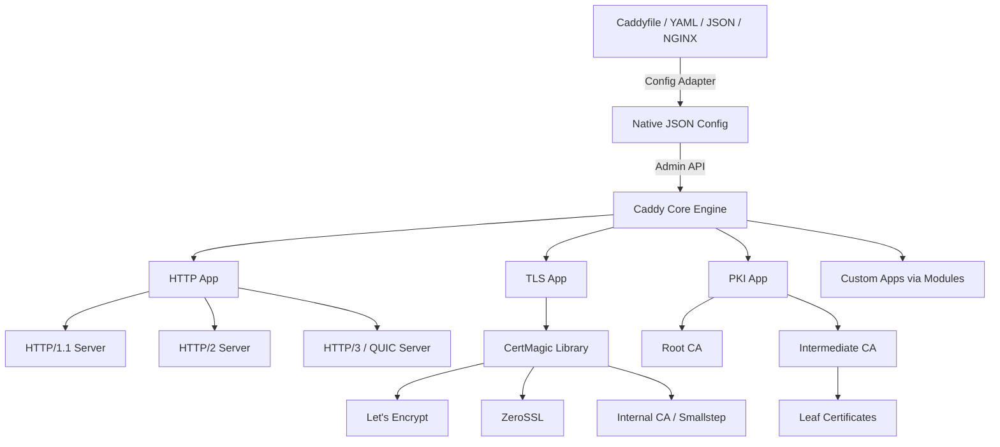
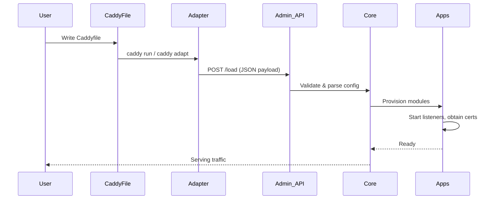

# 01 — Introduction & Architecture

## What Is Caddy?

Caddy is an open-source, production-ready web server written in **Go**. It was created by Matt Holt and first released in 2015. Its defining characteristic is **automatic HTTPS**: give Caddy a domain name and it obtains, installs, and renews a TLS certificate with zero manual intervention.

> "Caddy is the first and only web server to use HTTPS automatically and by default." — caddyserver.com

Caddy is not just an HTTP server. It is a **platform** — a general-purpose server runtime that hosts pluggable "apps" (HTTP server, TLS manager, PKI engine, reverse proxy, process supervisor, and more).

---

## A Brief History

| Year | Milestone |
|------|-----------|
| 2015 | Caddy 0.x released — first automatic HTTPS server |
| 2019 | Caddy 2.0 rewrite — modular architecture, JSON-native config, Admin API |
| 2021 | HTTP/3 experimental support added |
| 2022 | Caddy 2.6 — first stable general-purpose server with HTTP/3 enabled by default |
| 2023 | ZeroSSL added as second default ACME CA |
| 2025+ | Caddy continues as the fastest-growing web server by market share |

---

## Why Caddy Over Nginx or Apache?

```
┌──────────────────────┬──────────────┬──────────────┬──────────────┐
│ Feature              │ Caddy        │ Nginx        │ Apache       │
├──────────────────────┼──────────────┼──────────────┼──────────────┤
│ Automatic HTTPS      │ ✅ Built-in  │ ❌ Manual    │ ❌ Manual    │
│ HTTP/3 (QUIC)        │ ✅ Default   │ ⚠️  Partial  │ ❌ Plugin    │
│ Config language      │ Simple DSL   │ Custom       │ Complex      │
│ Zero-downtime reload │ ✅ Built-in  │ ✅ (signals) │ ⚠️  Partial  │
│ Config API           │ ✅ REST API  │ ❌ None      │ ❌ None      │
│ Written in           │ Go           │ C            │ C            │
│ CVEs (2020-2025)     │ 4            │ 47           │ ~60          │
│ Memory (400 conns)   │ ~32 MB       │ ~18 MB       │ ~145 MB      │
└──────────────────────┴──────────────┴──────────────┴──────────────┘
```

---

## Core Architecture: Caddy as a Platform

Unlike Nginx (which is fundamentally a C-based event-loop server), Caddy is designed as a **runtime for composable server applications**.



### Key Subsystems

#### 1. Caddy Core
The central orchestrator. It:
- Loads and validates configuration
- Starts and stops apps
- Manages the module registry
- Exposes the Admin API (default: `localhost:2019`)

#### 2. HTTP App
A full-featured HTTP server that handles:
- Route matching (host, path, method, header, query)
- Middleware chaining
- Handler execution
- Supports HTTP/1.1, HTTP/2, and HTTP/3 simultaneously on the same port

#### 3. TLS App (powered by CertMagic)
The heart of Caddy's HTTPS magic. It:
- Manages certificate lifecycles (obtain → store → renew → rotate)
- Integrates with ACME CAs (Let's Encrypt, ZeroSSL, or any RFC 8555-compatible CA)
- Manages OCSP stapling
- Handles DNS, HTTP, and TLS-ALPN challenges

#### 4. PKI App (powered by Smallstep)
For internal/private networks. It:
- Runs a local root CA + intermediate CA
- Signs certificates for `localhost`, internal hostnames, and private IPs
- Installs root cert into the OS/browser trust store automatically

#### 5. Module System
Every feature in Caddy is a **module** — a Go interface implementation registered into Caddy's global module registry. This enables:
- Hot-swappable handlers and middleware
- Config-driven polymorphism (no recompilation required for config changes)
- Clean plugin architecture via `xcaddy`

---

## The Configuration Lifecycle

Understanding how Caddy processes configuration is critical for debugging and advanced use.



### Config Sources (in priority order)
1. `--config` flag (file path)
2. `--resume` flag (last saved config from storage)
3. Default: look for `Caddyfile` in CWD

### Config Adapters
Caddy can consume **any** config format and convert it to native JSON:

```
caddy adapt --adapter caddyfile --input Caddyfile
```

Built-in adapters: `caddyfile`  
Third-party adapters: `yaml`, `toml`, `json5`, `nginx`, `hcl`

---

## The Admin API

Caddy exposes a REST API at `localhost:2019` for live config management — **without restart**.

```bash
# Load a new config
curl -X POST "http://localhost:2019/load" \
  -H "Content-Type: application/json" \
  -d @caddy.json

# Get current config
curl http://localhost:2019/config/

# Add a route dynamically
curl -X POST "http://localhost:2019/config/apps/http/servers/myserver/routes" \
  -H "Content-Type: application/json" \
  -d '{"handle": [{"handler": "static_response", "body": "Hello"}]}'

# Graceful stop
curl -X POST http://localhost:2019/stop
```

This is **the killer feature** for dynamic environments: you can add/remove routes, update upstream addresses, or rotate certificates — all live, all atomic, all zero-downtime.

---

## Go Runtime Advantages

Caddy inherits major benefits from being written in Go:

| Go Feature | Caddy Benefit |
|------------|---------------|
| Goroutines | Millions of concurrent connections with tiny stacks (2KB each) |
| net/http stdlib | Battle-tested HTTP/1.1 and HTTP/2 implementation |
| quic-go | High-quality QUIC/HTTP3 implementation |
| Static binary | Single binary deployment, no dependencies |
| Memory safety | No buffer overflows, use-after-free, or segfaults |
| Cross-compilation | One build produces Linux/macOS/Windows/ARM binaries |
| GC | Automatic memory management — no malloc/free bugs |

---

## Caddy vs. The 12-Factor App

Caddy aligns naturally with the [12-Factor App methodology](https://12factor.net/):

- **Config via environment**: `{env.MY_BACKEND}` in Caddyfile
- **Stateless processes**: Caddy itself is stateless; cert storage is pluggable (filesystem, Consul, Redis, S3)
- **Port binding**: Caddy listens on configurable ports
- **Disposability**: Fast startup, graceful shutdown with zero-downtime reload
- **Logs to stdout**: JSON structured logging, no log rotation needed

---

## Caddy Module Registry Internals

When you import Caddy packages, each module calls `caddy.RegisterModule()` in its `init()` function:

```go
// Example: how a handler module registers itself
func init() {
    caddy.RegisterModule(MyHandler{})
}

type MyHandler struct {
    // fields become JSON config keys
    Message string `json:"message,omitempty"`
}

func (MyHandler) CaddyModule() caddy.ModuleInfo {
    return caddy.ModuleInfo{
        ID:  "http.handlers.my_handler",
        New: func() caddy.Module { return new(MyHandler) },
    }
}

func (h MyHandler) ServeHTTP(w http.ResponseWriter, r *http.Request, next caddyhttp.Handler) error {
    w.Write([]byte(h.Message))
    return next.ServeHTTP(w, r)
}
```

Module IDs follow a **namespace.type.name** convention:
- `http.handlers.reverse_proxy`
- `http.matchers.host`
- `tls.issuance.acme`
- `caddy.storage.file_system`

This is essentially **dependency injection at the config level** — the JSON key `"handler": "reverse_proxy"` resolves to the module with ID `http.handlers.reverse_proxy`.

---

## Reading List

- *Designing Data-Intensive Applications* (Kleppmann) — Chapter 1: reliability and scalability concepts apply directly to choosing between Caddy, Nginx, and HAProxy for high-traffic systems.
- *The Pragmatic Programmer* (Hunt & Thomas) — "The Power of Plain Text" — Caddy's Caddyfile exemplifies plain-text config that humans and machines can both reason about.
