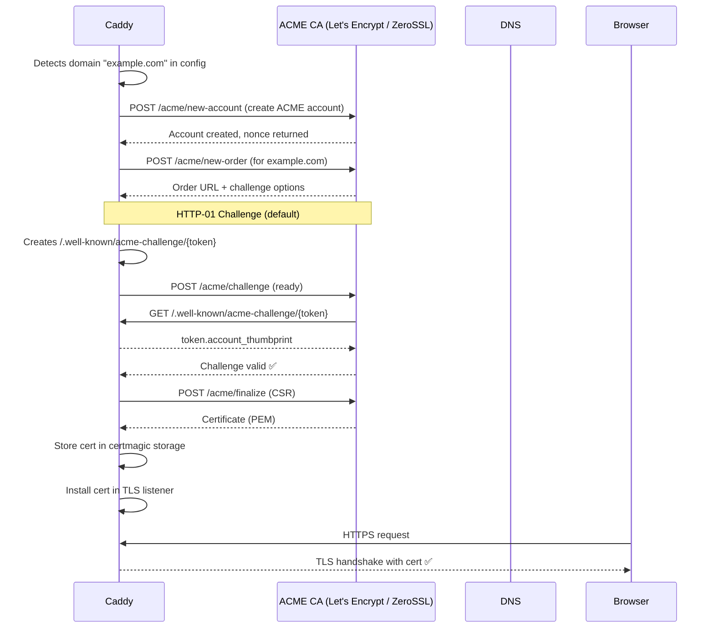
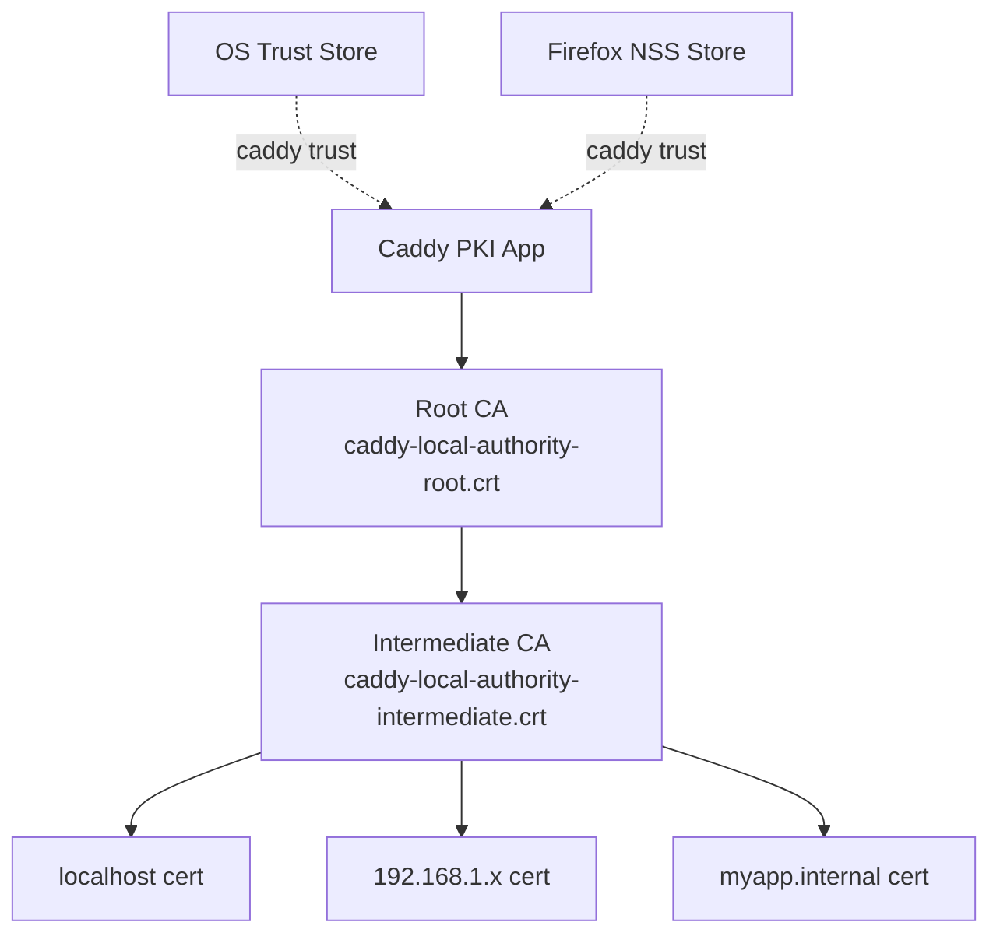
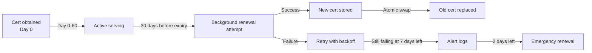

# 02 — Automatic HTTPS Deep Dive

## The Problem Caddy Solves

Before Caddy, enabling HTTPS on a web server required:
1. Purchasing or generating a TLS certificate
2. Running a manual `certbot` command (Let's Encrypt)
3. Configuring Nginx/Apache with correct cert paths
4. Setting up a cron job for renewal
5. Manually reloading the server after renewal
6. Configuring HTTP → HTTPS redirects separately

Caddy reduces all of this to: **add a domain name to your config**.

---

## How Automatic HTTPS Works (End-to-End)



---

## The ACME Protocol (RFC 8555)

ACME (Automated Certificate Management Environment) is the standardized protocol that Let's Encrypt pioneered. Key concepts:

### ACME Account
A keypair (EC P-256 or RSA) registered with the CA. Caddy creates and manages this automatically. Stored in configured storage backend.

### ACME Order
A request for a certificate covering one or more domain names. The CA responds with **challenges** — proofs that you control the requested domains.

### Challenge Types

| Challenge | How It Works | Use Case |
|-----------|-------------|----------|
| **HTTP-01** | CA fetches `/.well-known/acme-challenge/{token}` over HTTP | Public domains with port 80 open |
| **TLS-ALPN-01** | CA connects via TLS with `acme-tls/1` ALPN extension | Public domains, port 443 only |
| **DNS-01** | Add `_acme-challenge.example.com` TXT record | Wildcard certs, private networks, port-blocked hosts |

Caddy automatically picks the best challenge type. For wildcard certs (`*.example.com`), DNS-01 is mandatory.

---

## CertMagic: The Engine Behind It All

CertMagic is the Go library that powers Caddy's certificate management. It is also available as a standalone library for any Go application.

```
CertMagic Architecture:

┌─────────────────────────────────────────────────┐
│                  CertMagic                       │
│  ┌─────────────┐   ┌──────────────────────────┐ │
│  │  ACMEIssuer │   │  InternalIssuer (Smallstep)│ │
│  └─────────────┘   └──────────────────────────┘ │
│  ┌──────────────────────────────────────────┐    │
│  │            Certificate Cache             │    │
│  │  in-memory map[string]*tls.Certificate   │    │
│  └──────────────────────────────────────────┘    │
│  ┌──────────────────────────────────────────┐    │
│  │              Storage Backend             │    │
│  │  FileSystem | Consul | Redis | S3 | etc  │    │
│  └──────────────────────────────────────────┘    │
└─────────────────────────────────────────────────┘
```

### Storage Layout (FileSystem)
```
~/.local/share/caddy/
└── certificates/
    ├── acme-v02.api.letsencrypt.org-directory/
    │   └── example.com/
    │       ├── example.com.crt       ← certificate chain (PEM)
    │       ├── example.com.key       ← private key (PEM)
    │       └── example.com.json      ← metadata (expiry, issuer, etc.)
    └── acme.zerossl.com-v2-DV90/
        └── ...
```

---

## Certificate Authorities: Let's Encrypt vs ZeroSSL

Caddy uses **both** by default, round-robining between them for resilience.

```
┌─────────────────────────┬──────────────────────────┐
│ Let's Encrypt           │ ZeroSSL                  │
├─────────────────────────┼──────────────────────────┤
│ Free, open nonprofit    │ Free tier + paid plans   │
│ 90-day certs            │ 90-day certs             │
│ Rate: 50 certs/domain/wk│ Higher rate limits       │
│ No commercial SLA       │ Commercial SLA available │
│ ACME standard           │ ACME standard            │
│ Older, widely trusted   │ Newer, widely trusted    │
└─────────────────────────┴──────────────────────────┘
```

### Rate Limits (Critical for Production)

Let's Encrypt imposes strict rate limits:
- **50 certificates per registered domain per week**
- **5 duplicate certificates per week** (same set of names)
- **300 new orders per account per 3 hours**
- **10 ACME requests per account per 10 seconds** (Caddy's internal limit)

> ⚠️ **Production Warning**: Frequent config reloads in Caddy can trigger multiple ACME transactions. Batch config changes, use staging environment for testing.

### Staging Environment (Testing)
```
# Caddyfile — use staging CA to avoid rate limits during testing
{
    acme_ca https://acme-staging-v02.api.letsencrypt.org/directory
}

example.com {
    respond "Hello, staging HTTPS!"
}
```

---

## Local / Internal HTTPS (The PKI App)

For development and internal networks, Caddy acts as its **own Certificate Authority**.



When Caddy detects a site with `localhost`, `.internal`, `.local`, or a private IP, it automatically:
1. Generates a root CA (stored in Caddy's data dir)
2. Generates an intermediate CA signed by root
3. Issues leaf certs signed by intermediate
4. **Installs the root CA into your OS trust store** (with `caddy trust`)

```bash
# Install Caddy's local CA into system trust store
caddy trust

# Verify
caddy untrust  # removes it
```

This means `https://localhost` in Chrome works — no certificate warnings — without any manual configuration.

---

## OCSP Stapling

OCSP (Online Certificate Status Protocol) lets browsers check if a certificate has been revoked without contacting the CA on every request.

Without OCSP Stapling:
```
Browser → CA's OCSP server: "Is cert X still valid?"
CA's OCSP server → Browser: "Yes"
(adds latency, CA gets traffic data about your users)
```

With OCSP Stapling (Caddy default):
```
Caddy → CA's OCSP server (cached, background): "Is cert X valid?"
Caddy → Browser: [cert + signed OCSP response bundled in TLS handshake]
(zero extra latency, CA never sees individual user requests)
```

Caddy enables OCSP stapling **automatically** for all certificates. The staple is cached and refreshed before it expires.

---

## Certificate Renewal Strategy



Key renewal behaviors:
- Caddy renews certs **30 days before expiry** by default (90-day certs = renewed at day 60)
- Renewal happens in the **background** — zero interruption to traffic
- Cert rotation is **atomic** — the new cert is atomically swapped in Go's `sync.Map`
- If renewal fails, Caddy **retries with exponential backoff**
- On startup, Caddy checks all managed certs and renews any that are expired or near expiry

---

## DNS Challenge for Wildcards

To obtain `*.example.com` (wildcard), you must prove DNS control:

```
# Caddyfile with DNS challenge (using Cloudflare)
{
    acme_dns cloudflare {env.CF_API_TOKEN}
}

*.example.com {
    tls {
        dns cloudflare {env.CF_API_TOKEN}
    }
    reverse_proxy localhost:3000
}
```

You need to build Caddy with the DNS provider plugin:

```bash
xcaddy build --with github.com/caddy-dns/cloudflare
```

Popular DNS providers supported:
- Cloudflare, Route53, Namecheap, Porkbun, DigitalOcean, Hetzner, Gandi, and 50+ more

---

## TLS 1.3 and Modern Cipher Suites

Caddy defaults are extremely secure out of the box:

```
Default TLS versions: TLS 1.2, TLS 1.3
TLS 1.3 cipher suites (automatic, non-configurable per spec):
  - TLS_AES_128_GCM_SHA256
  - TLS_AES_256_GCM_SHA384
  - TLS_CHACHA20_POLY1305_SHA256

TLS 1.2 cipher suites (Caddy default):
  - TLS_ECDHE_ECDSA_WITH_AES_256_GCM_SHA384
  - TLS_ECDHE_RSA_WITH_AES_256_GCM_SHA384
  - TLS_ECDHE_ECDSA_WITH_CHACHA20_POLY1305_SHA256
  - TLS_ECDHE_RSA_WITH_CHACHA20_POLY1305_SHA256
```

All weak ciphers (RC4, 3DES, CBC-mode, export ciphers) are **disabled by default**.

---

## HSTS (HTTP Strict Transport Security)

Caddy automatically adds HSTS headers:

```
Strict-Transport-Security: max-age=31536000
```

This tells browsers to **only** use HTTPS for your domain for the next year — even if the user types `http://`.

---

## Custom TLS Configuration

```
# Caddyfile — custom TLS settings
example.com {
    tls {
        # Use specific cert files (disable auto-HTTPS for this site)
        cert_file /path/to/cert.pem
        key_file  /path/to/key.pem

        # Or specify CA
        issuer acme {
            ca https://acme.example.com/directory
            email admin@example.com
        }

        # Client certificate authentication (mTLS)
        client_auth {
            mode require_and_verify
            trusted_ca_cert_file /path/to/client-ca.pem
        }

        # Minimum TLS version
        protocols tls1.3

        # Custom curves
        curves x25519 p256
    }
}
```

---

## Practical Example: Full HTTPS Setup

```
# The simplest possible Caddy HTTPS config (3 lines):
example.com {
    root * /var/www/html
    file_server
}
```

What Caddy does automatically with these 3 lines:
1. Detects `example.com` is a public domain
2. Starts HTTP server on port 80 (for ACME HTTP-01 challenge)
3. Obtains TLS cert from Let's Encrypt (or ZeroSSL)
4. Starts HTTPS server on port 443 with the cert
5. Redirects all HTTP traffic to HTTPS
6. Enables HSTS
7. Enables OCSP stapling
8. Schedules background cert renewal
9. Serves files from `/var/www/html`

---

## Key Insight from Literature

> "Making data durable and available is about redundancy and careful failure handling. The same is true for TLS certificates — Caddy's design of using two CAs (Let's Encrypt + ZeroSSL) with automatic failover directly mirrors the redundancy patterns described in Chapter 5 of *Designing Data-Intensive Applications* (Kleppmann)."

Caddy treats TLS certs like any other piece of critical data: replicated, auto-renewed, and with graceful fallback.
