# 03 — Caddyfile Configuration

## What Is a Caddyfile?

A Caddyfile is Caddy's human-friendly configuration language — a purpose-built DSL (Domain Specific Language) that compiles down to Caddy's native JSON format. It is designed to be **readable, writable, and minimal**.

The Caddyfile is **optional** — Caddy's native format is JSON, and you can use JSON directly for maximum control. But for most deployments, the Caddyfile is all you need.

---

## Caddyfile Structure

```
# Global options block (optional, must be first)
{
    email admin@example.com
    admin off
}

# Site block(s)
example.com {
    directive argument
    directive {
        subdirective value
    }
}
```

### Key Structural Rules
- **One site block** per domain (or multiple domains)
- **Directives** are executed in a defined order (not top-to-bottom)
- **Tokens** are whitespace-delimited; use quotes for values with spaces
- **Braces** open and close blocks
- Comments start with `#`

---

## Site Addresses

```
# Domain with automatic HTTPS
example.com { ... }

# Multiple domains (same config)
example.com, www.example.com { ... }

# Wildcard (requires DNS challenge)
*.example.com { ... }

# Specific port (disables automatic HTTPS on non-standard ports)
example.com:8080 { ... }

# HTTP only (explicit, disables HTTPS)
http://example.com { ... }

# Localhost (uses internal CA)
localhost { ... }

# Private IP (uses internal CA)
192.168.1.10 { ... }

# All interfaces
:80 { ... }
:443 { ... }
```

---

## Global Options Block

```
{
    # ACME email for cert registration
    email admin@example.com

    # Disable admin API (production hardening)
    admin off

    # Custom admin listen address
    admin localhost:2019

    # Use Let's Encrypt staging
    acme_ca https://acme-staging-v02.api.letsencrypt.org/directory

    # Default ACME CA for DNS challenge
    acme_dns cloudflare {env.CF_TOKEN}

    # HTTP port (default: 80)
    http_port 80

    # HTTPS port (default: 443)
    https_port 443

    # Grace period for graceful shutdown
    grace_period 10s

    # Structured JSON logging
    log {
        output file /var/log/caddy/caddy.log
        format json
        level INFO
    }

    # Storage backend (default: filesystem)
    storage file_system {
        root /var/lib/caddy
    }

    # Persist config to storage on change
    persist_config off

    # On-demand TLS (obtain cert when first connection arrives)
    on_demand_tls {
        ask http://localhost:9000/check
        interval 2m
        burst 5
    }
}
```

---

## Core Directives

### `root` — Document Root

```
root * /var/www/html

# Pattern-specific root
root /api/* /var/www/api
root * /var/www/default
```

### `file_server` — Serve Static Files

```
file_server

# With options
file_server {
    root /var/www/html
    hide .git .env
    index index.html index.htm
    browse   # Enable directory listing
}
```

### `reverse_proxy` — Proxy to Backend

```
# Simple proxy
reverse_proxy localhost:3000

# Multiple upstreams (round-robin)
reverse_proxy localhost:3000 localhost:3001 localhost:3002

# With path stripping
reverse_proxy /api/* localhost:8080 {
    rewrite_path /api/{path}
}

# With health checks and load balancing
reverse_proxy localhost:3000 localhost:3001 {
    lb_policy least_conn
    health_check /health
    health_check_interval 10s
    health_check_timeout 5s
}
```

### `respond` — Inline Response

```
respond "Hello, World!" 200

respond /health 200 {
    body "OK"
}
```

### `redir` — Redirect

```
# 301 redirect (permanent)
redir https://www.example.com{uri} 301

# 302 redirect (temporary, default)
redir /old-path /new-path

# Redirect all HTTP to HTTPS (Caddy does this automatically, but manual example:)
redir https://{host}{uri} permanent
```

### `rewrite` — Rewrite URI Internally

```
# Rewrite /app to /app/index.html
rewrite /app /app/index.html

# Regex rewrite
rewrite /users/([0-9]+) /api/users?id={re.1}
```

### `header` — Set Response Headers

```
header {
    # Add header
    +X-Custom-Header "my-value"

    # Remove header
    -Server

    # Set/override header
    Content-Security-Policy "default-src 'self'"
    Strict-Transport-Security "max-age=31536000; includeSubDomains; preload"
    X-Frame-Options "DENY"
    X-Content-Type-Options "nosniff"
}
```

### `encode` — Compression

```
encode gzip zstd

encode {
    gzip 6      # compression level 1-9
    zstd        # Zstandard (faster, better ratio)
    minimum_length 1024   # only compress if > 1KB
}
```

### `log` — Access Logging

```
log {
    output file /var/log/caddy/access.log {
        roll_size 100mb
        roll_keep 10
        roll_keep_for 720h
    }
    format json
    level INFO

    # Exclude health check paths from logs
    except /health /ping
}
```

### `tls` — TLS Configuration

```
tls admin@example.com

tls {
    # mTLS — require client certificates
    client_auth {
        mode require_and_verify
        trusted_ca_cert_file /certs/client-ca.pem
    }

    # Use your own cert files
    cert_file /certs/cert.pem
    key_file  /certs/key.pem

    # TLS protocols
    protocols tls1.2 tls1.3

    # ACME DNS challenge
    dns cloudflare {env.CF_API_TOKEN}
}
```

---

## Matchers (Request Matching)

Matchers let you apply directives only to specific requests.

```
# Path matcher
handle /api/* {
    reverse_proxy localhost:8080
}

# Named matcher
@websocket {
    header Connection *Upgrade*
    header Upgrade websocket
}

reverse_proxy @websocket localhost:8080

# Method matcher
@post method POST PUT PATCH
handle @post {
    reverse_proxy localhost:3000
}

# Host matcher
@api host api.example.com
handle @api {
    reverse_proxy localhost:8080
}

# Header matcher
@mobile header User-Agent *Mobile*

# Query string matcher
@search query q=*

# Remote IP matcher
@internal remote_ip 192.168.0.0/16 10.0.0.0/8

# Protocol matcher
@https protocol https

# Combining matchers (AND logic)
@secure_api {
    host api.example.com
    path /v2/*
    method GET POST
}
```

---

## `handle` vs `route` — Execution Order Control

By default, Caddy executes directives in a **predefined order** (not the order you write them). This prevents common footguns where, for example, authentication runs after the response is sent.

```mermaid
graph LR
    A[map] --> B[vars]
    B --> C[root]
    C --> D[header]
    D --> E[request_body]
    E --> F[rewrite]
    F --> G[uri]
    G --> H[try_files]
    H --> I[basicauth]
    I --> J[forward_auth]
    J --> K[request_header]
    K --> L[encode]
    L --> M[push]
    M --> N[templates]
    N --> O[handle / route]
    O --> P[respond / reverse_proxy / file_server]
    P --> Q[abort]
    Q --> R[error]
    R --> S[handle_errors]
```



### `handle` blocks (mutually exclusive routing)

```
handle /api/* {
    reverse_proxy localhost:8080
}

handle /static/* {
    file_server
}

handle {
    # Default — matches everything else
    respond "Not found" 404
}
```

### `route` blocks (sequential, override order)

```
route {
    # These run in THIS exact order (overrides Caddy's default order)
    basicauth /admin/* {
        admin $2a$14$...
    }
    reverse_proxy localhost:3000
}
```

---

## Environment Variables in Caddyfile

```
{
    email {env.CADDY_EMAIL}
}

{$MY_DOMAIN} {
    reverse_proxy {env.BACKEND_HOST}:{env.BACKEND_PORT}
}
```

Run with:
```bash
CADDY_EMAIL=admin@example.com MY_DOMAIN=example.com BACKEND_HOST=localhost BACKEND_PORT=3000 caddy run
```

---

## Common Caddyfile Patterns

### Pattern 1: Static Website with HTTPS

```
example.com {
    root * /var/www/html
    file_server
    encode gzip zstd
    header {
        Strict-Transport-Security "max-age=31536000; includeSubDomains"
        X-Content-Type-Options nosniff
        X-Frame-Options DENY
    }
}
```

### Pattern 2: SPA (Single-Page Application)

```
app.example.com {
    root * /var/www/app/dist
    encode gzip
    try_files {path} /index.html   # Fallback to index.html for client-side routing
    file_server
}
```

### Pattern 3: Reverse Proxy with Path-Based Routing

```
example.com {
    # API on /api/*
    handle /api/* {
        reverse_proxy localhost:8080
    }

    # WebSocket on /ws/*
    handle /ws/* {
        reverse_proxy localhost:8081
    }

    # Frontend on everything else
    handle {
        root * /var/www/html
        try_files {path} /index.html
        file_server
    }
}
```

### Pattern 4: Microservices Gateway

```
api.example.com {
    handle /users/* {
        reverse_proxy users-service:3001
    }
    handle /orders/* {
        reverse_proxy orders-service:3002
    }
    handle /payments/* {
        reverse_proxy payments-service:3003
    }
    handle {
        respond "Service not found" 404
    }
}
```

### Pattern 5: mTLS (Mutual TLS)

```
secure.example.com {
    tls {
        client_auth {
            mode require_and_verify
            trusted_ca_cert_file /certs/client-ca.pem
        }
    }
    reverse_proxy localhost:8080
}
```

### Pattern 6: Basic Auth

```
admin.example.com {
    basicauth * {
        # Generate hash: caddy hash-password --plaintext "mypassword"
        admin $2a$14$5TM0CRLzRVe0iFhFyqYfDeKV0dj0qvjHa/tWLI8ItdTtB8cIyHvQe
    }
    reverse_proxy localhost:3000
}
```

### Pattern 7: Rate Limiting (with plugin)

```
# Requires: xcaddy build --with github.com/mholt/caddy-ratelimit
example.com {
    rate_limit {
        zone dynamic {
            key {remote_host}
            events 100
            window 1m
        }
    }
    reverse_proxy localhost:3000
}
```

---

## Caddyfile vs JSON — When to Use Each

```
┌──────────────────────────┬─────────────────────────────────────┐
│ Use Caddyfile when...    │ Use JSON when...                    │
├──────────────────────────┼─────────────────────────────────────┤
│ Human-managed config     │ Config generated by code/CI         │
│ Small to medium setups   │ Dynamic config via Admin API        │
│ Dev and staging          │ Kubernetes operators / Terraform     │
│ Learning / prototyping   │ Complex conditional logic           │
│ Most production cases    │ Fine-grained module control         │
└──────────────────────────┴─────────────────────────────────────┘
```

### Convert Caddyfile to JSON

```bash
caddy adapt --adapter caddyfile --input Caddyfile --pretty
```

This is an excellent way to learn what Caddy is actually doing under the hood.

---

## Caddyfile Formatting

Caddy provides an official formatter:

```bash
caddy fmt --overwrite Caddyfile
```

This normalizes indentation, spacing, and ordering — similar to `gofmt` for Go code. Consistent formatting across teams prevents config drift.
