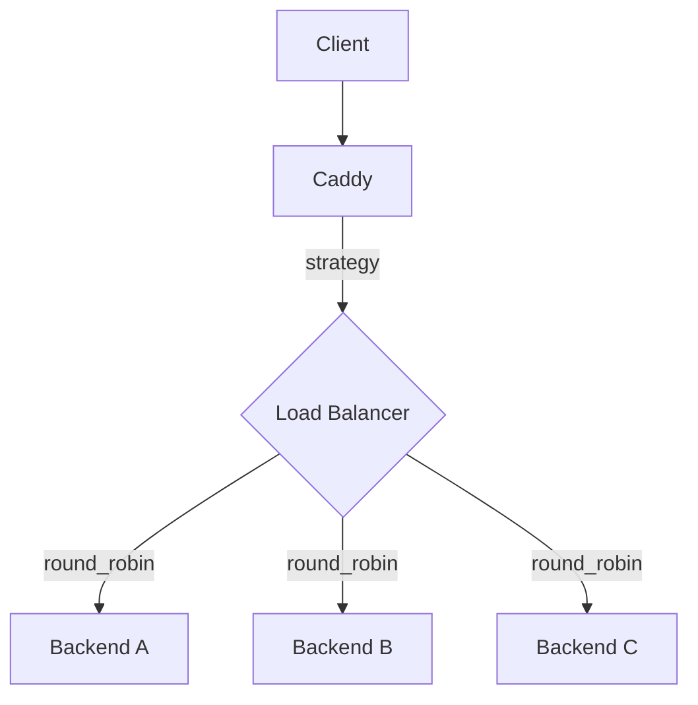
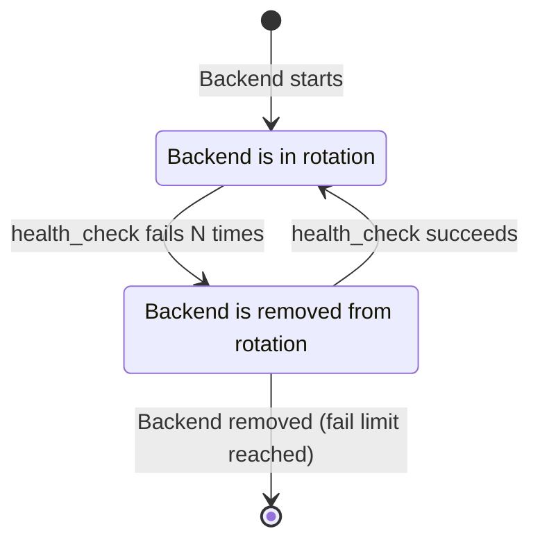
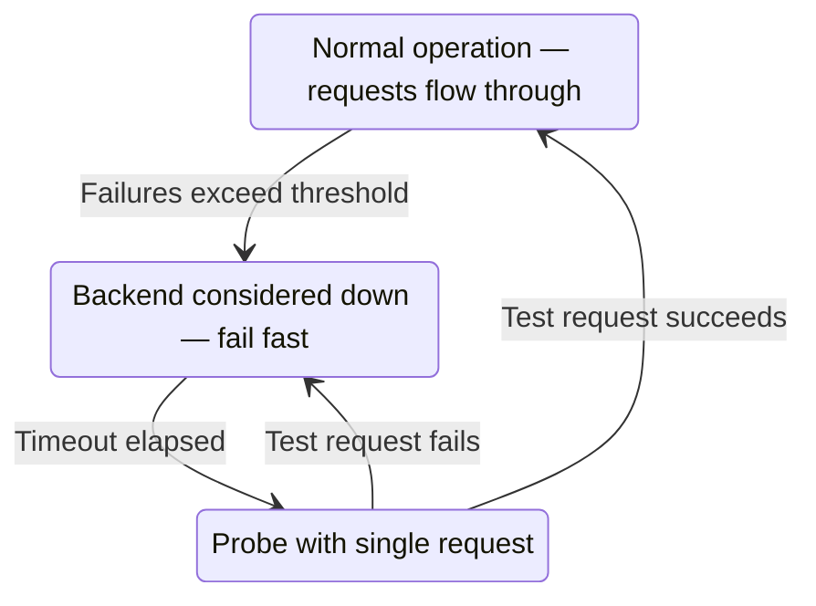

# 04 — Reverse Proxy & Load Balancing

## What Is a Reverse Proxy?

A **reverse proxy** sits between clients and backend servers. The client talks to Caddy; Caddy talks to the backend. From the client's perspective, Caddy **is** the server.

```
                   ┌──────────────────────────────────────┐
Internet           │           Caddy Server               │
                   │                                      │
Client ──HTTPS──→  │  ┌──────────────────────────────┐   │  ──HTTP──→  Backend A :3000
                   │  │   reverse_proxy module       │   │
Client ──HTTPS──→  │  │   - TLS termination          │   │  ──HTTP──→  Backend B :3001
                   │  │   - Load balancing           │   │
Client ──HTTPS──→  │  │   - Health checks            │   │  ──HTTP──→  Backend C :3002
                   │  │   - Header manipulation      │   │
                   │  └──────────────────────────────┘   │
                   └──────────────────────────────────────┘
```

This pattern is fundamental in modern architectures:
- **TLS Termination**: Backends get plain HTTP; Caddy handles encryption
- **Load Distribution**: Spread traffic across multiple instances
- **Health Filtering**: Route only to healthy backends
- **Observability**: Centralized logging and metrics

---

## Basic Reverse Proxy Setup

```
# Simplest case
api.example.com {
    reverse_proxy localhost:8080
}

# With explicit upstream block
api.example.com {
    reverse_proxy {
        to localhost:8080
    }
}

# Multiple backends
api.example.com {
    reverse_proxy localhost:8080 localhost:8081 localhost:8082
}
```

---

## Load Balancing Strategies



### Available Strategies

```
reverse_proxy localhost:8080 localhost:8081 localhost:8082 {
    lb_policy round_robin          # Default: equal distribution
}

reverse_proxy localhost:8080 localhost:8081 {
    lb_policy least_conn           # Fewest active connections (best for variable request times)
}

reverse_proxy localhost:8080 localhost:8081 {
    lb_policy random               # Random selection
}

reverse_proxy localhost:8080 localhost:8081 {
    lb_policy random_choose 2      # Pick 2 random, use least-conn among them
}

reverse_proxy localhost:8080 localhost:8081 {
    lb_policy first                # Always use first healthy (active-passive failover)
}

reverse_proxy localhost:8080 localhost:8081 {
    lb_policy ip_hash              # Same IP → same backend (sticky sessions)
}

reverse_proxy localhost:8080 localhost:8081 {
    lb_policy uri_hash             # Same URI → same backend (cache affinity)
}

reverse_proxy localhost:8080 localhost:8081 {
    lb_policy header X-User-ID     # Hash by header value
}

reverse_proxy localhost:8080 localhost:8081 {
    lb_policy cookie session_id    # Cookie-based sticky sessions
}
```

### Choosing a Strategy

```
┌────────────────────┬─────────────────────────────────────────────────┐
│ Strategy           │ Best For                                        │
├────────────────────┼─────────────────────────────────────────────────┤
│ round_robin        │ Homogeneous backends, similar request times     │
│ least_conn         │ Variable request durations (API, WebSocket)     │
│ ip_hash            │ Sticky sessions without a session store         │
│ cookie             │ Sticky sessions (more reliable than IP)         │
│ first              │ Active-passive HA (use backend B only if A down)│
│ random_choose 2    │ Power-of-two choices — good scalability         │
└────────────────────┴─────────────────────────────────────────────────┘
```

---

## Health Checks

Caddy continuously monitors backends and removes unhealthy ones from the rotation.



```
reverse_proxy localhost:8080 localhost:8081 {
    # Active health checks (Caddy polls backends)
    health_uri /health
    health_port 8080
    health_interval 10s
    health_timeout 5s
    health_status 200        # Expected HTTP status
    health_body "OK"         # Expected body content (substring match)

    # Passive health checks (detect failures from real traffic)
    fail_duration 30s        # Mark as unhealthy for 30s after failure
    max_fails 3              # Failures before marking unhealthy
    unhealthy_status 5xx     # Treat 5xx as failure
    unhealthy_latency 500ms  # Treat >500ms as failure
}
```

### Health Check Endpoint (Backend Side)

Your backend should implement:

```go
// Go example
http.HandleFunc("/health", func(w http.ResponseWriter, r *http.Request) {
    // Check DB connection, cache, etc.
    if err := db.Ping(); err != nil {
        w.WriteHeader(http.StatusServiceUnavailable)
        w.Write([]byte("DB unavailable"))
        return
    }
    w.WriteHeader(http.StatusOK)
    w.Write([]byte("OK"))
})
```

---

## Header Manipulation

Headers are critical for reverse proxy setups. Caddy provides fine-grained control.

### Headers Caddy Adds Automatically

```
X-Forwarded-For: <client IP>
X-Forwarded-Proto: https
X-Forwarded-Host: example.com
```

### Custom Header Configuration

```
reverse_proxy localhost:8080 {
    # Headers sent TO the backend
    header_up X-Real-IP {remote_host}
    header_up X-Request-ID {uuid}
    header_up Host {upstream_hostport}  # Preserve original Host header

    # Remove header before sending to backend
    header_up -Authorization

    # Headers sent back TO the client (modify response)
    header_down X-Powered-By ""         # Remove X-Powered-By
    header_down +X-Cache-Status HIT     # Add custom header

    # Trusted client IP addresses (for X-Forwarded-For)
    trusted_proxies 10.0.0.0/8 172.16.0.0/12
}
```

### Forwarding Real Client IPs

When behind another load balancer (e.g., AWS ALB → Caddy → App):

```
{
    servers {
        trusted_proxies static 10.0.0.0/8
    }
}

example.com {
    reverse_proxy localhost:8080 {
        header_up X-Real-IP {http.request.header.X-Forwarded-For}
    }
}
```

---

## HTTPS to Backend (End-to-End Encryption)

Caddy can forward to HTTPS backends:

```
# Proxy to HTTPS backend
reverse_proxy https://backend.internal:443 {
    transport http {
        tls_trusted_ca_certs /certs/internal-ca.pem
    }
}

# Or skip TLS verification (not recommended for production)
reverse_proxy https://backend.internal:443 {
    transport http {
        tls_insecure_skip_verify
    }
}
```

---

## WebSocket Proxying

Caddy handles WebSocket upgrades automatically — no special config needed:

```
# WebSocket proxying works out of the box
ws.example.com {
    reverse_proxy localhost:8080
}
```

For mixed HTTP and WebSocket on the same backend:

```
example.com {
    # WebSocket connections
    @ws {
        header Connection *Upgrade*
        header Upgrade websocket
    }
    reverse_proxy @ws localhost:8080

    # Regular HTTP
    reverse_proxy localhost:8080
}
```

---

## Buffering, Timeouts, and Retries

```
reverse_proxy localhost:8080 {
    transport http {
        # Connection pool
        dial_timeout 5s
        keepalive 30s
        keepalive_idle_conns 100

        # Read/write timeouts
        response_header_timeout 30s
        read_timeout 60s

        # Buffer request body (enables retry on failure)
        read_buffer 4096
        write_buffer 4096
    }

    # Retry on failure
    lb_retries 3
    lb_try_duration 5s
    lb_try_interval 250ms
}
```

---

## Circuit Breaker Pattern



Caddy's `fail_duration` + `max_fails` implements a circuit breaker:

```
reverse_proxy localhost:8080 localhost:8081 {
    fail_duration 1m      # Circuit stays open for 1 minute
    max_fails 5           # Open after 5 consecutive failures
    unhealthy_status 500 502 503 504
}
```

---

## Streaming and SSE (Server-Sent Events)

```
# Server-Sent Events require disabling buffering
example.com {
    reverse_proxy /events/* localhost:8080 {
        flush_interval -1   # Flush immediately (disable buffering)
    }

    reverse_proxy localhost:8080
}
```

---

## gRPC Proxying

```
grpc.example.com {
    reverse_proxy h2c://localhost:50051  # h2c = HTTP/2 cleartext (gRPC without TLS)
}
```

gRPC uses HTTP/2 for transport. Caddy terminates HTTPS and proxies to gRPC over h2c (unencrypted HTTP/2) to the backend.

---

## Real-World Example: Full API Gateway

```
{
    email ops@example.com
    admin localhost:2019
}

# Public API Gateway
api.example.com {
    log {
        output file /var/log/caddy/api-access.log
        format json
    }

    encode gzip zstd

    # Security headers
    header {
        -Server
        X-Content-Type-Options nosniff
        X-Frame-Options DENY
        Strict-Transport-Security "max-age=31536000"
    }

    # Rate limiting (requires caddy-ratelimit plugin)
    # rate_limit {
    #     zone api {
    #         key {remote_host}
    #         events 100
    #         window 1m
    #     }
    # }

    # Routing
    handle /v1/users/* {
        reverse_proxy users-svc:8001 users-svc-2:8001 {
            lb_policy least_conn
            health_uri /health
            health_interval 15s
            fail_duration 30s
        }
    }

    handle /v1/orders/* {
        reverse_proxy orders-svc:8002 {
            health_uri /health
        }
    }

    handle /v1/payments/* {
        # mTLS to payment service
        reverse_proxy https://payments-svc:8443 {
            transport http {
                tls_trusted_ca_certs /certs/internal-ca.pem
            }
        }
    }

    # WebSocket endpoint
    @ws {
        path /ws/*
        header Upgrade websocket
    }
    reverse_proxy @ws ws-svc:8080 {
        transport http {
            read_timeout 0  # No timeout for WebSocket connections
        }
    }

    handle {
        respond "API endpoint not found" 404
    }
}
```

---

## Performance Insight

From benchmarks (Caddy vs Nginx as reverse proxy, 1000 concurrent connections):

| Metric | Caddy | Nginx |
|--------|-------|-------|
| p50 latency | ~2ms | ~1.8ms |
| p95 latency | ~8ms | ~6ms |
| p99 latency | ~25ms | ~18ms |
| Throughput | ~65K req/s | ~78K req/s |
| Memory | ~32 MB | ~18 MB |

Caddy's ~20% overhead vs Nginx is irrelevant in most workloads where the database or application is the bottleneck. The operational simplicity (auto-HTTPS, live reload, REST API) justifies the tradeoff for the vast majority of deployments.

---

## Key Insight from Literature

> *Patterns of Enterprise Application Architecture* (Fowler) describes the **Gateway** pattern: a single entry point that handles cross-cutting concerns (auth, rate limiting, logging, TLS) so backends can stay simple.

Caddy's reverse proxy + middleware chain is a direct implementation of this pattern. Your Node.js or Go backends never need to handle TLS, certificate rotation, or HSTS — Caddy owns all of that.
