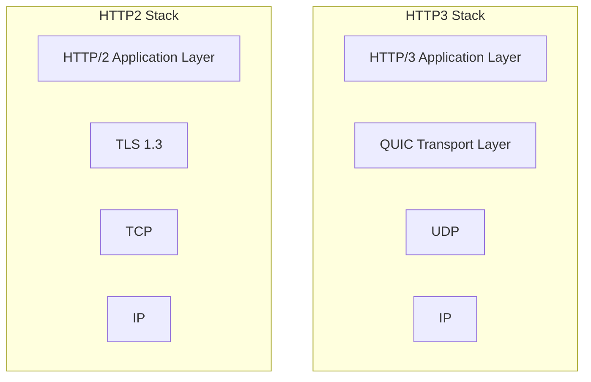
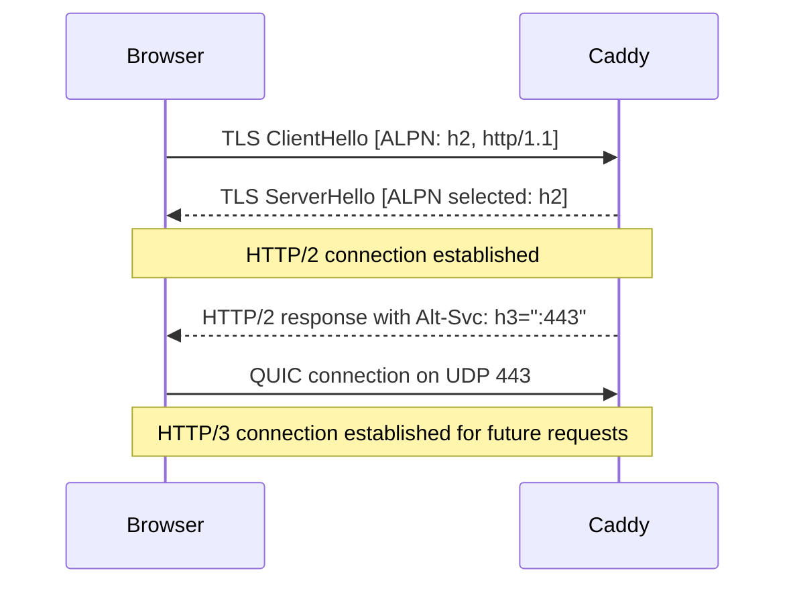
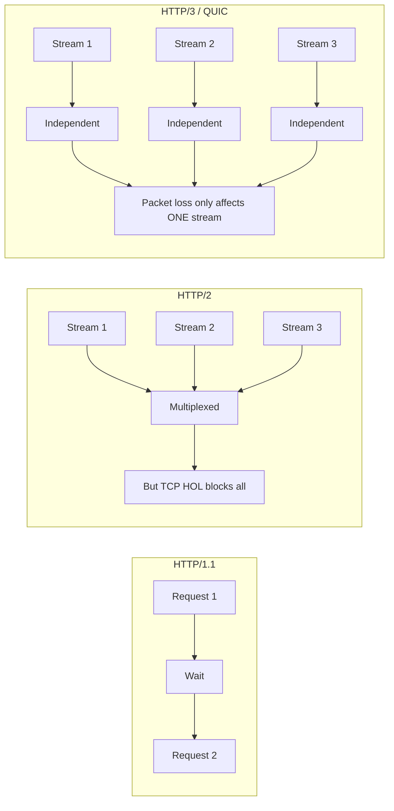

# 05 — HTTP/3 & Modern Protocols

## The Protocol Evolution

```
HTTP/1.0 (1996) → HTTP/1.1 (1997) → HTTP/2 (2015) → HTTP/3 (2022)
   TCP                TCP                TCP              UDP/QUIC
```

Caddy is one of the few general-purpose servers that supports all four versions natively, including being the **first stable server to enable HTTP/3 by default** (v2.6, 2022).

---

## HTTP/1.1 Limitations

HTTP/1.1, despite its pipelining feature, suffers from **head-of-line (HOL) blocking**:

```
Connection 1: Request A ──→ Response A ──→ Request B ──→ Response B
Connection 2: Request C ──→ Response C
Connection 3: Request D ──→ Response D

# Browsers open 6-8 TCP connections to work around this
```

Problems:
- Each connection = TCP handshake (1 RTT) + TLS handshake (1-2 RTT)
- HOL blocking: if packet for Request A is lost, B must wait
- Redundant headers in every request (no compression)

---

## HTTP/2 Improvements

HTTP/2 introduced multiplexing over a single TCP connection:

```
         ┌──────────────────────────────────┐
         │       Single TCP Connection      │
         │                                  │
Stream 1 │  ──[Req A]──────────[Res A]──▶  │
Stream 2 │  ────[Req B]──────[Res B]────▶  │
Stream 3 │  ──────[Req C]──[Res C]──────▶  │
         │                                  │
         └──────────────────────────────────┘
```

HTTP/2 benefits:
- Multiplexing (many requests over one TCP connection)
- Header compression (HPACK)
- Server push (send resources before client requests them)
- Binary framing (more efficient than text)

HTTP/2 remaining problem:
- **TCP-level HOL blocking**: A dropped packet blocks ALL streams on that TCP connection
- TCP is stateful — connection establishment is slow on mobile/lossy networks

---

## QUIC: The Transport Revolution

QUIC (Quick UDP Internet Connections) was designed by Google and standardized in RFC 9000 (2021). HTTP/3 runs on QUIC instead of TCP.



### QUIC Key Features

```
┌─────────────────────────────────────────────────────────┐
│ Feature              │ TCP+TLS       │ QUIC             │
├─────────────────────────────────────────────────────────┤
│ Connection setup     │ 1-3 RTT       │ 0-1 RTT          │
│ HOL blocking         │ Yes (TCP)     │ No (stream-level)│
│ Connection migration │ No            │ Yes (mobile!)    │
│ TLS                  │ Separate      │ Built-in (TLS1.3)│
│ Header compression   │ HPACK         │ QPACK            │
│ Encryption           │ Optional      │ Mandatory        │
│ Packet loss recovery │ Slow (TCP)    │ Fast (per-stream)│
└─────────────────────────────────────────────────────────┘
```

### Connection Migration

This is QUIC's killer feature for mobile users:

```
BEFORE QUIC (TCP):
  Phone on WiFi ──TCP conn──▶ Server
  [User moves to 4G]
  TCP connection DROPS — new TCP+TLS handshake required (1-3 RTT)

WITH QUIC:
  Phone on WiFi ──QUIC conn (Connection ID: abc123)──▶ Server
  [User moves to 4G, IP changes]
  QUIC maintains connection using Connection ID — no interruption!
```

### 0-RTT Connection Resumption

```
First connection:
  Client ──── Initial + ClientHello ────▶ Server  (1 RTT)
  Client ◀─── ServerHello + cert + Finished ───── Server
  Client ──── Finished + HTTP request ──▶ Server  (1 RTT handshake complete)

Resumed connection (0-RTT):
  Client ──── Initial + 0-RTT data (HTTP request) ──▶ Server  (0 RTT!)
  Server processes request immediately
```

> ⚠️ **0-RTT Security Note**: 0-RTT is vulnerable to replay attacks. Never use 0-RTT for non-idempotent requests (POST, DELETE). Caddy's HTTP/3 implementation handles this correctly.

---

## HTTP/3 in Caddy

Caddy enables HTTP/3 **automatically** when TLS is configured. No extra config needed.

```
# Automatically enables HTTP/3
example.com {
    reverse_proxy localhost:3000
}
```

Under the hood, Caddy:
1. Creates a QUIC listener on UDP port 443
2. Creates TCP listeners on ports 80 and 443 (for HTTP/1.1 and HTTP/2)
3. Sends `Alt-Svc` header to advertise HTTP/3 support:
   ```
   Alt-Svc: h3=":443"; ma=2592000
   ```
4. Browser connects via HTTP/1.1 or HTTP/2 first, sees Alt-Svc, upgrades to HTTP/3

### Disabling HTTP/3

```
{
    servers {
        protocols h1 h2   # Only HTTP/1.1 and HTTP/2
    }
}
```

### HTTP/3 Only (experimental)

```
{
    servers {
        protocols h3
    }
}
```

---

## quic-go: Caddy's QUIC Library

Caddy uses the [quic-go](https://github.com/quic-go/quic-go) library, the most mature QUIC implementation in Go. It supports:
- RFC 9000 (QUIC), RFC 9001 (QUIC+TLS), RFC 9002 (QUIC Loss Detection)
- RFC 9114 (HTTP/3)
- RFC 9204 (QPACK — HTTP/3 header compression)
- Unreliable datagrams (RFC 9221) — for gaming, real-time media
- WebTransport (draft-ietf-webtrans-http3)

---

## WebTransport

WebTransport is a new API built on HTTP/3 that enables bidirectional, multiplexed communication between browsers and servers — a better WebSocket over QUIC.

```
WebSocket problems:
  - TCP-level HOL blocking
  - Single stream only
  - No connection migration

WebTransport advantages:
  - Multiple independent streams over one QUIC connection
  - Bidirectional streams (like WebSocket)
  - Unidirectional streams
  - Datagrams (unreliable, low-latency — for gaming/VoIP)
  - Connection migration (works on mobile)
```

Caddy's quic-go library exposes WebTransport capabilities. Real-world use: SSH3 (SSH over QUIC via HTTP/3) and Hysteria (high-speed proxy using QUIC).

---

## HTTPS and Protocol Negotiation

When a browser connects to Caddy, the protocol negotiation happens via ALPN (Application-Layer Protocol Negotiation) in the TLS handshake:



---

## Firewall Considerations

HTTP/3 uses **UDP port 443**. Many corporate firewalls block UDP.

```
Scenario: Corporate firewall blocks UDP 443
Result: Browser cannot connect via QUIC
Fallback: Browser uses TCP 443 (HTTP/2 or HTTP/1.1)
Impact: None (graceful degradation works correctly)
```

Caddy's fallback handling is automatic — if UDP 443 is blocked, clients use TCP 443 seamlessly.

---

## Real-World Performance Impact of HTTP/3

Improvements are most significant in:
- **High packet-loss networks** (mobile, satellite) — QUIC's per-stream loss recovery vs TCP's all-streams block
- **Mobile networks** — connection migration means no re-handshake when switching WiFi/4G
- **Cold connections** — 0-RTT or 1-RTT vs TCP's 1-3 RTT
- **Many small files** — multiplexing without HOL blocking (loading many JS/CSS files)

Improvement is minimal for:
- Low-latency, reliable networks (same datacenter)
- Long-running connections (already amortized handshake cost)
- Large file downloads (throughput-bound, not latency-bound)

Google's research on QUIC showed **~5% improvement in page load time** for average users and **~30% for users in the 75th percentile** (poor network conditions).

---

## HTTP/2 Push (Deprecated)

HTTP/2 Server Push allowed proactively sending resources (CSS, JS) before the browser asked. Caddy supported it but it was:
- Removed from Chrome in 2022
- Proved ineffective in practice (cache poisoning, poor cache-hit coordination)

Modern replacement: Use `103 Early Hints` or `Link: rel=preload` headers instead.

```
# Early Hints (Caddy supports this)
header Link "</style.css>; rel=preload; as=style, </app.js>; rel=preload; as=script"
```

---

## Summary: Protocol Comparison



Caddy gives you all three simultaneously, automatically selecting the best protocol for each client.
