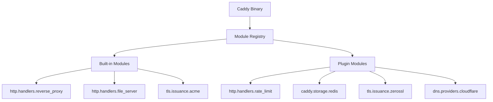

# 07 — Plugins & Module System

## The Module Architecture

Every single feature in Caddy — HTTP handlers, matchers, TLS issuers, storage backends, loggers — is a **module**. Caddy's "standard library" is just a set of built-in modules. You extend Caddy by adding more modules.



---

## Module Naming Convention

Module IDs follow a hierarchical namespace:

```
{namespace}.{type}.{name}

Examples:
  http.handlers.reverse_proxy     → HTTP middleware handler
  http.handlers.file_server       → Static file handler
  http.matchers.host              → Host-based route matcher
  http.matchers.path              → Path-based route matcher
  tls.issuance.acme               → ACME cert issuer
  tls.issuance.internal           → Internal CA cert issuer
  caddy.storage.file_system       → Filesystem cert storage
  caddy.storage.redis             → Redis cert storage
  caddy.listeners.tls             → TLS listener
  http.encoders.gzip              → Gzip response encoder
  http.encoders.zstd              → Zstandard encoder
  http.authentication.providers.http_basic → HTTP Basic auth
```

---

## xcaddy: The Plugin Build Tool

You cannot add plugins at runtime — Caddy plugins are compiled in. The `xcaddy` tool makes this easy:

```bash
# Install xcaddy
go install github.com/caddyserver/xcaddy/cmd/xcaddy@latest

# Build Caddy with Cloudflare DNS plugin
xcaddy build --with github.com/caddy-dns/cloudflare

# Build with multiple plugins
xcaddy build \
  --with github.com/caddy-dns/cloudflare \
  --with github.com/mholt/caddy-ratelimit \
  --with github.com/greenpau/caddy-security \
  --with github.com/sjtug/caddy2-explorer

# Build specific Caddy version
xcaddy build v2.7.5 --with github.com/caddy-dns/cloudflare

# Build with local replacement module (for development)
xcaddy build --with github.com/my-org/my-plugin=./local-plugin
```

---

## Popular Community Plugins

### DNS Providers (for DNS-01 ACME challenge / wildcard certs)

```
github.com/caddy-dns/cloudflare      → Cloudflare
github.com/caddy-dns/route53         → AWS Route53
github.com/caddy-dns/digitalocean    → DigitalOcean
github.com/caddy-dns/namecheap       → Namecheap
github.com/caddy-dns/porkbun         → Porkbun
github.com/caddy-dns/hetzner         → Hetzner
github.com/caddy-dns/gandi           → Gandi
# 50+ more at https://github.com/caddy-dns
```

### Security & Auth

```
github.com/greenpau/caddy-security   → OAuth2, SAML, OpenID Connect, MFA
github.com/mholt/caddy-ratelimit     → Rate limiting (token bucket, sliding window)
github.com/hslatman/caddy-crowdsec   → CrowdSec integration (crowdsourced IPs)
github.com/RussellLuo/caddy-ext/...  → Request validation, JWT auth
```

### Storage Backends

```
github.com/pberkel/caddy-storage-redis    → Redis cert storage
github.com/lucaslorentz/caddy-s3-proxy    → S3 proxy + S3 storage
github.com/ss098/certmagic-s3            → S3 cert storage
github.com/gamalan/caddy-tlsredis        → Redis TLS storage
```

### Observability

```
github.com/greenpau/caddy-trace          → Request tracing
github.com/fvbommel/caddy-combine-ip     → Combine proxy headers for logging
github.com/dunglas/vulcain               → HTTP/2 push + preloading
```

### Advanced Handlers

```
github.com/mholt/caddy-webdav            → WebDAV file server
github.com/mholt/caddy-l4               → Layer 4 (TCP/UDP) routing
github.com/mholt/caddy-dynamicdns        → Dynamic DNS updater
github.com/caddyserver/forwardproxy      → Forward proxy (Shadowsocks-like)
github.com/sjtug/caddy2-explorer         → File browser UI
github.com/nicholasgasior/caddy-git      → Git repo webhooks
```

---

## Writing a Custom Module

Let's build a simple custom handler module that adds a request ID to every request.

### Step 1: Project Setup

```bash
mkdir caddy-request-id
cd caddy-request-id
go mod init github.com/myorg/caddy-request-id
go get github.com/caddyserver/caddy/v2
```

### Step 2: Implement the Module

```go
// requestid.go
package requestid

import (
    "net/http"

    "github.com/caddyserver/caddy/v2"
    "github.com/caddyserver/caddy/v2/modules/caddyhttp"
    "go.uber.org/zap"
)

func init() {
    caddy.RegisterModule(RequestIDHandler{})
}

// RequestIDHandler adds a unique request ID to each request.
type RequestIDHandler struct {
    Header string `json:"header,omitempty"` // Header name to set
    logger *zap.Logger
}

// CaddyModule implements caddy.Module.
func (RequestIDHandler) CaddyModule() caddy.ModuleInfo {
    return caddy.ModuleInfo{
        ID:  "http.handlers.request_id",
        New: func() caddy.Module { return new(RequestIDHandler) },
    }
}

// Provision implements caddy.Provisioner.
func (h *RequestIDHandler) Provision(ctx caddy.Context) error {
    h.logger = ctx.Logger(h)
    if h.Header == "" {
        h.Header = "X-Request-ID"
    }
    return nil
}

// Validate implements caddy.Validator.
func (h RequestIDHandler) Validate() error {
    if h.Header == "" {
        return fmt.Errorf("header name cannot be empty")
    }
    return nil
}

// ServeHTTP implements caddyhttp.MiddlewareHandler.
func (h RequestIDHandler) ServeHTTP(w http.ResponseWriter, r *http.Request, next caddyhttp.Handler) error {
    id := caddy.NewReplacer().ReplaceAll("{uuid}", "")
    r.Header.Set(h.Header, id)
    w.Header().Set(h.Header, id)

    h.logger.Debug("assigned request ID", zap.String("id", id), zap.String("path", r.URL.Path))

    return next.ServeHTTP(w, r)
}

// Interface guards — compile-time checks that interfaces are implemented
var (
    _ caddy.Provisioner           = (*RequestIDHandler)(nil)
    _ caddy.Validator             = (*RequestIDHandler)(nil)
    _ caddyhttp.MiddlewareHandler = (*RequestIDHandler)(nil)
)
```

### Step 3: Build with xcaddy

```bash
xcaddy build --with github.com/myorg/caddy-request-id=./
```

### Step 4: Use in Caddyfile

```
example.com {
    request_id {
        header X-Request-ID
    }
    reverse_proxy localhost:8080
}
```

Or in JSON:

```json
{
  "handle": [
    {
      "handler": "request_id",
      "header": "X-Request-ID"
    },
    {
      "handler": "reverse_proxy",
      "upstreams": [{"dial": "localhost:8080"}]
    }
  ]
}
```

---

## Module Lifecycle Interfaces

Caddy modules can implement optional lifecycle interfaces:

```go
// Provisioner — called after module is loaded, before serving
type Provisioner interface {
    Provision(Context) error
}

// Validator — called after provisioning to validate config
type Validator interface {
    Validate() error
}

// CleanerUpper — called when module is unloaded (e.g., config reload)
type CleanerUpper interface {
    Cleanup() error
}

// Destructor — called when Caddy is shutting down
// (use for releasing resources like file handles, DB connections)
type Destructor interface {
    Destruct() error
}
```

---

## Writing a Custom Storage Backend

CertMagic (Caddy's TLS storage) accepts custom storage backends:

```go
package redisstorage

import (
    "github.com/caddyserver/caddy/v2"
    "github.com/caddyserver/certmagic"
    "github.com/redis/go-redis/v9"
)

type RedisStorage struct {
    Address  string `json:"address"`
    Password string `json:"password"`
    DB       int    `json:"db"`
    client   *redis.Client
}

func (r *RedisStorage) CaddyModule() caddy.ModuleInfo {
    return caddy.ModuleInfo{
        ID:  "caddy.storage.redis",
        New: func() caddy.Module { return new(RedisStorage) },
    }
}

func (r *RedisStorage) Provision(ctx caddy.Context) error {
    r.client = redis.NewClient(&redis.Options{
        Addr:     r.Address,
        Password: r.Password,
        DB:       r.DB,
    })
    return nil
}

// Implements certmagic.Storage interface
func (r *RedisStorage) Store(key string, value []byte) error {
    return r.client.Set(ctx, key, value, 0).Err()
}

func (r *RedisStorage) Load(key string) ([]byte, error) {
    return r.client.Get(ctx, key).Bytes()
}

func (r *RedisStorage) Delete(key string) error {
    return r.client.Del(ctx, key).Err()
}

func (r *RedisStorage) Exists(key string) bool {
    return r.client.Exists(ctx, key).Val() > 0
}

func (r *RedisStorage) List(prefix string, recursive bool) ([]string, error) {
    return r.client.Keys(ctx, prefix+"*").Result()
}

func (r *RedisStorage) Stat(key string) (certmagic.KeyInfo, error) {
    // ...
}

func (r *RedisStorage) Lock(ctx context.Context, name string) error {
    // Distributed lock implementation
}

func (r *RedisStorage) Unlock(ctx context.Context, name string) error {
    // ...
}
```

Use in Caddyfile:
```
{
    storage redis {
        address redis:6379
        password {env.REDIS_PASSWORD}
        db 0
    }
}
```

---

## The caddy-security Plugin (Deep Dive)

`caddy-security` is the most feature-rich auth plugin, providing:
- Local user database
- OAuth2 / OpenID Connect (Google, GitHub, Azure AD, Okta)
- SAML
- Multi-factor authentication (TOTP, WebAuthn/FIDO2)
- Role-based access control (RBAC)
- JWT validation

```
# Caddyfile with Google OAuth2
{
    security {
        oauth identity provider google {
            realm google
            driver google
            client_id {env.GOOGLE_CLIENT_ID}
            client_secret {env.GOOGLE_CLIENT_SECRET}
        }

        authentication portal myportal {
            crypto default token lifetime 3600
            enable identity provider google
            cookie domain example.com
        }

        authorization policy mypolicy {
            set auth url https://auth.example.com/
            allow roles admin editor
        }
    }
}

auth.example.com {
    authenticate with myportal
}

app.example.com {
    authorize with mypolicy
    reverse_proxy localhost:3000
}
```

---

## Plugin Development Best Practices

1. **Use interface guards**: `var _ caddy.Provisioner = (*MyModule)(nil)` catches missing method implementations at compile time
2. **Log with structured fields**: Use `zap.String("key", value)` not `fmt.Sprintf`
3. **Provision resources, not config**: Heavy setup (DB connections, file handles) in `Provision()`, not `New()`
4. **Clean up in Cleanup()**: Release resources when config is hot-reloaded
5. **Use `ctx.Logger(h)`**: Gets a logger scoped to your module with automatic fields
6. **Test with integration tests**: Use `caddytest` package for full Caddy integration tests

```go
// Integration test example
func TestMyHandler(t *testing.T) {
    tester := caddytest.NewTester(t)
    tester.InitServer(`
        localhost {
            my_handler {
                option value
            }
            respond "OK"
        }
    `, "caddyfile")
    tester.AssertGetResponse("https://localhost/", 200, "OK")
}
```
