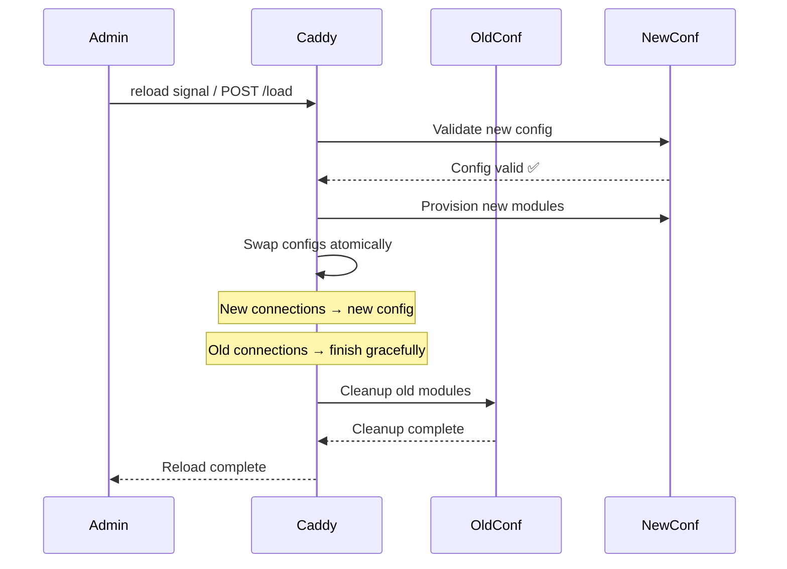

# 08 — Real-World Deployment

## Installation

### Linux (Recommended: Official Package)

```bash
# Ubuntu/Debian
sudo apt install -y debian-keyring debian-archive-keyring apt-transport-https curl
curl -1sLf 'https://dl.cloudsmith.io/public/caddy/stable/gpg.key' | sudo gpg --dearmor -o /usr/share/keyrings/caddy-stable-archive-keyring.gpg
curl -1sLf 'https://dl.cloudsmith.io/public/caddy/stable/debian.deb.txt' | sudo tee /etc/apt/sources.list.d/caddy-stable.list
sudo apt update
sudo apt install caddy

# RHEL/Fedora
sudo yum install yum-utils
sudo yum-config-manager --add-repo https://copr.fedorainfracloud.org/coprs/g/caddy/caddy/repo/epel-8/
sudo yum install caddy

# macOS
brew install caddy

# Arch Linux
pacman -S caddy
```

### Direct Binary Download

```bash
# Download specific version
curl -L "https://github.com/caddyserver/caddy/releases/latest/download/caddy_linux_amd64.tar.gz" | tar -xz
chmod +x caddy
sudo mv caddy /usr/local/bin/
```

---

## systemd Service (Production Linux)

```ini
# /etc/systemd/system/caddy.service
[Unit]
Description=Caddy
Documentation=https://caddyserver.com/docs/
After=network.target network-online.target
Requires=network-online.target

[Service]
Type=notify
User=caddy
Group=caddy
ExecStart=/usr/bin/caddy run --environ --config /etc/caddy/Caddyfile
ExecReload=/usr/bin/caddy reload --config /etc/caddy/Caddyfile --force
TimeoutStopSec=5s
LimitNOFILE=1048576
PrivateTmp=true
ProtectSystem=full
AmbientCapabilities=CAP_NET_BIND_SERVICE  # Allow binding to ports < 1024 as non-root

[Install]
WantedBy=multi-user.target
```

```bash
# Enable and start
sudo systemctl enable --now caddy

# Zero-downtime reload
sudo systemctl reload caddy

# View logs
journalctl -u caddy -f

# Check status
sudo systemctl status caddy
```

### Key systemd Options Explained

- `Type=notify`: Caddy signals systemd when it's ready (proper readiness detection)
- `AmbientCapabilities=CAP_NET_BIND_SERVICE`: Allow non-root user to bind port 80/443
- `LimitNOFILE=1048576`: Allow 1M file descriptors (needed for high connection counts)
- `ProtectSystem=full`: Security hardening — prevents writing to /usr, /boot, /etc

---

## Docker Deployment

### Basic Docker Setup

```bash
# Run Caddy in Docker with a Caddyfile
docker run -d \
  --name caddy \
  -p 80:80 \
  -p 443:443 \
  -p 443:443/udp \           # HTTP/3 uses UDP
  -v $(pwd)/Caddyfile:/etc/caddy/Caddyfile:ro \
  -v caddy_data:/data \       # Cert storage (persist this!)
  -v caddy_config:/config \   # Config storage
  caddy:latest
```

> ⚠️ **Critical**: Always mount a persistent volume to `/data`. This is where Caddy stores TLS certificates. If this volume is lost, Caddy has to obtain new certificates and may hit rate limits.

### Docker Compose (Recommended)

```yaml
# docker-compose.yml
version: "3.9"

services:
  caddy:
    image: caddy:2-alpine
    restart: unless-stopped
    ports:
      - "80:80"
      - "443:443"
      - "443:443/udp"   # HTTP/3
    volumes:
      - ./Caddyfile:/etc/caddy/Caddyfile:ro
      - ./site:/srv:ro
      - caddy_data:/data
      - caddy_config:/config
    environment:
      - DOMAIN=example.com
      - EMAIL=admin@example.com
    networks:
      - web

  app:
    image: my-app:latest
    restart: unless-stopped
    networks:
      - web
    # NOT exposed to host — only Caddy can reach it

networks:
  web:
    external: false

volumes:
  caddy_data:
    external: true   # Ensure data persists across compose down/up
  caddy_config:
```

```
# Caddyfile for Docker Compose
{$DOMAIN} {
    reverse_proxy app:3000
}
```

### Custom Docker Image with Plugins

```dockerfile
# Dockerfile
FROM caddy:2-builder AS builder

RUN xcaddy build \
    --with github.com/caddy-dns/cloudflare \
    --with github.com/mholt/caddy-ratelimit

FROM caddy:2-alpine

COPY --from=builder /usr/bin/caddy /usr/bin/caddy
```

```bash
docker build -t my-caddy:latest .
```

---

## Kubernetes Deployment

### Ingress Controller: caddy-ingress-controller

```bash
# Install via Helm
helm repo add caddy https://caddyserver.github.io/ingress/
helm install caddy caddy/caddy-ingress-controller \
  --namespace caddy \
  --create-namespace \
  --set ingressController.config.email=admin@example.com
```

```yaml
# ingress.yaml
apiVersion: networking.k8s.io/v1
kind: Ingress
metadata:
  name: my-app
  annotations:
    kubernetes.io/ingress.class: caddy
spec:
  rules:
    - host: example.com
      http:
        paths:
          - path: /
            pathType: Prefix
            backend:
              service:
                name: my-app-service
                port:
                  number: 3000
```

### Manual Kubernetes Deployment

```yaml
# caddy-deployment.yaml
apiVersion: apps/v1
kind: Deployment
metadata:
  name: caddy
  namespace: default
spec:
  replicas: 2
  selector:
    matchLabels:
      app: caddy
  template:
    metadata:
      labels:
        app: caddy
    spec:
      containers:
        - name: caddy
          image: caddy:2-alpine
          ports:
            - containerPort: 80
            - containerPort: 443
          volumeMounts:
            - name: caddyfile
              mountPath: /etc/caddy/Caddyfile
              subPath: Caddyfile
            - name: caddy-data
              mountPath: /data
          env:
            - name: ACME_EMAIL
              valueFrom:
                secretKeyRef:
                  name: caddy-secrets
                  key: acme-email
          resources:
            requests:
              memory: "128Mi"
              cpu: "100m"
            limits:
              memory: "512Mi"
              cpu: "500m"
          readinessProbe:
            httpGet:
              path: /health
              port: 2019
            initialDelaySeconds: 5
            periodSeconds: 10
          livenessProbe:
            httpGet:
              path: /health
              port: 2019
            initialDelaySeconds: 15
            periodSeconds: 20
      volumes:
        - name: caddyfile
          configMap:
            name: caddy-config
        - name: caddy-data
          persistentVolumeClaim:
            claimName: caddy-data-pvc
---
apiVersion: v1
kind: ConfigMap
metadata:
  name: caddy-config
data:
  Caddyfile: |
    {
        email {$ACME_EMAIL}
        storage redis {
            address redis-service:6379
        }
    }
    
    example.com {
        reverse_proxy app-service:3000
    }
```

### Kubernetes + Redis Storage for Multi-Replica

When running multiple Caddy replicas, they must share TLS certificate storage:

```yaml
# Use Redis for shared cert storage
{
    storage redis {
        address redis-service:6379
        password {env.REDIS_PASSWORD}
        db 0
    }
}
```

This ensures all replicas use the same certificates — no duplicated ACME requests, no rate limit issues.

---

## Zero-Downtime Reload

Caddy's graceful reload is one of its best operational features:

```bash
# Signal-based reload (systemd)
sudo systemctl reload caddy
# Internally: caddy reload --config /etc/caddy/Caddyfile

# Manual reload
caddy reload --config /etc/caddy/Caddyfile

# API-based reload (works for dynamically managed configs)
curl -X POST http://localhost:2019/load \
  -H "Content-Type: application/json" \
  -d @caddy.json
```

### What Happens During Reload



Key guarantees:
- **Zero dropped connections**: Existing connections complete normally
- **Atomic swap**: No moment where config is partially applied
- **Rollback on failure**: If new config fails to provision, old config stays active
- **In-flight ACME tasks are cancelled**: Rate limit aware (batch changes to avoid this)

---

## Logging in Production

### Structured JSON Logging

```
{
    log {
        output file /var/log/caddy/caddy.log {
            roll_size 100mb
            roll_keep 10
            roll_keep_for 720h  # 30 days
        }
        format json
        level INFO
    }
}

example.com {
    log {
        output file /var/log/caddy/example.com-access.log
        format json {
            time_format iso8601
        }
        # Log these fields
        include http.request.method
        include http.request.uri
        include http.response.status
        include http.response.size
        include duration
        include http.request.remote_addr
    }
}
```

### Log Shipping with Vector/Fluentd

```yaml
# vector.yaml — ship Caddy JSON logs to Elasticsearch
sources:
  caddy_logs:
    type: file
    include:
      - /var/log/caddy/*.log
    read_from: beginning

transforms:
  parse_json:
    type: remap
    inputs: [caddy_logs]
    source: '. = parse_json!(.message)'

sinks:
  elasticsearch:
    type: elasticsearch
    inputs: [parse_json]
    endpoint: https://elasticsearch:9200
    index: caddy-logs-%Y.%m.%d
```

---

## Monitoring with Prometheus

```
# Enable Prometheus metrics
{
    metrics {
        per_host
    }
}
```

Caddy exposes metrics at `http://localhost:2019/metrics` in Prometheus format:

```
# Key metrics to alert on:
caddy_http_requests_total              # Request rate
caddy_http_request_duration_seconds   # Latency histogram
caddy_http_active_requests            # Current in-flight requests
caddy_tls_handshakes_total           # TLS handshake rate
caddy_tls_active_handshakes          # Current TLS handshakes
```

```yaml
# prometheus.yml
scrape_configs:
  - job_name: caddy
    static_configs:
      - targets: ['caddy:2019']
    metrics_path: /metrics
```

### Grafana Dashboard

Import Caddy's official Grafana dashboard (ID: 14280) for:
- Request rate and error rate
- Latency percentiles (p50, p95, p99)
- Active connections
- TLS cert expiry alerts
- Memory and CPU usage

---

## Real-World Case Studies

### Case Study 1: Startup — Replace Nginx + Certbot

**Before**: Nginx + Certbot cron + manual renewal reminders + 3 config files per service

**After**: Single Caddyfile, zero cert management, one-command deploy

```
Result:
- 80% reduction in config lines
- Zero cert-expiry incidents
- 2-minute server setup vs 30 minutes
- HTTP/3 enabled automatically
```

### Case Study 2: SaaS — On-Demand TLS at Scale

For SaaS platforms where each customer gets a custom domain (e.g., `customer.saas.com`):

```
{
    on_demand_tls {
        ask http://localhost:9000/check-domain
        interval 2m
        burst 5
    }
}

:443 {
    tls {
        on_demand
    }
    reverse_proxy localhost:3000
}
```

Your backend at `:9000/check-domain?domain=customer.saas.com` returns 200 if the domain is valid, 403 otherwise. Caddy fetches a cert the **first time** a customer's domain connects.

Used by: Vercel, Netlify, and similar platforms.

### Case Study 3: Internal Network — Zero-Trust HTTPS

For internal services with mutual TLS:

```
{
    pki {
        ca internal {
            name "MyCompany Internal CA"
        }
    }
}

internal-api.corp {
    tls internal
    tls {
        client_auth {
            mode require_and_verify
            trusted_ca_cert_file /certs/corp-ca.pem
        }
    }
    reverse_proxy localhost:8080
}
```

All internal services get HTTPS with client cert verification — no Let's Encrypt needed, no public internet exposure.

---

## Environment-Specific Deployments

```bash
# Development
caddy run --config Caddyfile.dev --adapter caddyfile

# Staging
DOMAIN=staging.example.com caddy run --config Caddyfile

# Production with custom storage
DOMAIN=example.com \
ACME_EMAIL=ops@example.com \
REDIS_ADDR=redis:6379 \
caddy run --config Caddyfile
```

```
# Caddyfile — environment-aware
{
    email {$ACME_EMAIL:admin@localhost}
    
    # Use staging CA if CADDY_ENV=dev
    # (handled by separate Caddyfile.dev)
}

{$DOMAIN:localhost} {
    reverse_proxy {$BACKEND_ADDR:localhost:3000}
}
```
