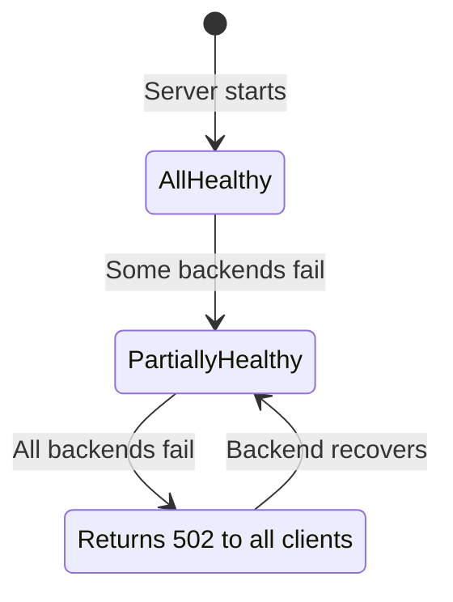
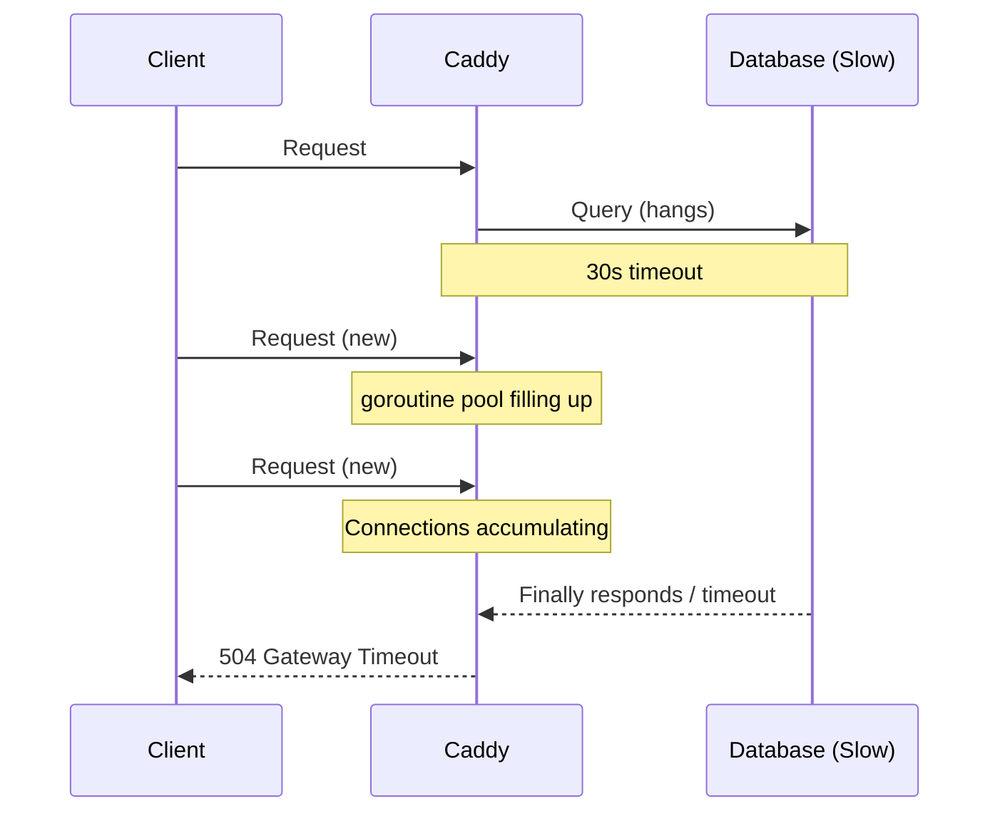

# 09 — Edge Cases & Failure Modes

## The Failure Taxonomy

When Caddy fails, failures fall into five categories:

```
┌─────────────────────────────────────────────────────────────┐
│ 1. Certificate Failures    — ACME/CA issues                 │
│ 2. Config Failures         — Bad Caddyfile, reload errors   │
│ 3. Backend Failures        — Upstream unavailable           │
│ 4. Resource Failures       — OOM, FD limits, GC pressure    │
│ 5. Network Failures        — Port conflicts, firewall       │
└─────────────────────────────────────────────────────────────┘
```

---

## 1. Certificate Failure Modes

### ACME Rate Limit Hit

**Symptom**: `certificate obtain error: ...too many certificates already issued`

```
Cause: More than 50 certificates issued for the same registered domain in a week
       OR more than 5 duplicate certificate orders

Recovery:
1. Check Let's Encrypt rate limit dashboard: https://tools.letsdns.org/
2. Wait for rate limit window to reset (usually 1 week)
3. Use ZeroSSL as backup CA (Caddy does this automatically by default)
4. Use staging CA for testing:
   { acme_ca https://acme-staging-v02.api.letsencrypt.org/directory }

Prevention:
- Never do frequent config reloads with new domain names
- Use staging CA during development
- Use on_demand_tls carefully (each new domain = new cert)
```

### HTTP-01 Challenge Failure

**Symptom**: `challenge failed: connection refused` or `challenge timeout`

```
Cause: Port 80 is blocked by firewall, or behind another proxy
       that doesn't forward /.well-known/acme-challenge/ correctly

Diagnosis:
  curl http://example.com/.well-known/acme-challenge/test
  # Should return 404 (Caddy serves the challenge file dynamically)
  # If connection refused: port 80 is blocked

Recovery options:
1. Open port 80 in firewall
2. Switch to TLS-ALPN-01 challenge:
   { acme_challenges tls-alpn }
3. Switch to DNS-01 challenge (wildcard, bypasses HTTP):
   { acme_dns cloudflare {env.CF_TOKEN} }
4. If behind another proxy, ensure it forwards port 80 to Caddy
```

### Certificate Storage Corruption

**Symptom**: `failed to load certificate: ...pem decode failed`

```
Recovery:
  # Stop Caddy
  sudo systemctl stop caddy

  # Inspect the broken cert file
  ls -la ~/.local/share/caddy/certificates/

  # Remove corrupted cert (Caddy will re-obtain on next start)
  rm -rf ~/.local/share/caddy/certificates/acme-v02.api.letsencrypt.org-directory/example.com/

  # Start Caddy
  sudo systemctl start caddy
```

### Clock Skew / TLS Certificate Validity

**Symptom**: `certificate not valid yet` or `certificate has expired` (even freshly obtained)

```
Cause: System clock is incorrect

Diagnosis:
  timedatectl status  # Check time sync status
  date -u             # Check UTC time

Fix:
  sudo timedatectl set-ntp true
  sudo systemctl restart systemd-timesyncd
```

### Let's Encrypt OCSP Responder Down

**Symptom**: Slow TLS handshakes (OCSP staple fetch fails)

```
Caddy behavior: Gracefully omits OCSP staple rather than blocking
Client behavior: Falls back to OCSP check against CA (adds ~100ms latency)
Impact: Minor latency increase, no outage

Caddy automatically retries OCSP staple fetch in background
```

---

## 2. Configuration Failure Modes

### Failed Config Reload

**Symptom**: `caddy reload` exits with non-zero status

```
Caddy behavior: Keeps serving old config (no downtime)
                New config is REJECTED, never applied

Diagnosis:
  caddy validate --config /etc/caddy/Caddyfile

Common causes:
  - Syntax error in Caddyfile
  - Unknown directive name (missing plugin)
  - Invalid upstream address
  - Port conflict
```

### Config Adapter Mismatch

**Symptom**: `unrecognized config format; ensure --adapter flag is set`

```
Fix: Specify adapter explicitly
  caddy run --config /etc/caddy/Caddyfile --adapter caddyfile

Or use the file extension convention:
  - Caddyfile (no extension) → automatic caddyfile adapter
  - caddy.json → automatic JSON
  - caddy.yaml → requires --adapter yaml
```

### Admin API Disabled in Production

**Symptom**: `connection refused` when trying to use Admin API

```
This is intentional if you set:
  { admin off }

To enable for ops use:
  { admin localhost:2019 }  # Only accessible from localhost

NEVER expose admin API to internet!
  { admin 0.0.0.0:2019 }   # ← DANGEROUS
```

---

## 3. Backend Failure Modes

### All Upstreams Unhealthy

**Symptom**: Clients receive `502 Bad Gateway`



```
Caddy behavior: Returns 502 immediately (no queuing or circuit breaking by default)
                Health checks continue — will auto-restore when backend recovers

Configuration to mitigate:
reverse_proxy localhost:8080 localhost:8081 {
    # Keep trying for 30 seconds before giving up
    lb_try_duration 30s
    lb_try_interval 500ms

    # Passive failure detection
    fail_duration 30s
    max_fails 3
}
```

### Connection Refused to Backend

**Symptom**: `502 Bad Gateway` immediately

```
Diagnosis:
  curl -v http://localhost:8080  # Test backend directly

Common causes:
  - Backend process crashed
  - Wrong port configured
  - Docker service not started
  - Backend only listens on specific interface

In Docker Compose:
  reverse_proxy app:3000  # Use service name, not localhost
  # 'localhost' in Caddy container ≠ app container
```

### Backend Timeout Cascade

**Symptom**: Latency spike → connection pool exhaustion → 502s



```
Prevention:
reverse_proxy localhost:8080 {
    transport http {
        response_header_timeout 10s   # Fail fast
        read_timeout 30s
    }
    
    # Don't hold connections indefinitely
    unhealthy_latency 5s
}
```

---

## 4. Resource Failure Modes

### File Descriptor Exhaustion

**Symptom**: `too many open files` in logs; new connections fail

```
Diagnosis:
  cat /proc/$(pgrep caddy)/limits | grep "Max open files"
  lsof -p $(pgrep caddy) | wc -l

Each connection uses 1-2 FDs. With 100K concurrent connections → need 200K+ FDs

Fix:
  # /etc/security/limits.conf
  caddy soft nofile 1000000
  caddy hard nofile 1000000

  # Or in systemd service
  LimitNOFILE=1048576
```

### Out of Memory

**Symptom**: Caddy process killed by OOM killer (`dmesg | grep oom`)

```
Memory breakdown:
  - Go runtime baseline: ~15 MB
  - Each goroutine: ~2 KB
  - TLS cert cache: ~1 KB per cert
  - Response buffers: variable

With 10K connections: ~20 MB for goroutines + baseline = ~35 MB minimum

Fix: 
  # Set GOMEMLIMIT to stay under system memory
  Environment=GOMEMLIMIT=512MiB

  # Or add swap (Go GC works well with swap unlike C programs)
  sudo fallocate -l 2G /swapfile
  sudo chmod 600 /swapfile
  sudo mkswap /swapfile
  sudo swapon /swapfile
```

### GC Pressure Under Load

**Symptom**: Periodic latency spikes (1-10ms) under high load

```
Diagnosis:
  GODEBUG=gctrace=1 caddy run 2>&1 | grep gc

Tuning:
  # Reduce GC frequency (use more memory)
  GOGC=200

  # Limit heap (forces GC before hitting system limit)
  GOMEMLIMIT=1GiB

  # Enable GC-friendly logging (avoids allocations in hot path)
  # Caddy uses zap — already allocation-free in production
```

---

## 5. Network Failure Modes

### Port Already in Use

**Symptom**: `bind: address already in use` on startup

```
Diagnosis:
  sudo ss -tlnp | grep ':80\|:443'
  sudo lsof -i :80
  sudo lsof -i :443

Common culprits:
  - Another Caddy instance (zombie process)
  - nginx/apache still running
  - Docker port binding conflict

Fix:
  sudo systemctl stop nginx
  sudo kill -9 $(lsof -t -i:80)
  # Then start Caddy
```

### Firewall Blocking UDP 443 (HTTP/3)

**Symptom**: HTTP/3 never used; clients always fall back to HTTP/2

```
Diagnosis:
  curl -I --http3 https://example.com  # Should show HTTP/3
  
  # Check if UDP 443 is open
  sudo ufw status
  sudo iptables -L INPUT -n

Fix:
  sudo ufw allow 443/udp
  sudo iptables -A INPUT -p udp --dport 443 -j ACCEPT

Note: HTTP/3 failure is GRACEFUL — clients fall back to HTTP/2 automatically
```

### DNS Challenge Not Working

**Symptom**: Wildcard cert fails; `DNS propagation verification failed`

```
Causes:
  1. API token doesn't have DNS edit permissions
  2. DNS propagation delay (can take up to 60 seconds)
  3. Wrong zone ID or account ID configured

Debug:
  # Test token manually
  curl -X GET "https://api.cloudflare.com/client/v4/zones" \
    -H "Authorization: Bearer {CF_API_TOKEN}"

  # Check if TXT record was created
  dig TXT _acme-challenge.example.com @8.8.8.8

Fix: Increase DNS propagation wait in Caddy config
  tls {
      dns cloudflare {env.CF_TOKEN}
      propagation_timeout 5m  # Wait up to 5 minutes for DNS propagation
  }
```

---

## Debugging Toolkit

### Caddy's Built-in Debug Mode

```bash
# Verbose logging
caddy run --config Caddyfile --watch 2>&1 | tee caddy-debug.log

# Check current config
curl -s http://localhost:2019/config/ | jq .

# Check loaded modules
curl -s http://localhost:2019/pki/ca/ | jq .

# Check cert status
curl -s http://localhost:2019/config/apps/tls | jq .

# Force cert renewal
curl -X POST "http://localhost:2019/config/apps/tls/certificates/autorenew" \
  -H "Content-Type: application/json" \
  -d '{"subjects": ["example.com"]}'
```

### TLS Inspection

```bash
# Check what cert Caddy is serving
openssl s_client -connect example.com:443 -servername example.com 2>/dev/null | \
  openssl x509 -noout -text | grep -A2 "Validity\|Subject\|Issuer"

# Check OCSP stapling
openssl s_client -connect example.com:443 -status 2>/dev/null | grep "OCSP Response"

# Test HTTP/3
curl -IL --http3 https://example.com

# Test TLS versions
nmap --script ssl-enum-ciphers -p 443 example.com
```

### Performance Debugging

```bash
# Real-time request count
watch -n1 'curl -s http://localhost:2019/metrics | grep caddy_http_active'

# Goroutine dump (detect goroutine leaks)
curl http://localhost:2019/debug/pprof/goroutine?debug=2 | head -100

# Memory profile
go tool pprof http://localhost:2019/debug/pprof/heap
```

---

## Common Configuration Mistakes

```
Mistake 1: Using 'localhost' as upstream in Docker
  ❌  reverse_proxy localhost:3000   (points to Caddy container)
  ✅  reverse_proxy app:3000         (points to app container by service name)

Mistake 2: Not persisting cert storage volume
  ❌  docker run -v ./data:/data     (lost on host OS reinstall)
  ✅  docker volume create caddy_data
      docker run -v caddy_data:/data (named volume, persists)

Mistake 3: Exposing admin API publicly
  ❌  { admin 0.0.0.0:2019 }         (anyone can change your config!)
  ✅  { admin localhost:2019 }        (localhost only)
  ✅  { admin off }                   (disabled in high-security environments)

Mistake 4: Testing with production CA
  ❌  Using Let's Encrypt for staging/testing
  ✅  { acme_ca https://acme-staging-v02.api.letsencrypt.org/directory }

Mistake 5: Wrong directive order (before knowing about Caddy's order)
  ❌  Assuming directives run top-to-bottom
  ✅  Use `route { }` block if you need explicit ordering

Mistake 6: Missing UDP port for HTTP/3
  ❌  -p 443:443                      (TCP only, no HTTP/3)
  ✅  -p 443:443 -p 443:443/udp       (TCP + UDP for HTTP/3)

Mistake 7: Wildcard cert without DNS challenge
  ❌  *.example.com { ... }           (fails — HTTP-01 can't validate wildcards)
  ✅  *.example.com {
          tls { dns cloudflare {env.CF_TOKEN} }
      }
```

---

## Monitoring Checklist for Production

```
Alerts to configure:
  □ cert_expiry < 14 days          (emergency — renewal should happen at 30 days)
  □ error_rate > 1%                (backend or config issues)
  □ p99_latency > 2s               (backend slow or connection pool exhausted)
  □ active_connections > 90% max   (FD limits approaching)
  □ memory > 80% limit             (approaching OOM)
  □ disk_usage (/data) > 80%       (cert storage filling up — unlikely but monitor)

Health check endpoints to expose:
  /health    → 200 OK (backend health)
  /metrics   → Prometheus metrics (localhost:2019)
  /config    → Current config (localhost:2019, for ops tooling)
```

---

## Key Insight from Literature

> *The Pragmatic Programmer* (Hunt & Thomas) advocates for "tracer bullets" — thin, end-to-end implementations that let you see if the system works before investing heavily. 

When deploying Caddy, start with the minimal configuration (one domain, one upstream), verify HTTPS works end-to-end, then layer in complexity (rate limiting, mTLS, DNS challenge). Debugging a minimal setup is orders of magnitude easier than debugging a fully configured production system from the start.
