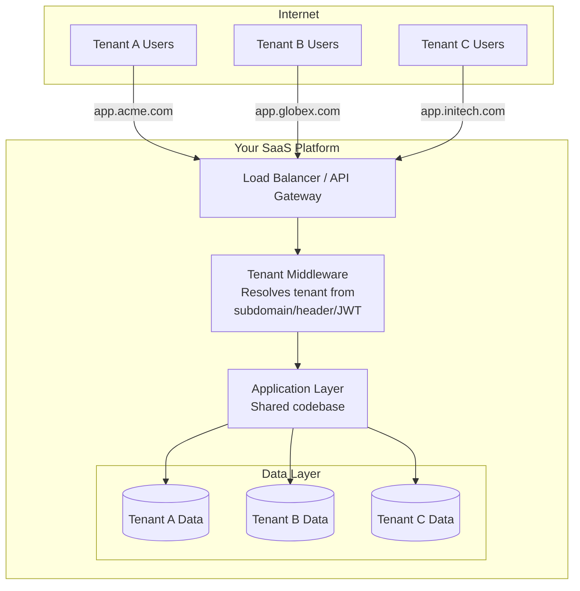

# Module 1 — What Is Multi-Tenancy?

## Learning Objectives

- Define multi-tenancy and understand why it exists
- Distinguish multi-tenancy from single-tenancy deployments
- Understand the SaaS business model alignment with multi-tenancy

## Core Concept

A **tenant** is a customer, organization, or user group that uses your software as a discrete, isolated unit. **Multi-tenancy** means a single deployed instance of your application (code + infrastructure) serves many such tenants simultaneously, while each tenant believes it is using a dedicated system.

Think of it like an apartment building:

- The building (infrastructure) is shared.
- Each flat (tenant) has private space (data, config).
- Neighbors cannot see into each other's flats (isolation).
- One janitor (ops team) maintains all flats simultaneously (operational efficiency).

## Single-Tenancy vs. Multi-Tenancy

| Dimension                    | Single-Tenant             | Multi-Tenant              |
| ---------------------------- | ------------------------- | ------------------------- |
| Deployment                   | One instance per customer | One instance, N customers |
| Cost per customer            | High (dedicated infra)    | Low (shared infra)        |
| Isolation                    | Hardware-level by default | Must be designed-in       |
| Customization                | Easy (isolated codebase)  | Hard (shared codebase)    |
| Operations complexity        | N × complexity            | \~Constant complexity     |
| Data residency control       | Natural                   | Requires routing logic    |
| Time-to-onboard new customer | Slow (provision)          | Fast (register + config)  |

## Why This Matters for SaaS

The entire economics of SaaS are built on **amortizing infrastructure costs across many customers**. At 10 tenants, the cost savings are minor. At 10,000 tenants, the operational advantage is enormous. This is why Salesforce, HubSpot, Jira, and virtually every B2B SaaS product uses multi-tenant architecture.

> **From Patterns of Enterprise Application Architecture (Fowler):** "A hosted application should try to keep the number of running instances to a minimum, because each instance requires operational overhead."

## Architecture Overview Diagram

