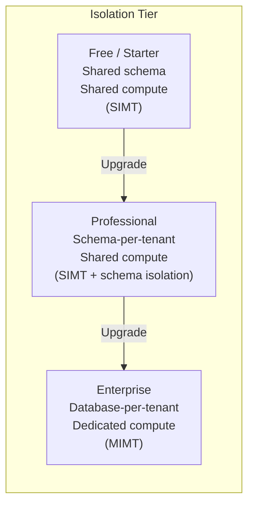

# Module 2 — Tenancy Models & Trade-Offs

## Learning Objectives

- Understand the two primary deployment models: SIMT and MIMT
- Know when to choose which model
- Understand tiered isolation for different customer segments

## Model 1: Single-Instance Multi-Tenant (SIMT)

One running process serves all tenants. Tenant isolation is enforced **in code** (database queries, middleware, access control).

**Characteristics:**

- Lowest cost per tenant
- Highest operational efficiency
- Weakest isolation guarantee
- Harder to customize per tenant
- "Noisy neighbor" risk is highest

**Best for:** B2B SaaS with SMB customers, freemium products, internal tools

## Model 2: Multi-Instance Multi-Tenant (MIMT)

Each tenant (or tier of tenants) gets a dedicated runtime instance, but the **codebase is still shared**.

**Characteristics:**

- Higher cost per tenant
- Strong isolation (process-level)
- Easier per-tenant customization
- Simpler compliance (data never co-mingles at runtime)
- Can deploy different versions per tenant ("version pinning")

**Best for:** Enterprise SaaS, regulated industries (fintech, healthcare), customers with strict SLAs

## The Tiered Isolation Pattern (Industry Standard 2025)

Most mature SaaS companies use a **tiered model** — different isolation levels for different customer segments:

| Tier         | Database Isolation        | Compute Isolation | Cost per Tenant | Target Segment   |
| ------------ | ------------------------- | ----------------- | --------------- | ---------------- |
| Free/Starter | Shared schema (row-level) | Shared pod        | \~$0.01/mo      | SMB, self-serve  |
| Professional | Schema-per-tenant         | Shared pod        | \~$0.10/mo      | Growth companies |
| Enterprise   | Database-per-tenant       | Dedicated pod/VM  | \~$5–50/mo      | Large orgs       |

> **Insight from Salesforce:** Salesforce's original Shared Everything model (one DB, shared tables with a TenantID column) allowed them to scale to 150,000+ customers. Their "silo" model for regulated customers came later.
