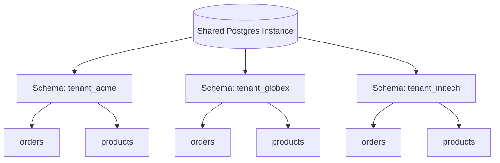
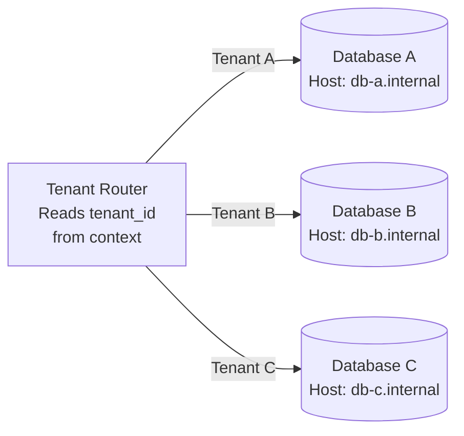
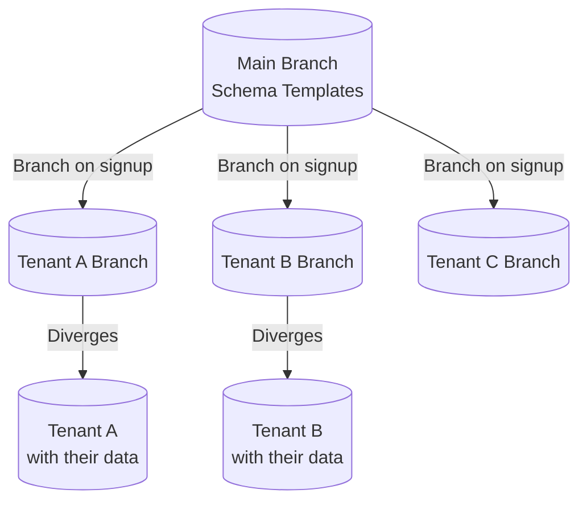

# Module 3 — Database Isolation Strategies

## Learning Objectives

- Understand the four main database isolation strategies in depth
- Know the migration path between strategies
- Implement row-level security in Postgres

## Strategy 1: Shared Schema (Row-Level Isolation)

All tenants share the same tables. Every row has a `tenant_id` column. Application code filters every query by `tenant_id`.

```sql
-- Example schema
CREATE TABLE orders (
    id          UUID PRIMARY KEY DEFAULT gen_random_uuid(),
    tenant_id   UUID NOT NULL REFERENCES tenants(id),
    customer_id UUID NOT NULL,
    total       DECIMAL(10, 2),
    created_at  TIMESTAMPTZ DEFAULT NOW()
);

CREATE INDEX idx_orders_tenant ON orders(tenant_id);
```

**Critical: Row-Level Security (Postgres)**

Never rely on application-layer filtering alone. Use Postgres RLS as a defense-in-depth layer:

```sql
-- Enable RLS on the table
ALTER TABLE orders ENABLE ROW LEVEL SECURITY;
ALTER TABLE orders FORCE ROW LEVEL SECURITY;

-- Policy: users can only see their tenant's rows
CREATE POLICY tenant_isolation ON orders
    USING (tenant_id = current_setting('app.current_tenant_id')::UUID);

-- Set the tenant context per connection/transaction
SET app.current_tenant_id = 'abc123-...';
```

**Pros:**

- Simplest to implement and operate
- Lowest infrastructure cost
- Schema migrations run once, apply to all tenants

**Cons:**

- Single DB is a performance bottleneck and SPOF
- A missing `WHERE tenant_id = ?` leaks data across tenants
- Cannot restore a single tenant's data without full DB restore
- One noisy tenant degrades all others

---

## Strategy 2: Schema-Per-Tenant

Each tenant gets a dedicated Postgres **schema** (namespace) within a shared database instance.

```sql
-- On tenant creation
CREATE SCHEMA tenant_abc123;

-- Tables are created inside that schema
CREATE TABLE tenant_abc123.orders (
    id          UUID PRIMARY KEY,
    customer_id UUID NOT NULL,
    total       DECIMAL(10, 2)
    -- No tenant_id column needed!
);

-- Point the search path to the tenant's schema
SET search_path TO tenant_abc123, public;
```



**Pros:**

- No `tenant_id` columns needed; no risk of cross-tenant leaks via missing WHERE clause
- Can restore a single tenant's schema independently
- Natural namespace separation — easier to reason about
- Can still share connection pool (PgBouncer with `search_path` setting)

**Cons:**

- Schema migrations must run N times (once per tenant schema)
- Postgres has practical limits \~1000–10,000 schemas per DB before performance degrades
- Connection routing complexity increases

---

## Strategy 3: Database-Per-Tenant

Each tenant has a completely separate database instance (or cluster).



**Pros:**

- Maximum isolation — a breach in one DB cannot affect others
- Independent backups, restores, and scaling per tenant
- Easier compliance (GDPR right-to-erasure is just `DROP DATABASE`)
- Can use different DB versions/configurations per tenant

**Cons:**

- Highest cost and operational overhead
- Must maintain a "tenant registry" that maps tenant IDs to connection strings
- Connection pool explosion (100 tenants × 10 connections = 1,000 DB connections)
- Cross-tenant analytics requires data warehousing or federation

**Tenant Registry Pattern:**

```typescript
// A central registry that maps tenants to their DB connection strings
interface TenantConfig {
  tenantId: string;
  dbConnectionString: string;
  dbRegion: string;
  tier: 'free' | 'pro' | 'enterprise';
}

// Cached in Redis to avoid hitting the registry DB on every request
class TenantRegistry {
  async getConfig(tenantId: string): Promise<TenantConfig> {
    const cached = await this.redis.get(`tenant:${tenantId}`);
    if (cached) return JSON.parse(cached);
    const config = await this.registryDb.findOne({ tenantId });
    await this.redis.setex(`tenant:${tenantId}`, 300, JSON.stringify(config));
    return config;
  }
}
```

---

## Strategy 4: Serverless Branch-Per-Tenant (Emerging 2025)

Platforms like **Neon** (Postgres) and **Turso** (SQLite/libSQL) enable creating isolated database branches or replicas per tenant near-instantly.

- **Neon:** Copy-on-write branching — a new branch shares storage with the parent until it diverges. Near-zero cost for idle tenants.
- **Turso:** SQLite database per tenant deployed to the edge (200+ PoPs). Near-zero latency for single-tenant reads.



## Comparison Summary

| Strategy            | Isolation          | Cost           | Migration Complexity | Best For                  |
| ------------------- | ------------------ | -------------- | -------------------- | ------------------------- |
| Shared Schema + RLS | Low (app-enforced) | Very Low       | Low (runs once)      | B2C, SMB, early-stage     |
| Schema-per-tenant   | Medium             | Low            | Medium (N schemas)   | Mid-market SaaS           |
| Database-per-tenant | High               | High           | High (N databases)   | Enterprise, regulated     |
| Branch-per-tenant   | High               | Near-zero idle | Low (automated)      | Edge, modern cloud-native |
