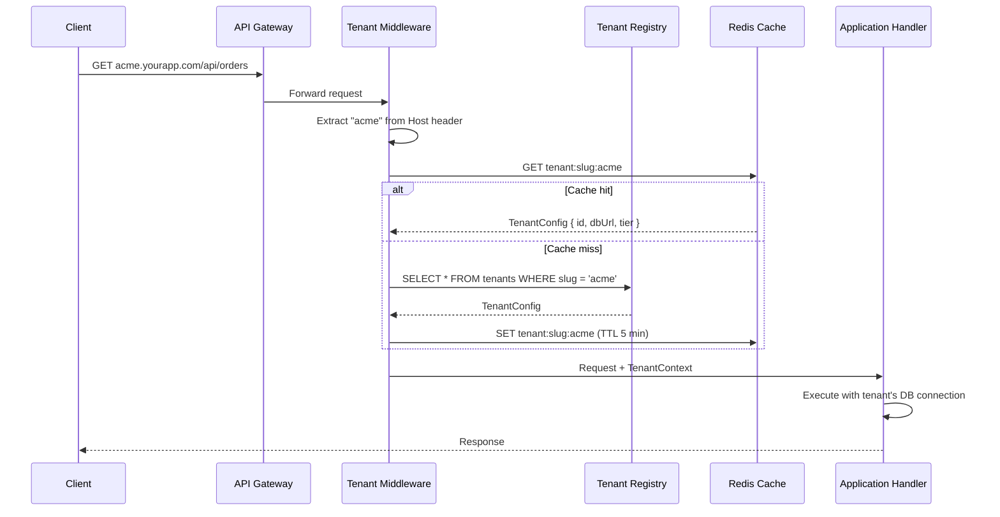

# Module 4 — Tenant Identity, Routing & Middleware

## Learning Objectives

- Understand the three common tenant identification strategies
- Implement tenant-aware middleware in Node.js/NestJS
- Use AsyncLocalStorage for safe concurrent tenant context propagation

## Tenant Identification Strategies

**1. Subdomain-Based**

```
acme.yourapp.com       → tenant: acme
globex.yourapp.com     → tenant: globex
```

Most common for B2B SaaS. Requires wildcard DNS (`*.yourapp.com`) and wildcard TLS cert.

**2. Path-Based**

```
yourapp.com/t/acme/dashboard    → tenant: acme
```

Simpler DNS setup. Less "white-label" feel.

**3. Header-Based (API)**

```
X-Tenant-ID: acme-tenant-uuid
```

Common for API-only SaaS, mobile apps, or server-to-server communication.

**4. JWT Claims**

```json
{
  "sub": "user-uuid",
  "tenant_id": "acme-uuid",
  "tenant_slug": "acme"
}
```

Best for stateless APIs — tenant context travels with every authenticated request.

---

## The Tenant Resolution Flow



---

## NestJS Implementation

**Tenant Middleware (subdomain resolution):**

```typescript
// tenant.middleware.ts
import { Injectable, NestMiddleware, UnauthorizedException } from '@nestjs/common';
import { Request, Response, NextFunction } from 'express';
import { TenantService } from './tenant.service';

@Injectable()
export class TenantMiddleware implements NestMiddleware {
  constructor(private readonly tenantService: TenantService) {}

  async use(req: Request, res: Response, next: NextFunction) {
    const host = req.hostname; // e.g. "acme.yourapp.com"
    const slug = host.split('.')[0];

    if (!slug || slug === 'www') {
      throw new UnauthorizedException('Tenant not identified');
    }

    const tenant = await this.tenantService.resolveBySlug(slug);
    if (!tenant) throw new UnauthorizedException(`Unknown tenant: ${slug}`);

    // Attach to request for downstream use
    req['tenant'] = tenant;
    next();
  }
}
```

**AsyncLocalStorage for concurrent-safe context (Node.js):**

The critical issue: Node.js handles many requests concurrently. A global variable `currentTenantId` would be shared and overwritten across concurrent requests. Use `AsyncLocalStorage` instead:

```typescript
// tenant-context.ts
import { AsyncLocalStorage } from 'async_hooks';

export interface TenantContext {
  tenantId: string;
  slug: string;
  tier: 'free' | 'pro' | 'enterprise';
  dbConnectionString?: string;
}

export const tenantStorage = new AsyncLocalStorage<TenantContext>();

// Helper accessor
export function getCurrentTenant(): TenantContext {
  const ctx = tenantStorage.getStore();
  if (!ctx) throw new Error('No tenant context — called outside request scope');
  return ctx;
}

// In middleware, wrap the call chain
export function runWithTenantContext<T>(
  context: TenantContext,
  fn: () => T
): T {
  return tenantStorage.run(context, fn);
}
```

**Custom Decorator for Controllers:**

```typescript
// current-tenant.decorator.ts
import { createParamDecorator, ExecutionContext } from '@nestjs/common';

export const CurrentTenant = createParamDecorator(
  (data: unknown, ctx: ExecutionContext) => {
    const request = ctx.switchToHttp().getRequest();
    return request.tenant;
  }
);

// Usage in controller
@Get('orders')
getOrders(@CurrentTenant() tenant: Tenant) {
  return this.ordersService.findAll(tenant.id);
}
```
