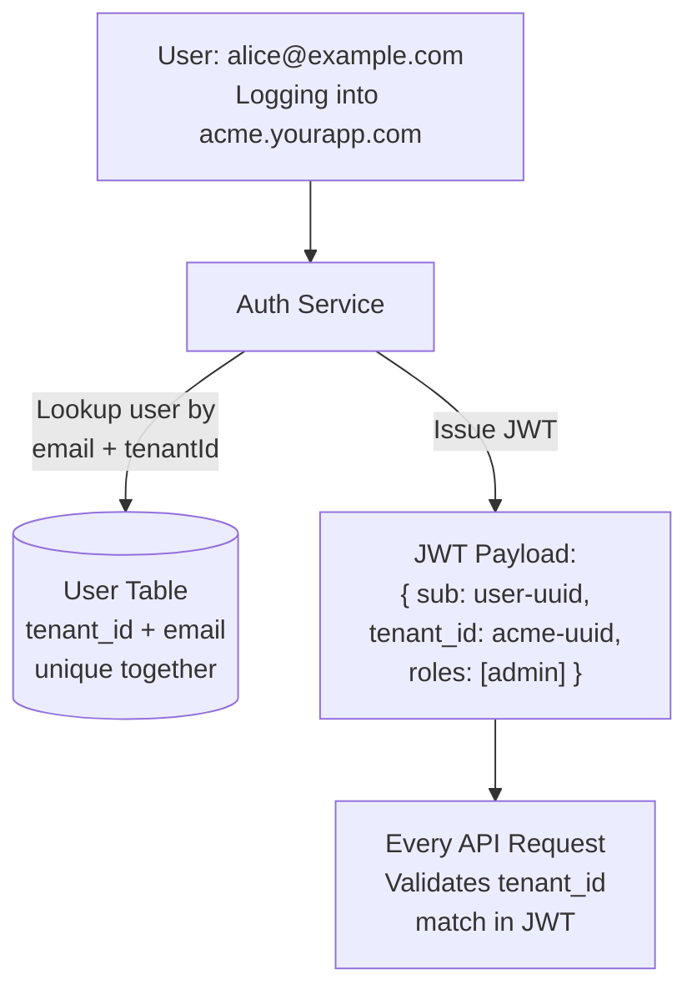

# Module 5 — Authentication & Authorization

## Learning Objectives

- Design tenant-scoped authentication
- Implement Role-Based Access Control (RBAC) within tenant boundaries
- Understand the difference between tenant-level and user-level permissions

## Authentication Architecture

Each tenant should have its own authentication namespace. A user's identity is always **scoped to a tenant** — `user@acme.com` logging into `acme.yourapp.com` is a different identity than the same email at `globex.yourapp.com`.



**Users table design:**

```sql
CREATE TABLE users (
    id          UUID PRIMARY KEY DEFAULT gen_random_uuid(),
    tenant_id   UUID NOT NULL REFERENCES tenants(id),
    email       TEXT NOT NULL,
    password_hash TEXT NOT NULL,
    created_at  TIMESTAMPTZ DEFAULT NOW(),
    
    -- Email must be unique PER TENANT, not globally
    UNIQUE (tenant_id, email)
);
```

## RBAC Within Tenants

Each tenant can define their own roles. A typical schema:

```sql
CREATE TABLE tenant_roles (
    id          UUID PRIMARY KEY,
    tenant_id   UUID NOT NULL,
    name        TEXT NOT NULL, -- 'admin', 'manager', 'viewer'
    permissions JSONB NOT NULL DEFAULT '[]'
);

CREATE TABLE user_roles (
    user_id UUID REFERENCES users(id),
    role_id UUID REFERENCES tenant_roles(id),
    PRIMARY KEY (user_id, role_id)
);
```

**Permission check guard (NestJS):**

```typescript
@Injectable()
export class PermissionsGuard implements CanActivate {
  constructor(private reflector: Reflector) {}

  canActivate(context: ExecutionContext): boolean {
    const required = this.reflector.get<string[]>('permissions', context.getHandler());
    if (!required) return true;

    const { user, tenant } = context.switchToHttp().getRequest();
    
    // Ensure user belongs to the tenant from the route
    if (user.tenantId !== tenant.id) return false;

    return required.every(perm => user.permissions.includes(perm));
  }
}
```

## Super-Admin vs. Tenant-Admin

| Role                   | Scope         | Can Do                                            |
| ---------------------- | ------------- | ------------------------------------------------- |
| Super-Admin (Platform) | All tenants   | Manage tenant accounts, billing, impersonation    |
| Tenant-Admin           | Single tenant | Manage users within their org, configure settings |
| Tenant-User            | Single tenant | Access features per their role                    |

**Danger:** Super-admins should only be able to impersonate a tenant user **with an audit log** and ideally with a time-limited session. Unaudited impersonation is a major compliance risk.
