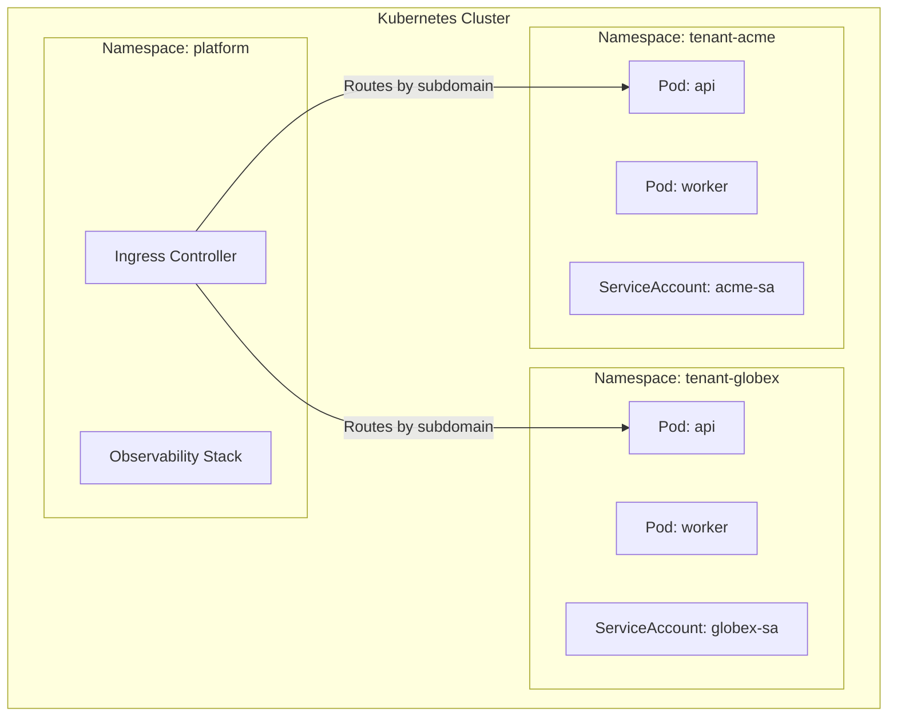

# Module 7 — Infrastructure & Kubernetes Multi-Tenancy

## Learning Objectives

- Configure Kubernetes namespaces for tenant isolation
- Apply ResourceQuotas and NetworkPolicies
- Understand soft vs. hard multi-tenancy in K8s

## Kubernetes Isolation Levels

**Soft Multi-Tenancy (namespace-per-team):**

- Tenants are internal teams or trusted partners
- Namespace isolation + RBAC
- Suitable when all tenants are within the same organization

**Hard Multi-Tenancy (namespace-per-customer):**

- Tenants are external customers with no mutual trust
- Requires: Namespaces + ResourceQuotas + NetworkPolicies + PodSecurityStandards
- For highest isolation: gVisor or Kata Containers (VM-level isolation per pod)



## ResourceQuota per Namespace

```yaml
# resource-quota-tenant.yaml
apiVersion: v1
kind: ResourceQuota
metadata:
  name: tenant-quota
  namespace: tenant-acme
spec:
  hard:
    requests.cpu: "2"
    requests.memory: 4Gi
    limits.cpu: "4"
    limits.memory: 8Gi
    pods: "20"
    persistentvolumeclaims: "5"
```

## NetworkPolicy (Zero-Trust Isolation)

```yaml
# network-policy-tenant.yaml
apiVersion: networking.k8s.io/v1
kind: NetworkPolicy
metadata:
  name: tenant-isolation
  namespace: tenant-acme
spec:
  podSelector: {}           # applies to all pods in namespace
  policyTypes:
    - Ingress
    - Egress
  ingress:
    - from:
        - namespaceSelector:
            matchLabels:
              name: tenant-acme   # only allow intra-namespace traffic
        - namespaceSelector:
            matchLabels:
              name: platform      # allow platform ingress controller
  egress:
    - to:
        - namespaceSelector:
            matchLabels:
              name: tenant-acme
        - namespaceSelector:
            matchLabels:
              name: platform
```

## Noisy Neighbor Prevention

The most dangerous Kubernetes multi-tenancy failure is a single tenant consuming all cluster resources. Layers of defense:

1. **ResourceQuota** — hard limits on CPU/memory/pods per namespace
2. **LimitRange** — default and max resource limits on individual pods
3. **PriorityClass** — assign lower priority to free-tier tenant workloads
4. **HorizontalPodAutoscaler** — autoscale per-tenant with tenant-scoped metrics
5. **Cluster Autoscaler** — add nodes when aggregate demand grows
