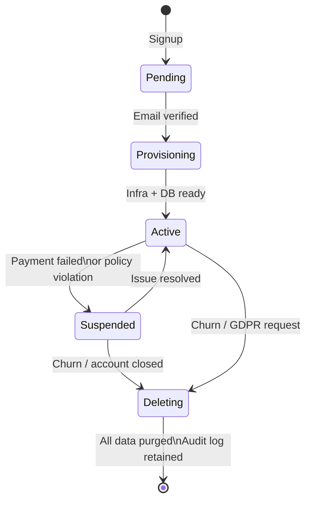
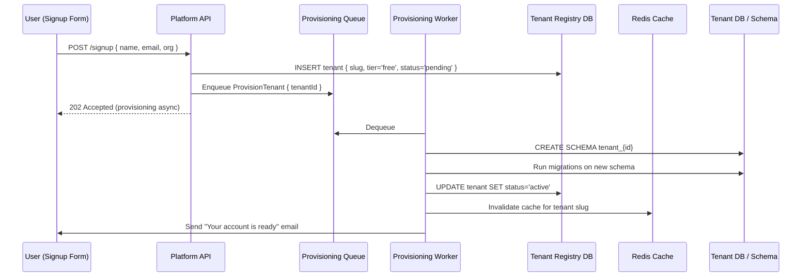

# Module 8 — Tenant Onboarding & Lifecycle Management

## Learning Objectives

- Design automated tenant provisioning workflows
- Handle tenant suspension, deletion, and data export
- Understand tenant configuration management

## Tenant Lifecycle



## Automated Provisioning Flow

A new tenant signup should trigger a provisioning pipeline:



**Why async provisioning?** Schema creation and migration can take seconds or even minutes. Returning a 202 immediately, then notifying via email or webhook, gives much better UX.

## Tenant Configuration Service

Each tenant typically has configuration that diverges from defaults:

```typescript
interface TenantConfiguration {
  tenantId: string;
  
  // Branding
  logoUrl: string;
  primaryColor: string;
  customDomain?: string;       // app.acme.com → your platform

  // Feature flags (per tenant)
  features: {
    advancedReports: boolean;
    apiAccess: boolean;
    ssoEnabled: boolean;
  };

  // Limits
  maxUsers: number;
  maxApiRequestsPerMinute: number;
  storageLimitGb: number;
}
```

Store this in the tenant registry (fast Redis cache) — it is read on every single request to determine what a tenant can do.
