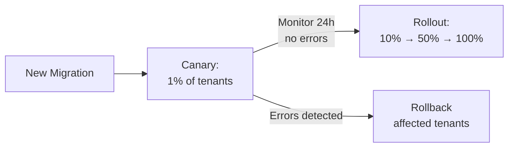

# Module 11 — Schema Migrations in Multi-Tenant Systems

## Learning Objectives

- Understand why schema migrations are the hardest operational problem in multi-tenancy
- Implement safe migration patterns with rollback strategies
- Use canary deployments for migrations

## The Core Problem

In single-tenant systems, a migration runs once. In a multi-tenant system with schema-per-tenant isolation, a migration must run **N times** — once per tenant schema. With 10,000 tenants, a naive sequential migration could take hours.

## Migration Strategies

**1. Parallel Migration with Bounded Concurrency**

```typescript
async function runMigrationForAllTenants(
  migration: Migration,
  concurrency = 10
) {
  const tenants = await getTenantSchemas();
  const queue = [...tenants];
  const failed: string[] = [];

  await Promise.all(
    Array.from({ length: concurrency }, async () => {
      while (queue.length > 0) {
        const tenant = queue.pop()!;
        try {
          await runMigration(tenant.schema, migration);
          await markMigrationComplete(tenant.id, migration.id);
        } catch (err) {
          failed.push(tenant.id);
          logger.error(`Migration failed for ${tenant.id}`, err);
        }
      }
    })
  );

  if (failed.length > 0) {
    throw new Error(`Migration failed for tenants: ${failed.join(', ')}`);
  }
}
```

**2. Expand-Contract Pattern (Zero-Downtime)**

Never rename or drop columns directly. Use the expand-contract pattern:

```
Phase 1 - Expand: Add new column alongside old one (app reads old, writes both)
Phase 2 - Migrate: Backfill new column from old column
Phase 3 - Switch: App reads new, writes new (deploy new code)
Phase 4 - Contract: Drop old column after confirming Phase 3 is stable
```

**3. Canary Rollout for Migrations**

Run a migration on 1% of tenants first, monitor for 24 hours, then proceed:


