# Multi-Tenant Architecture — Basics

> A comprehensive, structured curriculum for mastering multi-tenant SaaS architecture from first principles to production-grade implementation. Each module builds on the last; complete them in order.

***

## Table of Contents

1. [What Is Multi-Tenancy?](#module-1--what-is-multi-tenancy)
2. [Tenancy Models & Trade-Offs](#module-2--tenancy-models--trade-offs)
3. [Database Isolation Strategies](#module-3--database-isolation-strategies)
4. [Tenant Identity, Routing & Middleware](#module-4--tenant-identity-routing--middleware)
5. [Authentication & Authorization](#module-5--authentication--authorization)
6. [Data Security & Compliance](#module-6--data-security--compliance)
7. [Infrastructure & Kubernetes Multi-Tenancy](#module-7--infrastructure--kubernetes-multi-tenancy)
8. [Tenant Onboarding & Lifecycle Management](#module-8--tenant-onboarding--lifecycle-management)
9. [Observability, Monitoring & Alerting](#module-9--observability-monitoring--alerting)
10. [Billing, Metering & Usage Quotas](#module-10--billing-metering--usage-quotas)
11. [Schema Migrations in Multi-Tenant Systems](#module-11--schema-migrations-in-multi-tenant-systems)
12. [Edge Cases & Failure Modes](#module-12--edge-cases--failure-modes)
13. [Real-World Case Studies](#module-13--real-world-case-studies)
14. [Implementation Roadmap (NestJS + Postgres)](#module-14--implementation-roadmap-nestjs--postgres)
15. [Further Reading & References](#module-15--further-reading--references)

***

## Module 1 — What Is Multi-Tenancy?

### Learning Objectives

- Define multi-tenancy and understand why it exists
- Distinguish multi-tenancy from single-tenancy deployments
- Understand the SaaS business model alignment with multi-tenancy

### Core Concept

A **tenant** is a customer, organization, or user group that uses your software as a discrete, isolated unit. **Multi-tenancy** means a single deployed instance of your application (code + infrastructure) serves many such tenants simultaneously, while each tenant believes it is using a dedicated system.

Think of it like an apartment building:

- The building (infrastructure) is shared.
- Each flat (tenant) has private space (data, config).
- Neighbors cannot see into each other's flats (isolation).
- One janitor (ops team) maintains all flats simultaneously (operational efficiency).

### Single-Tenancy vs. Multi-Tenancy

| Dimension                    | Single-Tenant             | Multi-Tenant              |
| ---------------------------- | ------------------------- | ------------------------- |
| Deployment                   | One instance per customer | One instance, N customers |
| Cost per customer            | High (dedicated infra)    | Low (shared infra)        |
| Isolation                    | Hardware-level by default | Must be designed-in       |
| Customization                | Easy (isolated codebase)  | Hard (shared codebase)    |
| Operations complexity        | N × complexity            | \~Constant complexity     |
| Data residency control       | Natural                   | Requires routing logic    |
| Time-to-onboard new customer | Slow (provision)          | Fast (register + config)  |

### Why This Matters for SaaS

The entire economics of SaaS are built on **amortizing infrastructure costs across many customers**. At 10 tenants, the cost savings are minor. At 10,000 tenants, the operational advantage is enormous. This is why Salesforce, HubSpot, Jira, and virtually every B2B SaaS product uses multi-tenant architecture.

> **From Patterns of Enterprise Application Architecture (Fowler):** "A hosted application should try to keep the number of running instances to a minimum, because each instance requires operational overhead."

### Architecture Overview Diagram

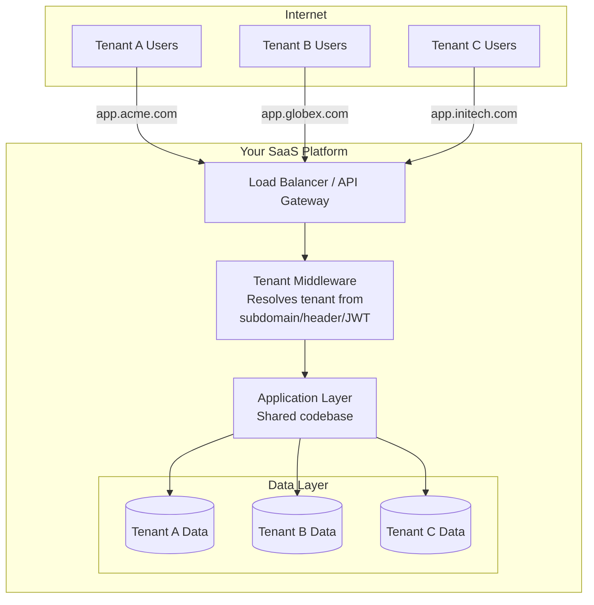

***

## Module 2 — Tenancy Models & Trade-Offs

### Learning Objectives

- Understand the two primary deployment models: SIMT and MIMT
- Know when to choose which model
- Understand tiered isolation for different customer segments

### Model 1: Single-Instance Multi-Tenant (SIMT)

One running process serves all tenants. Tenant isolation is enforced **in code** (database queries, middleware, access control).

**Characteristics:**

- Lowest cost per tenant
- Highest operational efficiency
- Weakest isolation guarantee
- Harder to customize per tenant
- "Noisy neighbor" risk is highest

**Best for:** B2B SaaS with SMB customers, freemium products, internal tools

### Model 2: Multi-Instance Multi-Tenant (MIMT)

Each tenant (or tier of tenants) gets a dedicated runtime instance, but the **codebase is still shared**.

**Characteristics:**

- Higher cost per tenant
- Strong isolation (process-level)
- Easier per-tenant customization
- Simpler compliance (data never co-mingles at runtime)
- Can deploy different versions per tenant ("version pinning")

**Best for:** Enterprise SaaS, regulated industries (fintech, healthcare), customers with strict SLAs

### The Tiered Isolation Pattern (Industry Standard 2025)

Most mature SaaS companies use a **tiered model** — different isolation levels for different customer segments:

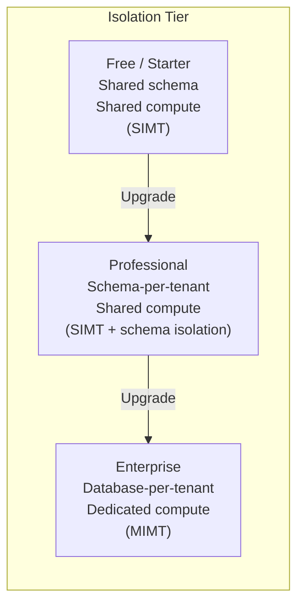

| Tier         | Database Isolation        | Compute Isolation | Cost per Tenant | Target Segment   |
| ------------ | ------------------------- | ----------------- | --------------- | ---------------- |
| Free/Starter | Shared schema (row-level) | Shared pod        | \~$0.01/mo      | SMB, self-serve  |
| Professional | Schema-per-tenant         | Shared pod        | \~$0.10/mo      | Growth companies |
| Enterprise   | Database-per-tenant       | Dedicated pod/VM  | \~$5–50/mo      | Large orgs       |

> **Insight from Salesforce:** Salesforce's original Shared Everything model (one DB, shared tables with a TenantID column) allowed them to scale to 150,000+ customers. Their "silo" model for regulated customers came later.

***

## Module 3 — Database Isolation Strategies

### Learning Objectives

- Understand the four main database isolation strategies in depth
- Know the migration path between strategies
- Implement row-level security in Postgres

### Strategy 1: Shared Schema (Row-Level Isolation)

All tenants share the same tables. Every row has a `tenant_id` column. Application code filters every query by `tenant_id`.

```sql
-- Example schema
CREATE TABLE orders (
    id          UUID PRIMARY KEY DEFAULT gen_random_uuid(),
    tenant_id   UUID NOT NULL REFERENCES tenants(id),
    customer_id UUID NOT NULL,
    total       DECIMAL(10, 2),
    created_at  TIMESTAMPTZ DEFAULT NOW()
);

CREATE INDEX idx_orders_tenant ON orders(tenant_id);
```

**Critical: Row-Level Security (Postgres)**

Never rely on application-layer filtering alone. Use Postgres RLS as a defense-in-depth layer:

```sql
-- Enable RLS on the table
ALTER TABLE orders ENABLE ROW LEVEL SECURITY;
ALTER TABLE orders FORCE ROW LEVEL SECURITY;

-- Policy: users can only see their tenant's rows
CREATE POLICY tenant_isolation ON orders
    USING (tenant_id = current_setting('app.current_tenant_id')::UUID);

-- Set the tenant context per connection/transaction
SET app.current_tenant_id = 'abc123-...';
```

**Pros:**

- Simplest to implement and operate
- Lowest infrastructure cost
- Schema migrations run once, apply to all tenants

**Cons:**

- Single DB is a performance bottleneck and SPOF
- A missing `WHERE tenant_id = ?` leaks data across tenants
- Cannot restore a single tenant's data without full DB restore
- One noisy tenant degrades all others

***

### Strategy 2: Schema-Per-Tenant

Each tenant gets a dedicated Postgres **schema** (namespace) within a shared database instance.

```sql
-- On tenant creation
CREATE SCHEMA tenant_abc123;

-- Tables are created inside that schema
CREATE TABLE tenant_abc123.orders (
    id          UUID PRIMARY KEY,
    customer_id UUID NOT NULL,
    total       DECIMAL(10, 2)
    -- No tenant_id column needed!
);

-- Point the search path to the tenant's schema
SET search_path TO tenant_abc123, public;
```

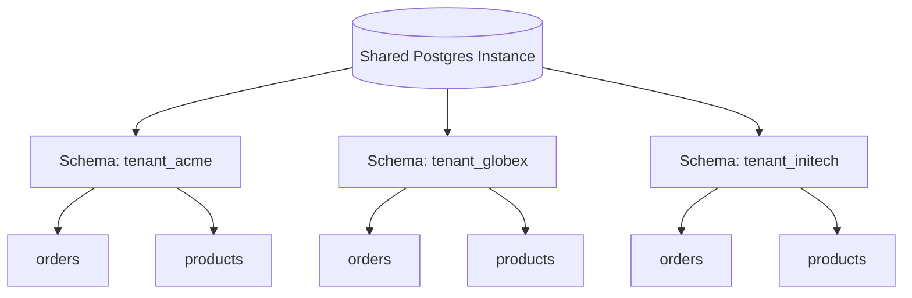

**Pros:**

- No `tenant_id` columns needed; no risk of cross-tenant leaks via missing WHERE clause
- Can restore a single tenant's schema independently
- Natural namespace separation — easier to reason about
- Can still share connection pool (PgBouncer with `search_path` setting)

**Cons:**

- Schema migrations must run N times (once per tenant schema)
- Postgres has practical limits \~1000–10,000 schemas per DB before performance degrades
- Connection routing complexity increases

***

### Strategy 3: Database-Per-Tenant

Each tenant has a completely separate database instance (or cluster).

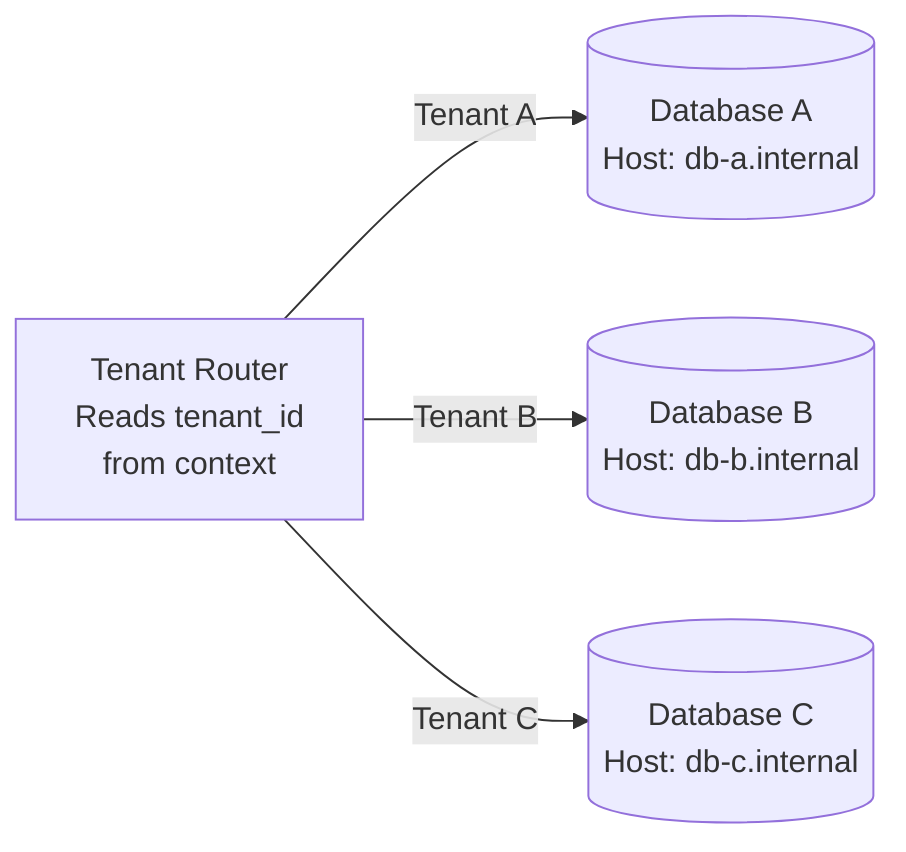

**Pros:**

- Maximum isolation — a breach in one DB cannot affect others
- Independent backups, restores, and scaling per tenant
- Easier compliance (GDPR right-to-erasure is just `DROP DATABASE`)
- Can use different DB versions/configurations per tenant

**Cons:**

- Highest cost and operational overhead
- Must maintain a "tenant registry" that maps tenant IDs to connection strings
- Connection pool explosion (100 tenants × 10 connections = 1,000 DB connections)
- Cross-tenant analytics requires data warehousing or federation

**Tenant Registry Pattern:**

```typescript
// A central registry that maps tenants to their DB connection strings
interface TenantConfig {
  tenantId: string;
  dbConnectionString: string;
  dbRegion: string;
  tier: 'free' | 'pro' | 'enterprise';
}

// Cached in Redis to avoid hitting the registry DB on every request
class TenantRegistry {
  async getConfig(tenantId: string): Promise<TenantConfig> {
    const cached = await this.redis.get(`tenant:${tenantId}`);
    if (cached) return JSON.parse(cached);
    const config = await this.registryDb.findOne({ tenantId });
    await this.redis.setex(`tenant:${tenantId}`, 300, JSON.stringify(config));
    return config;
  }
}
```

***

### Strategy 4: Serverless Branch-Per-Tenant (Emerging 2025)

Platforms like **Neon** (Postgres) and **Turso** (SQLite/libSQL) enable creating isolated database branches or replicas per tenant near-instantly.

- **Neon:** Copy-on-write branching — a new branch shares storage with the parent until it diverges. Near-zero cost for idle tenants.
- **Turso:** SQLite database per tenant deployed to the edge (200+ PoPs). Near-zero latency for single-tenant reads.

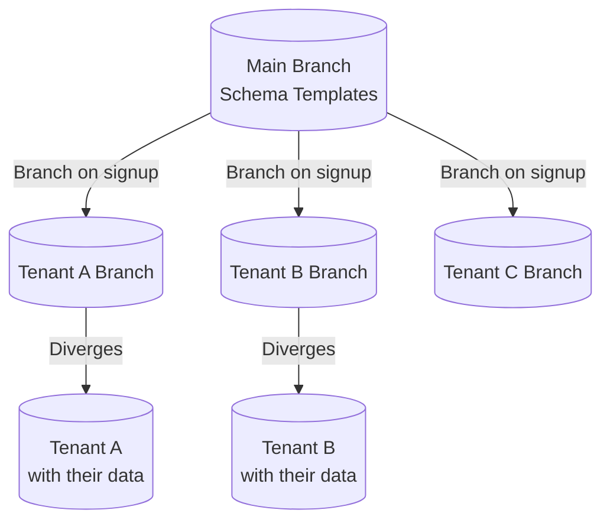

### Comparison Summary

| Strategy            | Isolation          | Cost           | Migration Complexity | Best For                  |
| ------------------- | ------------------ | -------------- | -------------------- | ------------------------- |
| Shared Schema + RLS | Low (app-enforced) | Very Low       | Low (runs once)      | B2C, SMB, early-stage     |
| Schema-per-tenant   | Medium             | Low            | Medium (N schemas)   | Mid-market SaaS           |
| Database-per-tenant | High               | High           | High (N databases)   | Enterprise, regulated     |
| Branch-per-tenant   | High               | Near-zero idle | Low (automated)      | Edge, modern cloud-native |

***

## Module 4 — Tenant Identity, Routing & Middleware

### Learning Objectives

- Understand the three common tenant identification strategies
- Implement tenant-aware middleware in Node.js/NestJS
- Use AsyncLocalStorage for safe concurrent tenant context propagation

### Tenant Identification Strategies

**1. Subdomain-Based**

```
acme.yourapp.com       → tenant: acme
globex.yourapp.com     → tenant: globex
```

Most common for B2B SaaS. Requires wildcard DNS (`*.yourapp.com`) and wildcard TLS cert.

**2. Path-Based**

```
yourapp.com/t/acme/dashboard    → tenant: acme
```

Simpler DNS setup. Less "white-label" feel.

**3. Header-Based (API)**

```
X-Tenant-ID: acme-tenant-uuid
```

Common for API-only SaaS, mobile apps, or server-to-server communication.

**4. JWT Claims**

```json
{
  "sub": "user-uuid",
  "tenant_id": "acme-uuid",
  "tenant_slug": "acme"
}
```

Best for stateless APIs — tenant context travels with every authenticated request.

***

### The Tenant Resolution Flow

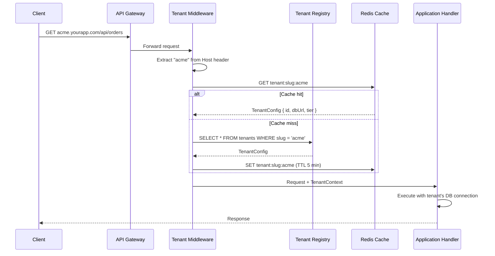

***

### NestJS Implementation

**Tenant Middleware (subdomain resolution):**

```typescript
// tenant.middleware.ts
import { Injectable, NestMiddleware, UnauthorizedException } from '@nestjs/common';
import { Request, Response, NextFunction } from 'express';
import { TenantService } from './tenant.service';

@Injectable()
export class TenantMiddleware implements NestMiddleware {
  constructor(private readonly tenantService: TenantService) {}

  async use(req: Request, res: Response, next: NextFunction) {
    const host = req.hostname; // e.g. "acme.yourapp.com"
    const slug = host.split('.')[0];

    if (!slug || slug === 'www') {
      throw new UnauthorizedException('Tenant not identified');
    }

    const tenant = await this.tenantService.resolveBySlug(slug);
    if (!tenant) throw new UnauthorizedException(`Unknown tenant: ${slug}`);

    // Attach to request for downstream use
    req['tenant'] = tenant;
    next();
  }
}
```

**AsyncLocalStorage for concurrent-safe context (Node.js):**

The critical issue: Node.js handles many requests concurrently. A global variable `currentTenantId` would be shared and overwritten across concurrent requests. Use `AsyncLocalStorage` instead:

```typescript
// tenant-context.ts
import { AsyncLocalStorage } from 'async_hooks';

export interface TenantContext {
  tenantId: string;
  slug: string;
  tier: 'free' | 'pro' | 'enterprise';
  dbConnectionString?: string;
}

export const tenantStorage = new AsyncLocalStorage<TenantContext>();

// Helper accessor
export function getCurrentTenant(): TenantContext {
  const ctx = tenantStorage.getStore();
  if (!ctx) throw new Error('No tenant context — called outside request scope');
  return ctx;
}

// In middleware, wrap the call chain
export function runWithTenantContext<T>(
  context: TenantContext,
  fn: () => T
): T {
  return tenantStorage.run(context, fn);
}
```

**Custom Decorator for Controllers:**

```typescript
// current-tenant.decorator.ts
import { createParamDecorator, ExecutionContext } from '@nestjs/common';

export const CurrentTenant = createParamDecorator(
  (data: unknown, ctx: ExecutionContext) => {
    const request = ctx.switchToHttp().getRequest();
    return request.tenant;
  }
);

// Usage in controller
@Get('orders')
getOrders(@CurrentTenant() tenant: Tenant) {
  return this.ordersService.findAll(tenant.id);
}
```

***

## Module 5 — Authentication & Authorization

### Learning Objectives

- Design tenant-scoped authentication
- Implement Role-Based Access Control (RBAC) within tenant boundaries
- Understand the difference between tenant-level and user-level permissions

### Authentication Architecture

Each tenant should have its own authentication namespace. A user's identity is always **scoped to a tenant** — `user@acme.com` logging into `acme.yourapp.com` is a different identity than the same email at `globex.yourapp.com`.

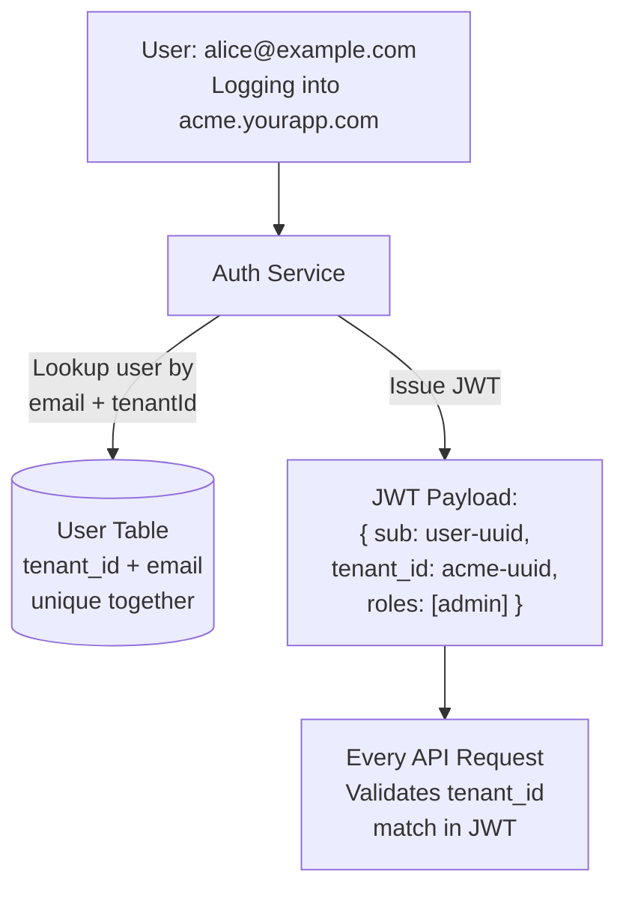

**Users table design:**

```sql
CREATE TABLE users (
    id          UUID PRIMARY KEY DEFAULT gen_random_uuid(),
    tenant_id   UUID NOT NULL REFERENCES tenants(id),
    email       TEXT NOT NULL,
    password_hash TEXT NOT NULL,
    created_at  TIMESTAMPTZ DEFAULT NOW(),
    
    -- Email must be unique PER TENANT, not globally
    UNIQUE (tenant_id, email)
);
```

### RBAC Within Tenants

Each tenant can define their own roles. A typical schema:

```sql
CREATE TABLE tenant_roles (
    id          UUID PRIMARY KEY,
    tenant_id   UUID NOT NULL,
    name        TEXT NOT NULL, -- 'admin', 'manager', 'viewer'
    permissions JSONB NOT NULL DEFAULT '[]'
);

CREATE TABLE user_roles (
    user_id UUID REFERENCES users(id),
    role_id UUID REFERENCES tenant_roles(id),
    PRIMARY KEY (user_id, role_id)
);
```

**Permission check guard (NestJS):**

```typescript
@Injectable()
export class PermissionsGuard implements CanActivate {
  constructor(private reflector: Reflector) {}

  canActivate(context: ExecutionContext): boolean {
    const required = this.reflector.get<string[]>('permissions', context.getHandler());
    if (!required) return true;

    const { user, tenant } = context.switchToHttp().getRequest();
    
    // Ensure user belongs to the tenant from the route
    if (user.tenantId !== tenant.id) return false;

    return required.every(perm => user.permissions.includes(perm));
  }
}
```

### Super-Admin vs. Tenant-Admin

| Role                   | Scope         | Can Do                                            |
| ---------------------- | ------------- | ------------------------------------------------- |
| Super-Admin (Platform) | All tenants   | Manage tenant accounts, billing, impersonation    |
| Tenant-Admin           | Single tenant | Manage users within their org, configure settings |
| Tenant-User            | Single tenant | Access features per their role                    |

**Danger:** Super-admins should only be able to impersonate a tenant user **with an audit log** and ideally with a time-limited session. Unaudited impersonation is a major compliance risk.

***

## Module 6 — Data Security & Compliance

### Learning Objectives

- Apply encryption at rest and in transit per tenant
- Understand GDPR "right to erasure" in multi-tenant systems
- Implement audit logging

### Encryption Strategies

**At Rest:**

- Use envelope encryption: each tenant's sensitive data is encrypted with a **tenant-specific Data Encryption Key (DEK)**, which is itself encrypted with a Key Encryption Key (KEK) stored in AWS KMS / Azure Key Vault / GCP Cloud KMS.
- Rotating a tenant's keys does not require re-encrypting all other tenants' data.

```
Tenant Data → encrypted with DEK (per-tenant)
DEK → encrypted with KEK (stored in KMS)
KEK → managed by cloud KMS (hardware-backed)
```

**In Transit:**

- TLS 1.3 on all connections (browser ↔ API, service ↔ service, service ↔ DB)
- mTLS between internal microservices (Istio / Linkerd service mesh)

### GDPR Right to Erasure

The implementation varies dramatically by isolation model:

| Isolation Model     | Erasure Implementation                                                    |
| ------------------- | ------------------------------------------------------------------------- |
| Shared schema       | `DELETE FROM all_tables WHERE tenant_id = ?` — cascading deletes, complex |
| Schema-per-tenant   | `DROP SCHEMA tenant_abc CASCADE` — clean and atomic                       |
| Database-per-tenant | `DROP DATABASE tenant_abc` — cleanest possible                            |

### Audit Logging

Every data-modifying action must be logged with tenant context:

```typescript
interface AuditEvent {
  id: string;
  tenantId: string;
  actorId: string;         // who did it
  actorType: 'user' | 'super_admin' | 'system';
  action: string;          // 'order.created', 'user.deleted'
  resourceType: string;
  resourceId: string;
  previousState?: object;  // snapshot before change
  nextState?: object;      // snapshot after change
  ipAddress: string;
  userAgent: string;
  timestamp: Date;
}
```

Store audit logs in a **write-once** store (separate from main DB) that even super-admins cannot modify.

***

## Module 7 — Infrastructure & Kubernetes Multi-Tenancy

### Learning Objectives

- Configure Kubernetes namespaces for tenant isolation
- Apply ResourceQuotas and NetworkPolicies
- Understand soft vs. hard multi-tenancy in K8s

### Kubernetes Isolation Levels

**Soft Multi-Tenancy (namespace-per-team):**

- Tenants are internal teams or trusted partners
- Namespace isolation + RBAC
- Suitable when all tenants are within the same organization

**Hard Multi-Tenancy (namespace-per-customer):**

- Tenants are external customers with no mutual trust
- Requires: Namespaces + ResourceQuotas + NetworkPolicies + PodSecurityStandards
- For highest isolation: gVisor or Kata Containers (VM-level isolation per pod)

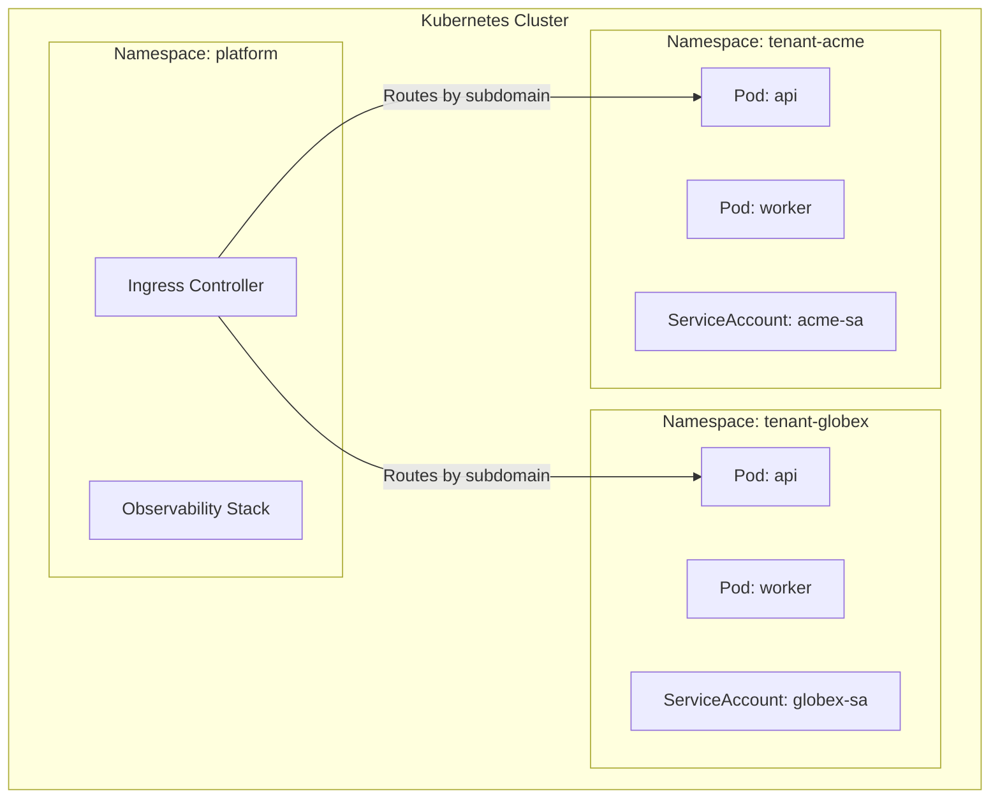

### ResourceQuota per Namespace

```yaml
# resource-quota-tenant.yaml
apiVersion: v1
kind: ResourceQuota
metadata:
  name: tenant-quota
  namespace: tenant-acme
spec:
  hard:
    requests.cpu: "2"
    requests.memory: 4Gi
    limits.cpu: "4"
    limits.memory: 8Gi
    pods: "20"
    persistentvolumeclaims: "5"
```

### NetworkPolicy (Zero-Trust Isolation)

```yaml
# network-policy-tenant.yaml
apiVersion: networking.k8s.io/v1
kind: NetworkPolicy
metadata:
  name: tenant-isolation
  namespace: tenant-acme
spec:
  podSelector: {}           # applies to all pods in namespace
  policyTypes:
    - Ingress
    - Egress
  ingress:
    - from:
        - namespaceSelector:
            matchLabels:
              name: tenant-acme   # only allow intra-namespace traffic
        - namespaceSelector:
            matchLabels:
              name: platform      # allow platform ingress controller
  egress:
    - to:
        - namespaceSelector:
            matchLabels:
              name: tenant-acme
        - namespaceSelector:
            matchLabels:
              name: platform
```

### Noisy Neighbor Prevention

The most dangerous Kubernetes multi-tenancy failure is a single tenant consuming all cluster resources. Layers of defense:

1. **ResourceQuota** — hard limits on CPU/memory/pods per namespace
2. **LimitRange** — default and max resource limits on individual pods
3. **PriorityClass** — assign lower priority to free-tier tenant workloads
4. **HorizontalPodAutoscaler** — autoscale per-tenant with tenant-scoped metrics
5. **Cluster Autoscaler** — add nodes when aggregate demand grows

***

## Module 8 — Tenant Onboarding & Lifecycle Management

### Learning Objectives

- Design automated tenant provisioning workflows
- Handle tenant suspension, deletion, and data export
- Understand tenant configuration management

### Tenant Lifecycle

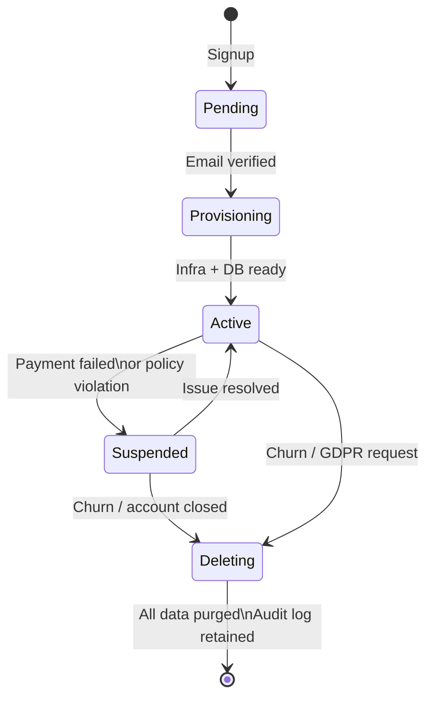

### Automated Provisioning Flow

A new tenant signup should trigger a provisioning pipeline:

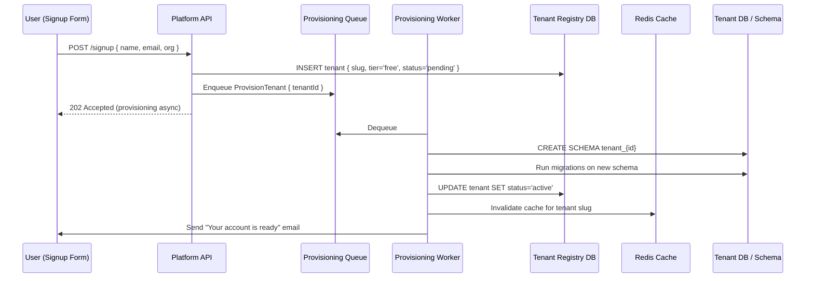

**Why async provisioning?** Schema creation and migration can take seconds or even minutes. Returning a 202 immediately, then notifying via email or webhook, gives much better UX.

### Tenant Configuration Service

Each tenant typically has configuration that diverges from defaults:

```typescript
interface TenantConfiguration {
  tenantId: string;
  
  // Branding
  logoUrl: string;
  primaryColor: string;
  customDomain?: string;       // app.acme.com → your platform

  // Feature flags (per tenant)
  features: {
    advancedReports: boolean;
    apiAccess: boolean;
    ssoEnabled: boolean;
  };

  // Limits
  maxUsers: number;
  maxApiRequestsPerMinute: number;
  storageLimitGb: number;
}
```

Store this in the tenant registry (fast Redis cache) — it is read on every single request to determine what a tenant can do.

***

## Module 9 — Observability, Monitoring & Alerting

### Learning Objectives

- Tag all telemetry (logs, metrics, traces) with tenant context
- Build per-tenant dashboards in Grafana
- Detect and alert on per-tenant SLA breaches

### The Golden Rule of Multi-Tenant Observability

> Every log line, metric data point, and trace span MUST carry a `tenant_id` label. Without this, you cannot distinguish a platform-wide outage from a single-tenant issue.

### OpenTelemetry Tenant Enrichment

```typescript
// otel-tenant-instrumentation.ts
import { trace, context, SpanStatusCode } from '@opentelemetry/api';

export function withTenantSpan<T>(
  spanName: string,
  tenantId: string,
  fn: () => Promise<T>
): Promise<T> {
  const tracer = trace.getTracer('platform');
  return tracer.startActiveSpan(spanName, async (span) => {
    // Tag every span with tenant context
    span.setAttribute('tenant.id', tenantId);
    span.setAttribute('tenant.tier', getCurrentTenant().tier);
    try {
      const result = await fn();
      span.setStatus({ code: SpanStatusCode.OK });
      return result;
    } catch (err) {
      span.setStatus({ code: SpanStatusCode.ERROR, message: err.message });
      span.recordException(err);
      throw err;
    } finally {
      span.end();
    }
  });
}
```

### Key Metrics to Track Per Tenant

| Metric                                 | Why It Matters                  | Alert Threshold |
| -------------------------------------- | ------------------------------- | --------------- |
| `http_request_duration_p99{tenant_id}` | Detect slow tenants             | > 2s for 5 min  |
| `db_query_duration_p95{tenant_id}`     | Slow query detection            | > 500ms         |
| `error_rate{tenant_id}`                | Detect tenant-specific failures | > 1% for 2 min  |
| `active_connections{tenant_id}`        | Connection pool exhaustion      | > 80% of limit  |
| `storage_used_gb{tenant_id}`           | Quota enforcement               | > 90% of limit  |
| `api_requests_per_minute{tenant_id}`   | Rate limit enforcement          | > quota         |

### Grafana Dashboard Structure

```
Platform Overview (cross-tenant)
├── Cluster health (CPU, memory, pods)
├── Top 10 tenants by request volume
├── Error rate by tenant (heat map)
└── P99 latency by tenant

Per-Tenant Drill-Down (parameterized by tenant_id)
├── Request rate (last 1h, 24h, 7d)
├── Error breakdown (4xx vs 5xx)
├── DB query latency percentiles
├── Active users
└── Storage usage vs quota
```

***

## Module 10 — Billing, Metering & Usage Quotas

### Learning Objectives

- Implement usage metering as an architectural concern (not an afterthought)
- Understand usage-based vs. seat-based billing models
- Enforce soft and hard usage quotas

### Metering Architecture

Billing is a first-class concern in multi-tenant systems. Meter every meaningful unit of consumption from day one — retrofitting metering is extremely painful.

```mermaid
graph LR
    subgraph "Application Layer"
        A[API Handler]
        W[Background Worker]
    end

    subgraph "Metering Pipeline"
        EQ[Event Queue\nKafka / SQS]
        MA[Metering Aggregator]
        MS[(Metering Store\nTimeSeries DB)]
    end

    subgraph "Billing System"
        BS[Billing Service\nStripe / Lago]
        UD[Usage Dashboard]
    end

    A -->|Emit usage event\n{ tenant_id, metric, value }| EQ
    W -->|Emit usage event| EQ
    EQ --> MA
    MA -->|Aggregate per\ntenant per hour| MS
    MS --> BS
    BS --> UD
```

**Usage event structure:**

```typescript
interface UsageEvent {
  tenantId: string;
  metric: 'api_calls' | 'storage_gb' | 'active_users' | 'compute_minutes';
  value: number;
  timestamp: Date;
  metadata?: Record<string, string>; // e.g., { endpoint: '/api/reports' }
}
```

### Quota Enforcement

Quotas have two enforcement modes:

**Soft Quota:** Warn the tenant but allow continued use. Send email warning at 80% and 95%.

**Hard Quota:** Block requests that exceed the limit.

```typescript
@Injectable()
export class QuotaGuard implements CanActivate {
  async canActivate(context: ExecutionContext): Promise<boolean> {
    const { tenant } = context.switchToHttp().getRequest();
    
    const currentUsage = await this.meteringService.getCurrentUsage(
      tenant.id,
      'api_calls',
      'current_month'
    );

    if (currentUsage >= tenant.config.maxApiCallsPerMonth) {
      throw new HttpException(
        { error: 'quota_exceeded', limit: tenant.config.maxApiCallsPerMonth },
        HttpStatus.TOO_MANY_REQUESTS
      );
    }

    // Async fire-and-forget — don't slow the request
    this.meteringService.record({
      tenantId: tenant.id,
      metric: 'api_calls',
      value: 1,
      timestamp: new Date(),
    }).catch(err => this.logger.error('Metering failed', err));

    return true;
  }
}
```

***

## Module 11 — Schema Migrations in Multi-Tenant Systems

### Learning Objectives

- Understand why schema migrations are the hardest operational problem in multi-tenancy
- Implement safe migration patterns with rollback strategies
- Use canary deployments for migrations

### The Core Problem

In single-tenant systems, a migration runs once. In a multi-tenant system with schema-per-tenant isolation, a migration must run **N times** — once per tenant schema. With 10,000 tenants, a naive sequential migration could take hours.

### Migration Strategies

**1. Parallel Migration with Bounded Concurrency**

```typescript
async function runMigrationForAllTenants(
  migration: Migration,
  concurrency = 10
) {
  const tenants = await getTenantSchemas();
  const queue = [...tenants];
  const failed: string[] = [];

  await Promise.all(
    Array.from({ length: concurrency }, async () => {
      while (queue.length > 0) {
        const tenant = queue.pop()!;
        try {
          await runMigration(tenant.schema, migration);
          await markMigrationComplete(tenant.id, migration.id);
        } catch (err) {
          failed.push(tenant.id);
          logger.error(`Migration failed for ${tenant.id}`, err);
        }
      }
    })
  );

  if (failed.length > 0) {
    throw new Error(`Migration failed for tenants: ${failed.join(', ')}`);
  }
}
```

**2. Expand-Contract Pattern (Zero-Downtime)**

Never rename or drop columns directly. Use the expand-contract pattern:

```
Phase 1 - Expand: Add new column alongside old one (app reads old, writes both)
Phase 2 - Migrate: Backfill new column from old column
Phase 3 - Switch: App reads new, writes new (deploy new code)
Phase 4 - Contract: Drop old column after confirming Phase 3 is stable
```

**3. Canary Rollout for Migrations**

Run a migration on 1% of tenants first, monitor for 24 hours, then proceed:

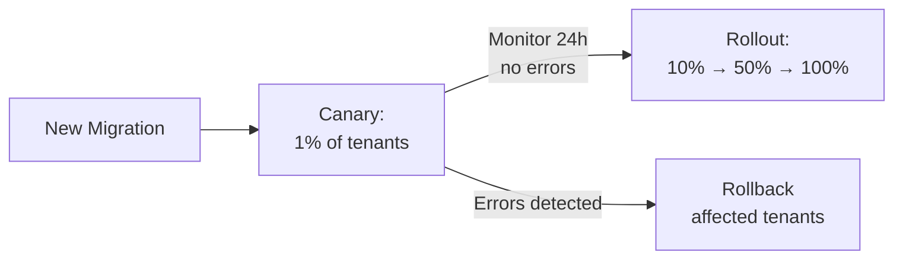

***

## Module 12 — Edge Cases & Failure Modes

### Learning Objectives

- Identify the most dangerous failure modes in multi-tenant systems
- Implement mitigations for each

### Critical Failure Modes

**1. Cross-Tenant Data Leak**

The most severe failure. Causes: missing `tenant_id` filter in a query, a buggy JOIN, or a middleware that fails open.

**Mitigations:**

- Postgres Row-Level Security as a hard backstop (even if app code is wrong)
- Integration tests that explicitly assert tenant isolation with two tenants
- Automated query auditing that fails CI if a query on a tenant-scoped table lacks a `tenant_id` filter

**2. Noisy Neighbor (Resource Starvation)**

One tenant generates a spike (bulk import, runaway job) that degrades all other tenants.

**Mitigations:**

- Per-tenant rate limiting at the API Gateway level
- Per-tenant database connection pool limits
- Background job queues scoped per tenant with fair scheduling
- Kubernetes ResourceQuotas (see Module 7)

**3. Tenant Registry Outage**

If the service that resolves tenant slugs → tenant config goes down, no request can be served.

**Mitigations:**

- Redis cache with a long TTL (5–30 min) — most requests are served from cache
- Circuit breaker: if registry is down, serve from stale cache rather than fail
- The registry should be a read-heavy, highly available service (not the same DB as tenant data)

**4. Migration Failure on Subset of Tenants**

A migration runs successfully on 9,990 tenants and fails on 10. Those 10 tenants are now on an older schema version.

**Mitigations:**

- Track migration status per tenant in a `tenant_migrations` table
- Deploy code that can handle both old and new schemas during the migration window (forward-compatible code)
- Alert immediately when tenant migration fails; retry with exponential backoff

**5. Stale Tenant Cache Serving Deleted/Suspended Tenant**

A tenant is suspended for non-payment. The cache still holds their active config. They keep making requests for 5 more minutes until TTL expires.

**Mitigations:**

- Publish a `tenant.suspended` event to a message bus; cache service subscribes and immediately invalidates
- Shorter TTL for tenant status (30s) vs. tenant config (5 min)

**6. Tenant Impersonation / JWT Confusion**

A malicious actor modifies their JWT to claim a different `tenant_id`.

**Mitigations:**

- Always verify JWT signature (never trust `tenant_id` from unsigned request body)
- Double-check that JWT `tenant_id` matches the tenant resolved from the subdomain/route — they must agree

***

## Module 13 — Real-World Case Studies

### Salesforce: The Original Multi-Tenant Pioneer

Salesforce built their "Shared Everything" architecture in 2000 where all 150,000+ customers share the same Oracle tables. Their key innovations:

- **`OrgID`** **as the universal tenant key** — every table has it, every query filters by it
- **Custom metadata tables** — tenants can add custom fields without schema changes (stored as key-value pairs in a metadata table, not as actual columns)
- **Pod architecture** — they split their SIMT into "pods" (groups of \~10,000 tenants per pod) to limit blast radius

### Shopify: Scaling Schema-Per-Tenant

Shopify uses a database-sharding approach where each "shop" (tenant) is assigned to a shard. They pioneered the use of **Vitess** (MySQL sharding middleware) to manage tens of thousands of database shards.

Key insight: Shopify does not use schema-per-tenant on a single database. They use **pod-based sharding** where each shard cluster serves \~1,000 shops, providing physical-level isolation between shards while still sharing infrastructure within a shard.

### GitHub: Multi-Tenant at the Infrastructure Layer

GitHub (enterprise server) allows organizations to run their own GitHub instances but GitHub.com itself is a multi-tenant service where every organization is a tenant. They heavily use **read replicas per region**, **database-level sharding by user ID ranges**, and **Kafka for cross-shard event propagation**.

### Stripe: API-First Multi-Tenancy

Stripe's core design: every API call is authenticated by an API key that is scoped to an **Account** (their term for tenant). Their entire data model is partitioned by Account ID from the database level up.

Key pattern: **Idempotency keys are scoped per account** — the same idempotency key can be reused across different accounts without conflict.

### Notion: Workspace as Tenant

Notion treats each **Workspace** as a logical tenant within their shared infrastructure. They use Postgres with careful RLS policies and workspace-scoped permissions. Their challenge: collaborative workspaces where users belong to multiple workspaces require switching tenant context within a single user session.

***

## Module 14 — Implementation Roadmap (NestJS + Postgres)

### Learning Objectives

- Have a concrete step-by-step path to build a production-ready multi-tenant API

### Phase 1: Foundation (Week 1–2)

- [ ] Set up NestJS monorepo (or modular monolith)
- [ ] Create `tenants` and `users` tables in a central registry DB
- [ ] Implement `TenantMiddleware` (subdomain-based resolution)
- [ ] Implement `AsyncLocalStorage` tenant context
- [ ] Set up Redis caching for tenant resolution

### Phase 2: Data Isolation (Week 3–4)

- [ ] Choose isolation model (shared schema + RLS recommended for start)
- [ ] Implement `TenantAwareRepository` base class that auto-filters by `tenant_id`
- [ ] Enable Postgres RLS policies on all tenant-scoped tables
- [ ] Write integration tests that assert cross-tenant data isolation (Two tenants, one of them must not see the other's data)

### Phase 3: Auth & RBAC (Week 5)

- [ ] JWT auth with `tenant_id` claim
- [ ] Tenant-scoped user registration and login
- [ ] RBAC: `roles` + `permissions` tables scoped per tenant
- [ ] `PermissionsGuard` NestJS decorator

### Phase 4: Onboarding Pipeline (Week 6)

- [ ] Async tenant provisioning via queue (BullMQ)
- [ ] Schema creation + migration on provisioning
- [ ] Tenant configuration service (feature flags, limits)

### Phase 5: Observability (Week 7)

- [ ] OpenTelemetry instrumentation with `tenant_id` on all spans
- [ ] Structured JSON logs with `tenantId` field
- [ ] Grafana + Prometheus dashboards (per-tenant panels)

### Phase 6: Billing (Week 8)

- [ ] Usage metering events (Kafka or BullMQ)
- [ ] Metering aggregator service
- [ ] Stripe integration for usage-based billing
- [ ] Quota guard middleware

### Phase 7: Production Hardening (Week 9–10)

- [ ] Rate limiting per tenant (throttle guard)
- [ ] Circuit breakers around tenant registry
- [ ] Migration runner with canary rollout support
- [ ] Load test with 100 simulated tenants (k6 or Artillery)
- [ ] Penetration test specifically targeting cross-tenant isolation

***

## Module 15 — Further Reading & References

### Books

| Book                                                              | Relevance                                                                                                               |
| ----------------------------------------------------------------- | ----------------------------------------------------------------------------------------------------------------------- |
| *Designing Data-Intensive Applications* — Martin Kleppmann        | Chapters on replication, partitioning, and distributed transactions are directly applicable to multi-tenant data layers |
| *Patterns of Enterprise Application Architecture* — Martin Fowler | Multi-tenancy mapping patterns, identity map, data source architectural patterns                                        |
| *Domain-Driven Design* — Eric Evans                               | Bounded contexts map naturally to tenant isolation boundaries                                                           |
| *The Pragmatic Programmer* — Hunt & Thomas                        | Principle of orthogonality applied to tenant configuration                                                              |
| *Clean Code* — Robert C. Martin                                   | Structuring tenant-aware service layer without polluting business logic                                                 |

### Online Resources

- [AWS SaaS Factory: Multi-Tenant Architecture Guide](https://aws.amazon.com/partners/programs/saas-factory/)
- [Microsoft Azure: Multitenant Architecture Center](https://learn.microsoft.com/en-us/azure/architecture/guide/multitenant/overview)
- [Neon: Branch-per-tenant pattern](https://neon.tech)
- [Northflank: Kubernetes Multi-Tenancy Guide (2026)](https://northflank.com/blog/kubernetes-multi-tenancy)
- [Bytebase: Multi-Tenant Database Patterns](https://www.bytebase.com/blog/multi-tenant-database-architecture-patterns-explained/)
- [Clerk: How to Design a Multi-Tenant SaaS Architecture](https://clerk.com/blog/how-to-design-multitenant-saas-architecture)
- [Redis: Data Isolation in Multi-Tenant SaaS](https://redis.io/blog/data-isolation-multi-tenant-saas/)

### Papers

- [Multi-Tenant System Design for Platform Scalability (ResearchGate, 2025)](https://www.researchgate.net/publication/398989155_Multi-Tenant_System_Design_for_Platform_Scalability_Architectural_Patterns_and_Implementation_Strategies_for_Modern_Cloud-Native_Applications)

***

## Quick Reference: Decision Matrix

### Which Database Isolation Should I Use?

```
Start here →
│
├── Are you early-stage or cost-constrained?
│   └── YES → Shared Schema + RLS. Start here. Migrate later.
│
├── Do you have enterprise customers requiring compliance (HIPAA, SOC2)?
│   └── YES → Database-per-tenant for those customers. Use tiered model.
│
├── Will you have > 10,000 tenants?
│   └── YES → Shared Schema or Branch-per-tenant (Neon/Turso). Schema-per-tenant breaks at scale.
│
└── Is data residency (EU data in EU) a hard requirement?
    └── YES → Database-per-tenant with region routing.
```

### Which Tenant Identification Should I Use?

```
B2B SaaS with branded experience?     → Subdomain (acme.yourapp.com)
API-first product?                     → Header (X-Tenant-ID) or JWT claim
Internal tooling / intranet?           → Path-based (/org/acme/...)
Mobile / native app?                   → JWT claim (no subdomain access)
```

***

*Syllabus version: 1.0 | Created: 2026-06-23 | Based on industry state as of mid-2026*
