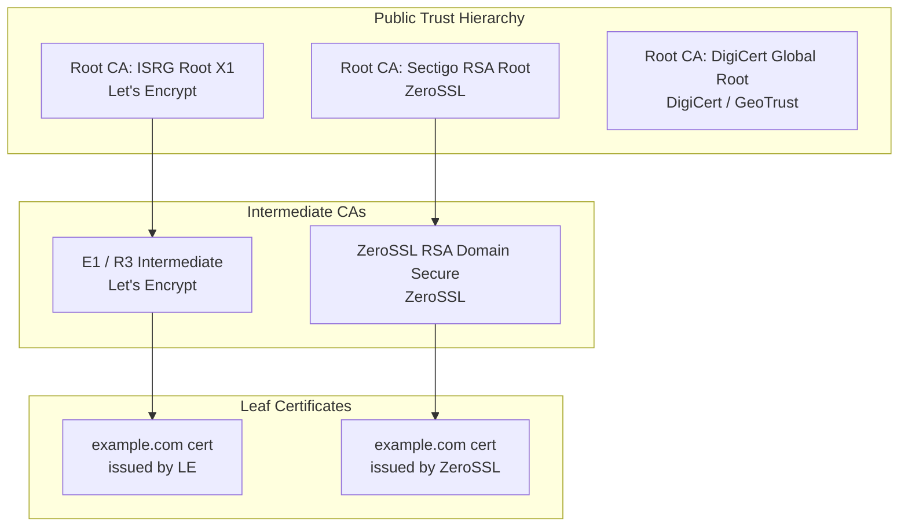
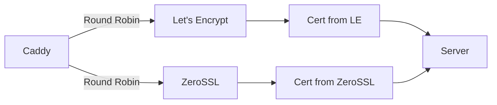

# 01 — What Is ZeroSSL?

## The Big Picture: What Is a Certificate Authority?

Before understanding ZeroSSL, you need to understand what a **Certificate Authority (CA)** is.

When your browser connects to `https://example.com`, it needs to answer one question: "Is this really example.com, or am I talking to an impersonator?"

The answer comes from **TLS certificates** issued by Certificate Authorities — organizations that browsers and operating systems **pre-trust**. If ZeroSSL says "yes, this is example.com," your browser believes it because ZeroSSL's root certificate is embedded in your OS/browser's trust store.

```
Browser                    Certificate Authority
   │                              │
   │  "I want to connect to       │
   │   example.com"               │
   │                              │
   │  ← Certificate (signed by ZeroSSL)
   │                              │
   │  Checks: Is ZeroSSL in my    │
   │  trusted CA list? YES ✅     │
   │  Is cert valid for           │
   │  example.com? YES ✅         │
   │                              │
   │  Secure connection established
```

---

## What Is ZeroSSL?

ZeroSSL is a **commercial Certificate Authority** founded in Vienna, Austria, operated by **Stack Holdings GmbH** (owners of apilayer.com). It is one of only a handful of CAs trusted by all major browsers and operating systems.

ZeroSSL was originally a simple web tool to generate free SSL certificates. It pivoted to become a full CA in 2020 when it launched its own **ACME endpoint** — making it the first major alternative to Let's Encrypt that supports the same automated ACME protocol.

### Key Milestones

| Year | Event |
|------|-------|
| 2015 | ZeroSSL founded as a free certificate generation tool |
| 2019 | ZeroSSL acquired by Stack Holdings / apilayer |
| 2020 | ZeroSSL launches its own ACME endpoint — becomes a true CA alternative to Let's Encrypt |
| 2021 | Caddy adds ZeroSSL as a second default CA (alongside Let's Encrypt) |
| 2022 | ZeroSSL EAB credentials become reusable (previously single-use) |
| 2023+ | ZeroSSL grows to serve millions of certificates, positioned as enterprise CA option |

---

## ZeroSSL's Position in the CA Ecosystem



ZeroSSL's trust chain is rooted in **Sectigo** (formerly Comodo) root certificates, which have been trusted in browsers since the early 2000s. This gives ZeroSSL certs **broader legacy compatibility** than Let's Encrypt's ISRG Root X1 (which older Android devices didn't trust until 2021).

---

## Why ZeroSSL Exists: The Problem It Solves

### Problem 1: Let's Encrypt Monopoly Risk

Let's Encrypt issues **~50% of all TLS certificates on the internet**. If Let's Encrypt went offline or had a policy change, half the internet's HTTPS would be at risk. ZeroSSL provides **a resilient alternative** using the same ACME protocol.

This is why **Caddy uses both by default** — round-robining between Let's Encrypt and ZeroSSL:



### Problem 2: No Visual Certificate Management

Let's Encrypt has no dashboard. You cannot see what certificates you have issued, check their expiry, or revoke them without command-line ACME tools. ZeroSSL provides:
- A web dashboard at `app.zerossl.com`
- Email renewal reminders
- REST API for programmatic management
- CSR import (bring your own key)

### Problem 3: No Long-Lived Certificates from Let's Encrypt

Let's Encrypt only issues **90-day certificates**. For use cases where automation is harder (hardware devices, embedded systems, air-gapped networks), ZeroSSL offers **1-year certificates** (paid).

### Problem 4: No OV/EV Certificates from Let's Encrypt

Let's Encrypt only validates **domain ownership** (Domain Validated / DV). For organizations that want the green bar (EV) or company name in the cert (OV), ZeroSSL offers:
- **OV (Organization Validated)**: Verifies company name — shows in cert details
- **EV (Extended Validation)**: Higher trust, legal entity verification — some browsers show company name in address bar

---

## How ZeroSSL Is Different from Let's Encrypt

```
┌────────────────────────────┬──────────────────────────┬──────────────────────────┐
│ Feature                    │ Let's Encrypt            │ ZeroSSL                  │
├────────────────────────────┼──────────────────────────┼──────────────────────────┤
│ Free 90-day DV certs       │ ✅ Unlimited via ACME    │ ✅ Unlimited via ACME    │
│ ACME protocol              │ ✅ Standard (no EAB)     │ ✅ Standard (EAB req'd)  │
│ EAB required               │ ❌ Not required          │ ✅ Required              │
│ REST API                   │ ❌ No                    │ ✅ Full REST API         │
│ Web dashboard              │ ❌ No                    │ ✅ app.zerossl.com       │
│ Email reminders            │ ❌ No                    │ ✅ Yes                   │
│ 1-year certs               │ ❌ No                    │ ✅ Paid plans            │
│ OV certificates            │ ❌ No                    │ ✅ Paid plans            │
│ EV certificates            │ ❌ No                    │ ✅ Paid plans            │
│ Wildcard certs (free)      │ ✅ DNS-01 only           │ ✅ DNS-01 only           │
│ Rate limit (ACME)          │ 50 certs/domain/week     │ Higher (unlisted)        │
│ Free tier limit (dashboard)│ N/A                      │ 3 concurrent certs       │
│ CSR import                 │ ❌ No                    │ ✅ Yes                   │
│ Multi-domain (SAN) certs   │ ✅ Up to 100 SANs        │ ✅ Paid (multi-domain)   │
│ Root CA                    │ ISRG Root X1             │ Sectigo RSA Root         │
│ Legacy Android support     │ ⚠️ Issues pre-7.1        │ ✅ Better legacy support  │
│ Non-profit                 │ ✅ ISRG                  │ ❌ Commercial company     │
└────────────────────────────┴──────────────────────────┴──────────────────────────┘
```

---

## ZeroSSL's Certificate Types

### 1. Free 90-Day DV Certificate (ACME)
- Domain validation only
- Issued via ACME protocol (automated)
- Requires EAB credentials
- No limit via ACME (unlike dashboard's 3-cert limit)
- Wildcard supported with DNS-01 challenge

### 2. Free 90-Day DV Certificate (Dashboard / REST API)
- Same as above but managed via web UI or REST API
- Limit: **3 concurrent active certificates** on free plan
- No ACME client required — just HTTP API calls
- Useful for non-technical users

### 3. Paid 1-Year DV Certificate
- Same domain validation, but **1-year validity**
- Reduces renewal frequency (once per year vs 4x per year)
- Ideal for devices that can't automate cert rotation
- Pricing: ~$10–$30/year per domain

### 4. Paid OV Certificate
- Organization Validated — CA verifies the company name
- Shows organization in cert details
- Required for some compliance frameworks (PCI-DSS, HIPAA)
- Pricing: ~$50–$150/year

### 5. Paid EV Certificate
- Extended Validation — highest trust level
- Legal entity verification (weeks-long process)
- Some browsers show company name in address bar
- Required for banking, government, financial institutions
- Pricing: ~$150–$500/year

---

## The Trust Chain: What Makes ZeroSSL Trusted?

```
Root Certificate (embedded in OS/browsers)
  └── Sectigo RSA Certification Authority
        └── ZeroSSL RSA Domain Secure Site CA
              └── Your Domain Certificate (example.com)
```

When a browser connects to your server:
1. Your server sends `example.com cert` + `ZeroSSL intermediate cert`
2. Browser has Sectigo root cert pre-installed
3. Chain: `example.com` ← `ZeroSSL intermediate` ← `Sectigo root` ← `Browser trust store`
4. Trust established ✅

---

## Who Uses ZeroSSL?

- **Caddy**: Built-in support; used as second default CA alongside Let's Encrypt
- **cPanel/WHM**: ZeroSSL is integrated as the default CA option
- **SaaS platforms**: Companies needing programmatic cert management via REST API
- **Enterprises**: Organizations needing OV/EV with a single provider
- **Non-automatable environments**: Hardware where 90-day rotation is difficult

---

## Key Insight from Literature

> *The Pragmatic Programmer* (Hunt & Thomas) warns against **single points of failure** and advocates for redundancy. The CA ecosystem is no different: relying solely on Let's Encrypt creates a systemic risk. ZeroSSL exists precisely to provide CA diversity — making the internet's TLS infrastructure more resilient.
