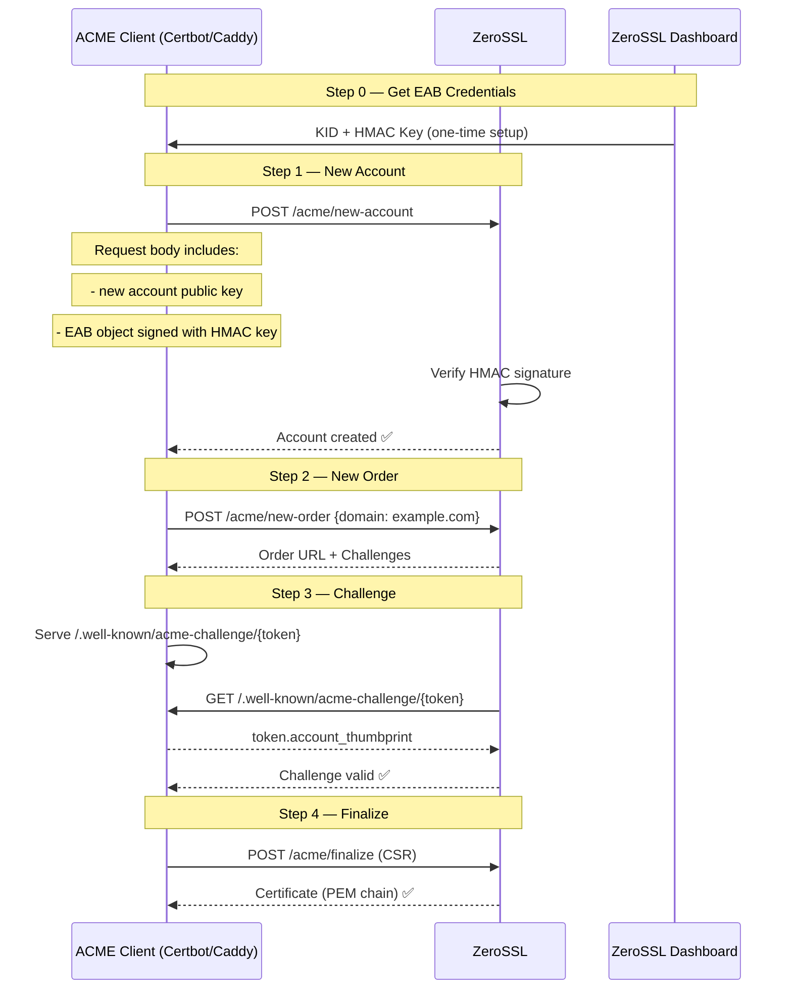

# 02 — ACME Protocol & External Account Binding (EAB)

## ACME: The Engine of Automated Certificate Management

ACME (Automated Certificate Management Environment) is the protocol standardized in **RFC 8555** that Let's Encrypt pioneered and ZeroSSL adopted. It allows clients to:

1. Automatically prove they control a domain
2. Request a certificate from a CA
3. Receive and install the certificate
4. Schedule automatic renewal

Without ACME, you would have to:
- Generate a CSR manually
- Email it to a CA
- Wait days for validation
- Manually install the cert
- Remember to renew 30 days before expiry

ACME makes this **fully automated and zero-touch**.

---

## ACME vs ZeroSSL: The One Key Difference

With Let's Encrypt:
```
Step 1: Point ACME client at LE's directory URL
Step 2: Create account with just an email
Step 3: Request certificate
```

With ZeroSSL:
```
Step 1: Point ACME client at ZeroSSL's directory URL
Step 2: Create ACME account
Step 3: ⚠️ EXTRA STEP: Provide EAB (External Account Binding) credentials
Step 4: Request certificate
```

The **External Account Binding** is the only meaningful difference in the ACME workflow.

---

## What Is External Account Binding (EAB)?

EAB is an optional ACME extension (RFC 8555 §7.3.4) that allows a CA to associate an ACME account with an existing customer account in their system.

ZeroSSL uses EAB to:
- Link your ACME-obtained certificates to your ZeroSSL dashboard account
- Apply rate limits, quotas, and plan features
- Enable certificate visibility in the web dashboard

### EAB Credentials Structure

EAB consists of two values:
- **Key ID** (`kid`): A unique identifier string (non-secret, like a username)
- **HMAC Key**: A Base64-encoded secret used to sign the account binding request

```json
{
  "kid": "qzOlKqMlgYgz1234567890abcdef",
  "hmac_key": "dGhpcyBpcyBhIHNhbXBsZSBITUFDIGtleSBmb3IgZGVtb25zdHJhdGlvbiBwdXJwb3Nlcw=="
}
```

---

## How EAB Works (Protocol Detail)



---

## ZeroSSL ACME Endpoint

```
Directory URL: https://acme.zerossl.com/v2/DV90
```

All standard ACME operations are available at this endpoint:

| ACME Endpoint | URL |
|---------------|-----|
| Directory | `https://acme.zerossl.com/v2/DV90` |
| New Nonce | `https://acme.zerossl.com/v2/DV90/newNonce` |
| New Account | `https://acme.zerossl.com/v2/DV90/newAccount` |
| New Order | `https://acme.zerossl.com/v2/DV90/newOrder` |
| Certificate | `https://acme.zerossl.com/v2/DV90/cert/{id}` |
| Revoke | `https://acme.zerossl.com/v2/DV90/revokeCert` |

---

## Getting EAB Credentials

### Method 1: ZeroSSL Dashboard (Manual)
1. Go to `https://app.zerossl.com/developer`
2. Scroll to "EAB Credentials for ACME Clients"
3. Click "Generate"
4. Copy **KID** and **HMAC Key**

> ⚠️ Since March 2022, EAB credentials are **reusable** — you can use the same KID+HMAC for multiple domains and multiple ACME clients. You do NOT need to generate new credentials for each domain.

### Method 2: ZeroSSL REST API (Programmatic)
```bash
curl -X POST "https://api.zerossl.com/acme/eab-credentials" \
  -d "access_key=YOUR_ZEROSSL_API_KEY"
```

Response:
```json
{
  "success": true,
  "eab_kid": "qzOlKqMlgYgz1234567890abcdef",
  "eab_hmac_key": "dGhpcyBpcyBhIHNhbXBsZSBITUFDIGtleSBmb3IgZGVtb25zdHJhdGlvbiBwdXJwb3Nlcw=="
}
```

### Method 3: Caddy Auto-Generate (Magic!)
Caddy 2.2+ can automatically obtain EAB credentials from ZeroSSL using your email address — no manual dashboard visit needed:

```
# Caddyfile — Caddy automatically gets EAB for ZeroSSL
{
    email admin@example.com  # Caddy uses this to auto-get EAB from ZeroSSL
}

example.com {
    reverse_proxy localhost:3000
}
```

Caddy calls the ZeroSSL API endpoint to get EAB credentials and then uses them for ACME — completely transparently.

---

## Challenge Types with ZeroSSL ACME

ZeroSSL supports all three standard ACME challenge types:

### HTTP-01 Challenge
```
Most common. CA validates domain by fetching a token over HTTP.

Caddy handles this automatically.
Manual example:
  Token: abc123
  URL verified: http://example.com/.well-known/acme-challenge/abc123
  File content: abc123.{account_key_thumbprint}
  
Requirements:
  - Port 80 must be open
  - Server must serve /.well-known/acme-challenge/ path
  - Does NOT support wildcard certs (*.example.com)
```

### DNS-01 Challenge
```
Required for wildcard certs. CA validates domain by checking a DNS TXT record.

Add TXT record:
  Name: _acme-challenge.example.com
  Value: {token hash}

Requirements:
  - DNS API access (Cloudflare, Route53, etc.)
  - Supports wildcard certs (*.example.com)
  - Supports private/internal domains
  - No port 80 requirement
```

### TLS-ALPN-01 Challenge
```
CA validates domain via TLS on port 443 using acme-tls/1 ALPN extension.

Requirements:
  - Port 443 must be open
  - Does NOT support wildcard certs
```

---

## ACME Clients for ZeroSSL

### Certbot

```bash
# Install certbot
sudo apt install certbot

# Get cert with ZeroSSL ACME + EAB
certbot certonly \
  --standalone \
  --server https://acme.zerossl.com/v2/DV90 \
  --eab-kid "YOUR_KID" \
  --eab-hmac-key "YOUR_HMAC_KEY" \
  --email admin@example.com \
  --agree-tos \
  -d example.com

# Wildcard with DNS challenge
certbot certonly \
  --dns-cloudflare \
  --dns-cloudflare-credentials ~/.secrets/cloudflare.ini \
  --server https://acme.zerossl.com/v2/DV90 \
  --eab-kid "YOUR_KID" \
  --eab-hmac-key "YOUR_HMAC_KEY" \
  --email admin@example.com \
  --agree-tos \
  -d "*.example.com"
```

### acme.sh

```bash
# Install acme.sh
curl https://get.acme.sh | sh

# Register with ZeroSSL
acme.sh --register-account \
  --server zerossl \
  --eab-kid "YOUR_KID" \
  --eab-hmac-key "YOUR_HMAC_KEY"

# Get certificate
acme.sh --issue \
  --server zerossl \
  -d example.com \
  --webroot /var/www/html

# Wildcard
acme.sh --issue \
  --server zerossl \
  -d "*.example.com" \
  --dns dns_cf \
  --cf-token "YOUR_CF_TOKEN"

# Auto-renew is set up automatically by acme.sh via cron
```

### Caddy (Recommended — Zero Config)

```
# Caddyfile — uses ZeroSSL automatically (one of two default CAs)
{
    email admin@example.com
}

example.com {
    reverse_proxy localhost:3000
}

# Force ZeroSSL only (skip Let's Encrypt)
{
    acme_ca https://acme.zerossl.com/v2/DV90
    email admin@example.com
}

example.com {
    reverse_proxy localhost:3000
}
```

Caddy's built-in ZeroSSL issuer:
```
# Explicitly configure ZeroSSL issuer in Caddyfile
example.com {
    tls {
        issuer zerossl {
            email admin@example.com
        }
    }
    reverse_proxy localhost:3000
}
```

---

## ZeroSSL ACME Rate Limits

Unlike the dashboard's 3-cert free tier limit, ZeroSSL's ACME endpoint has **significantly higher rate limits** than Let's Encrypt:

```
Let's Encrypt limits:
  - 50 certificates per registered domain per week
  - 300 new orders per account per 3 hours
  - 5 failures per account per hour

ZeroSSL ACME limits:
  - Not publicly documented, but higher than Let's Encrypt
  - Multiple sources report less frequent rate-limit issues
  - Caddy uses ZeroSSL as fallback precisely for this reason
```

### Staging / Test Endpoint

ZeroSSL does not have a separate staging endpoint like Let's Encrypt. For testing:
1. Use Let's Encrypt staging: `https://acme-staging-v02.api.letsencrypt.org/directory`
2. Or use a self-signed cert / local CA (Caddy's internal CA) for development

---

## cert-manager Integration (Kubernetes)

```yaml
# ClusterIssuer for ZeroSSL via ACME
apiVersion: cert-manager.io/v1
kind: ClusterIssuer
metadata:
  name: zerossl
spec:
  acme:
    server: https://acme.zerossl.com/v2/DV90
    email: admin@example.com
    externalAccountBinding:
      keyID: YOUR_KID
      keySecretRef:
        name: zerossl-eab-secret
        key: hmac-key
    privateKeySecretRef:
      name: zerossl-account-key
    solvers:
      - http01:
          ingress:
            class: nginx
      - dns01:
          cloudflare:
            apiTokenSecretRef:
              name: cloudflare-api-token
              key: api-token
        selector:
          dnsZones:
            - "example.com"
---
# Store the HMAC key as a Secret
apiVersion: v1
kind: Secret
metadata:
  name: zerossl-eab-secret
type: Opaque
stringData:
  hmac-key: "YOUR_BASE64_HMAC_KEY"
---
# Certificate request
apiVersion: cert-manager.io/v1
kind: Certificate
metadata:
  name: example-com
spec:
  secretName: example-com-tls
  issuerRef:
    name: zerossl
    kind: ClusterIssuer
  dnsNames:
    - example.com
    - www.example.com
```

---

## Key Insight

The beauty of the ACME protocol is that **the client code is identical** whether you use Let's Encrypt or ZeroSSL. The only difference is:
- The directory URL
- Whether EAB is required

This is exactly the principle in *The Pragmatic Programmer*'s "Don't Repeat Yourself" extended to protocols: RFC 8555 created one protocol that any CA can implement, so tooling doesn't need to change per-CA.
