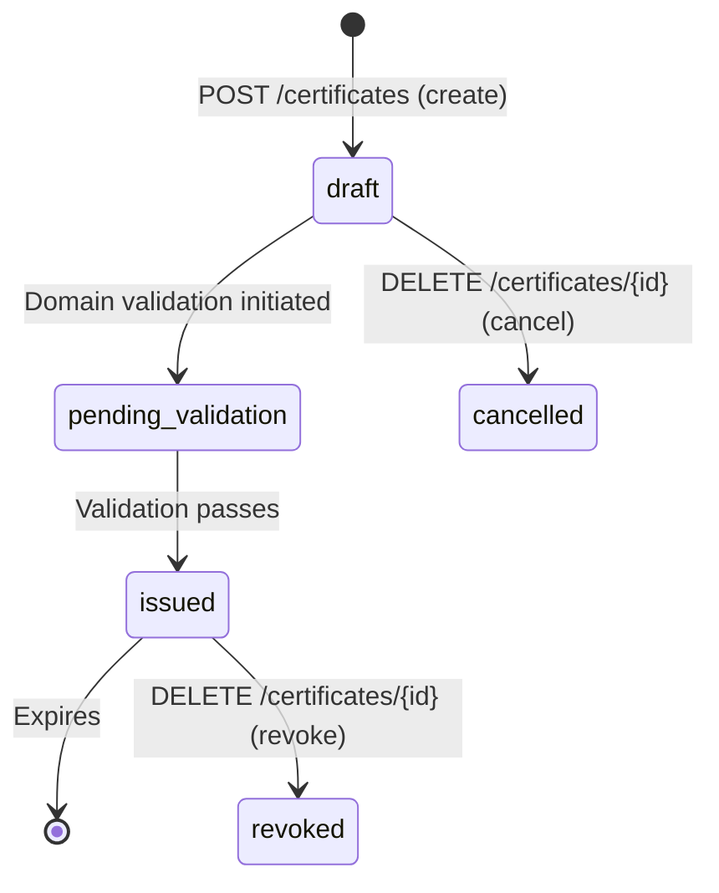

# 03 — ZeroSSL REST API & Certificate Management

## Why a REST API Matters

Let's Encrypt has no REST API. The only way to automate with Let's Encrypt is through the ACME protocol, which requires an ACME client (Certbot, acme.sh, Caddy, etc.).

ZeroSSL provides a **full REST API** alongside ACME, enabling:
- Custom automation scripts (curl, Python, Go, etc.)
- CI/CD pipeline integration without ACME client dependencies
- Certificate management in environments where ACME clients are not available
- Programmatic certificate revocation, listing, and status checking
- Integration with custom dashboards and monitoring systems

---

## Authentication

All REST API calls require an **API Access Key**:

1. Log in to `https://app.zerossl.com`
2. Go to **Developer → Access Key**
3. Copy your API key

```bash
# API key is passed as a query parameter
curl "https://api.zerossl.com/certificates?access_key=YOUR_API_KEY"
```

> ⚠️ Treat the API key like a password — store it in environment variables or secrets managers, never in source code.

---

## Certificate Lifecycle via REST API



---

## Core API Endpoints

### Base URL
```
https://api.zerossl.com
```

### 1. Create a Certificate

```bash
curl -X POST "https://api.zerossl.com/certificates?access_key=YOUR_KEY" \
  -H "Content-Type: application/x-www-form-urlencoded" \
  -d "certificate_domains=example.com" \
  -d "certificate_validity_days=90" \
  -d "certificate_csr=YOUR_CSR_CONTENT"
```

**Generate a CSR first:**
```bash
# Generate private key
openssl genrsa -out example.com.key 2048

# Generate CSR
openssl req -new -key example.com.key \
  -out example.com.csr \
  -subj "/CN=example.com/O=My Company/C=US"

# Read CSR content for API call
CSR=$(cat example.com.csr)
```

**Full create request:**
```bash
CSR=$(cat example.com.csr | tr -d '\n' | sed 's/-----BEGIN CERTIFICATE REQUEST-----//' | sed 's/-----END CERTIFICATE REQUEST-----//')

curl -X POST "https://api.zerossl.com/certificates?access_key=$ZEROSSL_KEY" \
  -H "Content-Type: application/x-www-form-urlencoded" \
  --data-urlencode "certificate_domains=example.com,www.example.com" \
  --data-urlencode "certificate_validity_days=90" \
  --data-urlencode "certificate_csr=$CSR"
```

**Response:**
```json
{
  "id": "abc123xyz789",
  "type": "90",
  "common_name": "example.com",
  "additional_domains": "www.example.com",
  "created": "2026-06-24 12:00:00",
  "expiration": "2026-09-22 23:59:59",
  "status": "draft",
  "validation": {
    "email_validation": {},
    "other_methods": {
      "example.com": {
        "file_validation_url_http": "http://example.com/.well-known/pki-validation/CA6EA7B3FF9C5D0D4826BB3ABCDEF.txt",
        "file_validation_content": ["AB12CD...", "EF34GH..."],
        "cname_validation_p1": "_AB12CD.example.com",
        "cname_validation_p2": "AB12CDEF.zerossl.com"
      }
    }
  }
}
```

---

### 2. Validate Domain Ownership

Three validation methods are available:

#### Method A: HTTP File Validation
```bash
# Create validation file on your server
mkdir -p /var/www/html/.well-known/pki-validation/
echo "AB12CD...
EF34GH..." > /var/www/html/.well-known/pki-validation/CA6EA7B3FF9C5D0D4826BB3ABCDEF.txt

# Verify it's accessible
curl http://example.com/.well-known/pki-validation/CA6EA7B3FF9C5D0D4826BB3ABCDEF.txt

# Trigger ZeroSSL validation
curl -X POST "https://api.zerossl.com/certificates/abc123xyz789/challenges?access_key=$ZEROSSL_KEY" \
  -H "Content-Type: application/x-www-form-urlencoded" \
  -d "validation_method=HTTP_CSR_HASH"
```

#### Method B: DNS CNAME Validation
```bash
# Add a CNAME record to your DNS:
# _AB12CD.example.com → AB12CDEF.zerossl.com

# Then trigger validation
curl -X POST "https://api.zerossl.com/certificates/abc123xyz789/challenges?access_key=$ZEROSSL_KEY" \
  -H "Content-Type: application/x-www-form-urlencoded" \
  -d "validation_method=CNAME_CSR_HASH"
```

#### Method C: Email Validation
```bash
# ZeroSSL sends email to admin@example.com (or other domain admin emails)
curl -X POST "https://api.zerossl.com/certificates/abc123xyz789/challenges?access_key=$ZEROSSL_KEY" \
  -H "Content-Type: application/x-www-form-urlencoded" \
  -d "validation_method=EMAIL" \
  -d "validation_email=admin@example.com"
```

---

### 3. Check Certificate Status

```bash
curl "https://api.zerossl.com/certificates/abc123xyz789?access_key=$ZEROSSL_KEY"
```

Poll until `status` changes from `pending_validation` to `issued`:

```bash
# Bash polling loop
while true; do
  STATUS=$(curl -s "https://api.zerossl.com/certificates/$CERT_ID?access_key=$ZEROSSL_KEY" | jq -r '.status')
  echo "Status: $STATUS"
  if [ "$STATUS" = "issued" ]; then
    echo "Certificate issued!"
    break
  fi
  sleep 10
done
```

---

### 4. Download Certificate

```bash
curl "https://api.zerossl.com/certificates/abc123xyz789/download/return?access_key=$ZEROSSL_KEY"
```

Response:
```json
{
  "certificate.crt": "-----BEGIN CERTIFICATE-----\n...\n-----END CERTIFICATE-----\n",
  "ca_bundle.crt": "-----BEGIN CERTIFICATE-----\n...\n-----END CERTIFICATE-----\n"
}
```

**Save to files:**
```bash
RESPONSE=$(curl -s "https://api.zerossl.com/certificates/$CERT_ID/download/return?access_key=$ZEROSSL_KEY")

echo "$RESPONSE" | jq -r '."certificate.crt"' > example.com.crt
echo "$RESPONSE" | jq -r '."ca_bundle.crt"' > ca_bundle.crt

# Combine for nginx (full chain)
cat example.com.crt ca_bundle.crt > example.com.fullchain.crt
```

---

### 5. List Certificates

```bash
# List all certificates
curl "https://api.zerossl.com/certificates?access_key=$ZEROSSL_KEY"

# Filter by status
curl "https://api.zerossl.com/certificates?access_key=$ZEROSSL_KEY&status=active"

# Filter by domain
curl "https://api.zerossl.com/certificates?access_key=$ZEROSSL_KEY&search=example.com"

# Pagination
curl "https://api.zerossl.com/certificates?access_key=$ZEROSSL_KEY&limit=50&page=2"
```

---

### 6. Revoke Certificate

```bash
curl -X POST "https://api.zerossl.com/certificates/abc123xyz789/revoke?access_key=$ZEROSSL_KEY" \
  -H "Content-Type: application/x-www-form-urlencoded"
```

---

### 7. Resend Validation Email

```bash
curl -X POST "https://api.zerossl.com/certificates/abc123xyz789/challenges/email?access_key=$ZEROSSL_KEY" \
  -H "Content-Type: application/x-www-form-urlencoded" \
  -d "validation_email=admin@example.com"
```

---

## Complete Automation Script (Python)

```python
#!/usr/bin/env python3
"""
ZeroSSL Certificate Automation Script
Obtains a certificate, waits for issuance, and downloads it.
"""

import os
import time
import subprocess
import requests

API_KEY = os.environ["ZEROSSL_API_KEY"]
DOMAIN = "example.com"
KEY_FILE = f"{DOMAIN}.key"
CSR_FILE = f"{DOMAIN}.csr"
CERT_FILE = f"{DOMAIN}.crt"
CHAIN_FILE = f"{DOMAIN}-fullchain.crt"
BASE_URL = "https://api.zerossl.com"


def generate_csr():
    subprocess.run(["openssl", "genrsa", "-out", KEY_FILE, "2048"], check=True)
    subprocess.run([
        "openssl", "req", "-new",
        "-key", KEY_FILE,
        "-out", CSR_FILE,
        "-subj", f"/CN={DOMAIN}/O=MyOrg/C=US"
    ], check=True)
    return open(CSR_FILE).read()


def create_certificate(csr: str) -> dict:
    r = requests.post(f"{BASE_URL}/certificates", params={"access_key": API_KEY}, data={
        "certificate_domains": DOMAIN,
        "certificate_validity_days": 90,
        "certificate_csr": csr,
    })
    r.raise_for_status()
    return r.json()


def setup_http_validation(cert_data: dict) -> tuple[str, list[str]]:
    domain_val = cert_data["validation"]["other_methods"][DOMAIN]
    file_url = domain_val["file_validation_url_http"]
    file_content = domain_val["file_validation_content"]
    filename = file_url.split("/")[-1]
    return filename, file_content


def trigger_validation(cert_id: str):
    r = requests.post(
        f"{BASE_URL}/certificates/{cert_id}/challenges",
        params={"access_key": API_KEY},
        data={"validation_method": "HTTP_CSR_HASH"}
    )
    r.raise_for_status()
    return r.json()


def wait_for_issuance(cert_id: str, timeout: int = 300) -> bool:
    start = time.time()
    while time.time() - start < timeout:
        r = requests.get(f"{BASE_URL}/certificates/{cert_id}", params={"access_key": API_KEY})
        status = r.json().get("status")
        print(f"Status: {status}")
        if status == "issued":
            return True
        if status in ("cancelled", "revoked"):
            return False
        time.sleep(10)
    return False


def download_certificate(cert_id: str):
    r = requests.get(
        f"{BASE_URL}/certificates/{cert_id}/download/return",
        params={"access_key": API_KEY}
    )
    r.raise_for_status()
    data = r.json()
    cert = data["certificate.crt"]
    bundle = data["ca_bundle.crt"]
    with open(CERT_FILE, "w") as f:
        f.write(cert)
    with open(CHAIN_FILE, "w") as f:
        f.write(cert + bundle)
    print(f"Certificate saved to {CERT_FILE}")
    print(f"Full chain saved to {CHAIN_FILE}")


def main():
    print("1. Generating CSR...")
    csr = generate_csr()

    print("2. Creating certificate order...")
    cert_data = create_certificate(csr)
    cert_id = cert_data["id"]
    print(f"Certificate ID: {cert_id}")

    print("3. Setting up HTTP validation...")
    filename, content = setup_http_validation(cert_data)
    val_dir = "/var/www/html/.well-known/pki-validation"
    os.makedirs(val_dir, exist_ok=True)
    with open(f"{val_dir}/{filename}", "w") as f:
        f.write("\n".join(content))
    print(f"Validation file created: {val_dir}/{filename}")

    print("4. Triggering validation...")
    trigger_validation(cert_id)

    print("5. Waiting for issuance...")
    if not wait_for_issuance(cert_id):
        print("Certificate issuance failed!")
        return

    print("6. Downloading certificate...")
    download_certificate(cert_id)
    print("Done! Certificate ready.")


if __name__ == "__main__":
    main()
```

---

## Monitoring Expiry via API

```bash
#!/bin/bash
# Check for certs expiring within 30 days

API_KEY="${ZEROSSL_API_KEY}"
WARN_DAYS=30

# Get all active certs
CERTS=$(curl -s "https://api.zerossl.com/certificates?access_key=$API_KEY&status=active&limit=1000")

echo "$CERTS" | jq -r '.results[] | "\(.common_name) expires: \(.expiration)"' | while read line; do
    DOMAIN=$(echo $line | cut -d' ' -f1)
    EXPIRY=$(echo $line | awk '{print $3}')
    
    EXPIRY_TS=$(date -d "$EXPIRY" +%s 2>/dev/null || date -j -f "%Y-%m-%d" "$EXPIRY" +%s)
    NOW_TS=$(date +%s)
    DAYS_LEFT=$(( (EXPIRY_TS - NOW_TS) / 86400 ))
    
    if [ "$DAYS_LEFT" -lt "$WARN_DAYS" ]; then
        echo "⚠️  WARNING: $DOMAIN expires in $DAYS_LEFT days ($EXPIRY)"
    fi
done
```
