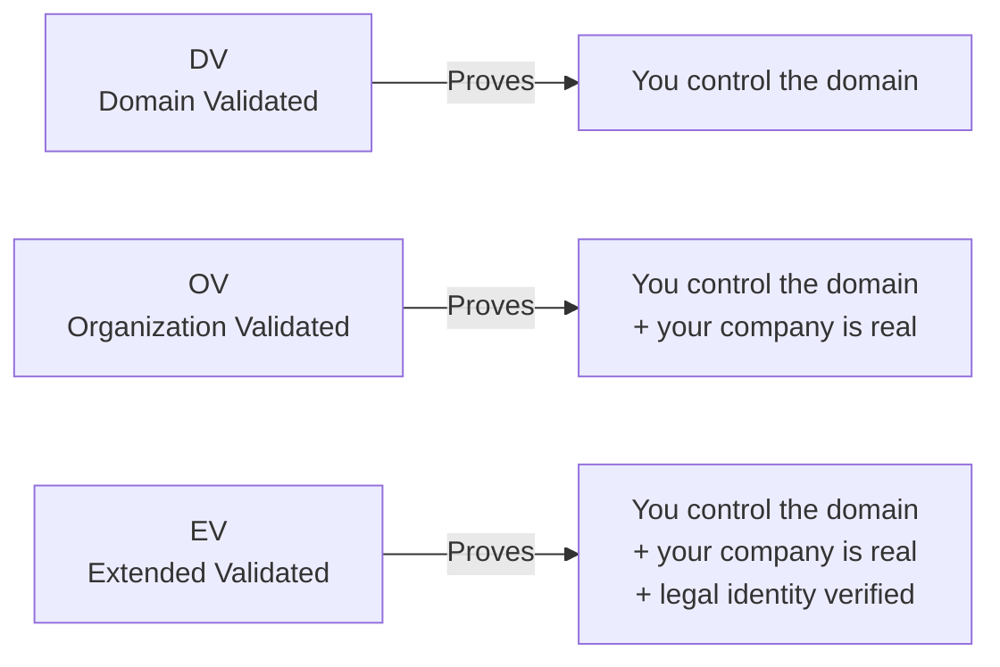

# 04 — Certificate Types, Pricing & Validation Levels

## The Three Validation Levels

TLS certificates are classified by how much the CA verified about the entity requesting the cert:



### Domain Validated (DV) — What ZeroSSL Free Provides

**What it proves**: The certificate requester controls the domain.

**How validated**: 
- HTTP file challenge: CA fetches a file from `http://domain/.well-known/`
- DNS TXT record: CA checks for a specific DNS entry
- Email: CA sends verification email to domain admin

**What it does NOT prove**:
- Who you are
- What company you represent
- Whether your business is legitimate

**Cert contents**:
```
Subject: CN=example.com
Issuer: ZeroSSL RSA Domain Secure Site CA
Valid: 90 days (free) or 1 year (paid)
```

**Use cases**: Personal websites, APIs, all automated systems, 99% of production deployments.

---

### Organization Validated (OV)

**What it proves**: Your company is real and registered.

**How validated**:
- Domain validation (same as DV)
- CA manually checks government business registry
- CA may call a verified phone number
- Verifies company address

**Process time**: 1–3 business days

**Cert contents**:
```
Subject: CN=example.com, O=ACME Corporation, L=San Francisco, C=US
```

**Use cases**: E-commerce, business websites, applications where users want to verify the company.

---

### Extended Validated (EV)

**What it proves**: Full legal entity verification.

**How validated**:
- All OV checks plus:
- Articles of incorporation
- Physical presence verification
- Legal representative verification
- CA-B Forum strict guidelines

**Process time**: 1–2 weeks

**What browsers do**: Some browsers show the company name in the address bar or lock icon.

**Cert contents**:
```
Subject: CN=example.com
         O=ACME Corporation, LLC
         L=San Francisco
         ST=California
         C=US
         jurisdictionCountry=US
         businessCategory=Private Organization
         serialNumber=C3456789 (State registration number)
```

**Use cases**: Banking, insurance, government, legal — where legal accountability must be visible.

---

## ZeroSSL Pricing Plans

### Free Plan

```
┌─────────────────────────────────────────────────────────────┐
│ FREE                                                        │
│                                                             │
│ ✅ Unlimited 90-day DV certs via ACME protocol              │
│ ✅ 3 concurrent active certs via dashboard/REST API         │
│ ✅ HTTP, DNS, and CNAME validation methods                  │
│ ✅ Wildcard certificates (via ACME + DNS challenge)         │
│ ✅ Multi-domain (SAN) certificates (up to 100 SANs, ACME)  │
│ ✅ Email renewal reminders                                  │
│ ✅ EAB credentials for ACME clients                        │
│ ❌ 1-year certificates                                      │
│ ❌ OV / EV certificates                                     │
│ ❌ Priority support                                         │
└─────────────────────────────────────────────────────────────┘

Note: The "3 cert limit" applies only to the dashboard/API.
      Via ACME protocol → unlimited certificates.
```

### Paid Plans (2026 Approximate Pricing)

```
┌────────────────────┬───────────┬────────────┬────────────┐
│ Certificate Type   │ Validity  │ Price/cert │ Notes      │
├────────────────────┼───────────┼────────────┼────────────┤
│ DV 90-day          │ 90 days   │ Free       │ Via ACME   │
│ DV Annual          │ 1 year    │ ~$9.99     │ Dashboard  │
│ DV Multi-Domain    │ 1 year    │ ~$39.99    │ Up to 5 dom│
│ DV Wildcard        │ 1 year    │ ~$69.99    │ *.domain   │
│ OV Standard        │ 1-2 years │ ~$49.99    │            │
│ OV Wildcard        │ 1-2 years │ ~$149.99   │            │
│ EV Standard        │ 1-2 years │ ~$199.99   │            │
│ EV Multi-Domain    │ 1-2 years │ ~$399.99   │            │
└────────────────────┴───────────┴────────────┴────────────┘
Custom/Enterprise pricing available for volume purchases.
```

---

## Wildcard Certificates

A wildcard cert (`*.example.com`) covers **all subdomains one level deep**:

```
*.example.com covers:
  ✅ api.example.com
  ✅ www.example.com
  ✅ mail.example.com
  ✅ app.example.com
  
*.example.com does NOT cover:
  ❌ example.com (root domain — need separate cert or SAN)
  ❌ api.v2.example.com (two levels deep)
```

**Why wildcards require DNS-01 challenge**:
- HTTP-01 challenge requires physically serving a file from each domain
- For a wildcard, there are infinitely many subdomains — impossible to prove control this way
- DNS-01 requires a DNS TXT record at `_acme-challenge.example.com` — one record proves control of all subdomains

### Wildcard + Root in One Cert (SAN)

```bash
# certbot: wildcard + root domain in one cert
certbot certonly \
  --dns-cloudflare \
  --dns-cloudflare-credentials ~/.secrets/cloudflare.ini \
  --server https://acme.zerossl.com/v2/DV90 \
  --eab-kid "$EAB_KID" \
  --eab-hmac-key "$EAB_HMAC" \
  -d "example.com" \
  -d "*.example.com"
```

This produces a single cert with two SANs:
- `example.com`
- `*.example.com`

---

## Multi-Domain (SAN) Certificates

SAN (Subject Alternative Names) lets one cert cover multiple unrelated domains:

```
CN: example.com
SAN: example.com, example.net, example.org, api.myapp.io

One cert → multiple domains → simpler management, fewer renewal operations
```

Via ACME (certbot):
```bash
certbot certonly \
  --standalone \
  --server https://acme.zerossl.com/v2/DV90 \
  --eab-kid "$EAB_KID" \
  --eab-hmac-key "$EAB_HMAC" \
  -d example.com \
  -d www.example.com \
  -d api.example.com \
  -d blog.example.com
```

---

## Certificate Validity: 90-Day vs 1-Year

This is a key architectural decision:

```
┌───────────────────────────────┬──────────────────────┬──────────────────────┐
│ Factor                        │ 90-Day               │ 1-Year               │
├───────────────────────────────┼──────────────────────┼──────────────────────┤
│ Security                      │ Better               │ Worse                │
│ (smaller compromise window)   │ (key exposed ≤90d)   │ (key exposed ≤1yr)   │
│ Automation required           │ Yes (or manual 4x/yr)│ No (1x/yr manual OK) │
│ Suitable for devices          │ No (hard to automate)│ Yes                  │
│ Industry trend                │ ✅ Shorter preferred │ ❌ Being deprecated  │
│ Let's Encrypt offers          │ ✅ Yes               │ ❌ No                │
│ ZeroSSL free offers           │ ✅ Via ACME          │ ❌ Paid only         │
│ Price (ZeroSSL)               │ Free                 │ ~$10/year            │
└───────────────────────────────┴──────────────────────┴──────────────────────┘
```

> **Industry trend**: The CA/Browser Forum has been moving toward **shorter certificate lifetimes**. As of 2026, there is active discussion about mandating 47-day or even shorter certificates. Automate your renewals — long-lived certs are a legacy concern.

---

## Certificate Chain: Understanding the Full Chain

When you download from ZeroSSL, you get two files:

```
certificate.crt  → Your leaf certificate (just for your domain)
ca_bundle.crt    → Intermediate certificate(s) from ZeroSSL

For most web servers, combine them:
fullchain.crt = certificate.crt + ca_bundle.crt

Why? 
  Browser doesn't always know ZeroSSL's intermediate cert.
  Serving the full chain allows browser to build the trust path:
  
  Your Cert (example.com)
       ↑ signed by
  ZeroSSL Intermediate
       ↑ signed by
  Sectigo Root (in browser trust store)
```

### Nginx configuration:
```nginx
server {
    listen 443 ssl;
    server_name example.com;
    
    ssl_certificate     /etc/ssl/example.com.fullchain.crt;  # Full chain
    ssl_certificate_key /etc/ssl/example.com.key;
    
    ssl_protocols TLSv1.2 TLSv1.3;
    ssl_ciphers ECDHE-ECDSA-AES128-GCM-SHA256:ECDHE-RSA-AES128-GCM-SHA256;
    ssl_prefer_server_ciphers off;
    ssl_session_timeout 1d;
    ssl_session_cache shared:SSL:10m;
    ssl_stapling on;
    ssl_stapling_verify on;
}
```

---

## Choosing: ZeroSSL vs Let's Encrypt vs Others

```
Use ZeroSSL when:
  ✅ You want a web dashboard to manage certs visually
  ✅ You need higher rate limits than Let's Encrypt
  ✅ You want OV or EV certs from the same provider
  ✅ You need 1-year certs (paid)
  ✅ You need REST API without ACME client
  ✅ You want email renewal reminders
  ✅ Legacy Android compatibility matters (Sectigo root)
  ✅ You want CA diversity (not just Let's Encrypt)

Use Let's Encrypt when:
  ✅ Simplest ACME setup (no EAB needed)
  ✅ Nonprofit CA matters to you
  ✅ 100% free for all features
  ✅ Maximum community support and tooling

Use Cloudflare SSL when:
  ✅ Your DNS is already on Cloudflare
  ✅ You want CDN + SSL in one place
  ✅ Cloudflare manages all cert complexity for you
  
Use AWS Certificate Manager when:
  ✅ All infrastructure is in AWS
  ✅ Free + automatic with ALB/CloudFront
  ✅ No self-managed servers
```
