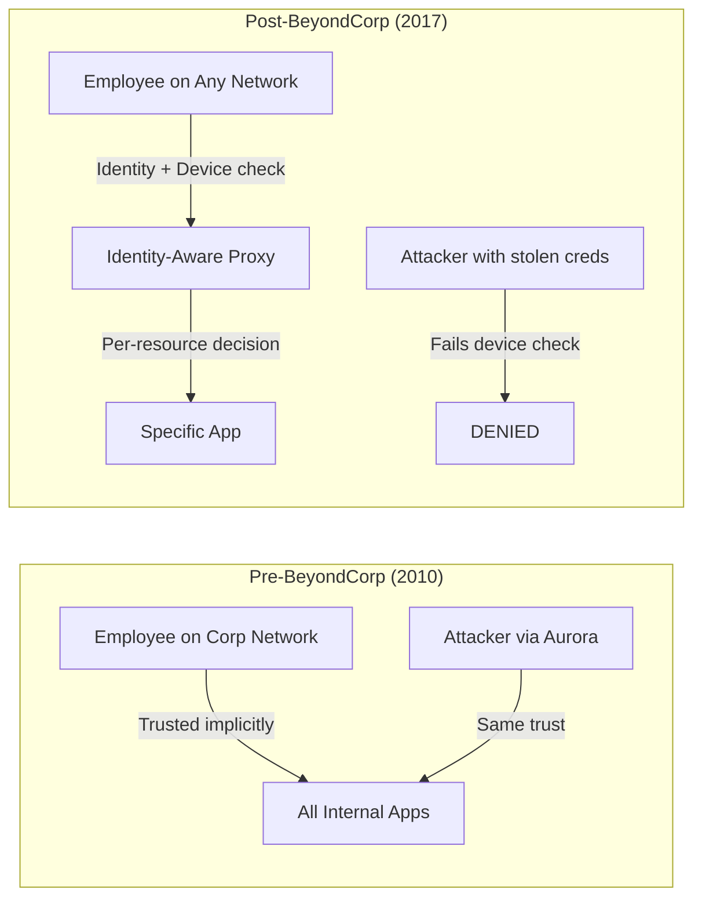
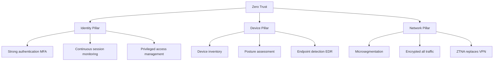

# 01 — Zero Trust: Philosophy & Principles

## The Problem With "Trust the Network"

For decades, enterprise security was built on the **castle-and-moat** model:

```
┌─────────────────────────────────────────────────────┐
│                   INTERNET                          │
│                                                     │
│   ┌─────────────────────────────────────────────┐  │
│   │         CORPORATE FIREWALL (The Moat)       │  │
│   │                                             │  │
│   │   ┌─────────────────────────────────────┐  │  │
│   │   │    TRUSTED INTERNAL NETWORK         │  │  │
│   │   │    "Everything inside = safe"       │  │  │
│   │   │                                     │  │  │
│   │   │  [Database]  [Servers]  [Files]     │  │  │
│   │   └─────────────────────────────────────┘  │  │
│   └─────────────────────────────────────────────┘  │
└─────────────────────────────────────────────────────┘
```

The assumption: **If you're inside the network, you're trusted.**

This model **completely fails** in the modern world because:

| Threat | Why the Moat Fails |
|--------|-------------------|
| Phishing → VPN credentials stolen | Attacker is now "inside" — trusted completely |
| Compromised employee laptop | Inside the network — full lateral movement |
| Malicious insider | Already trusted by network location |
| Cloud workloads | No "inside" — services span AWS, Azure, GCP |
| Remote work | Employees connect from home, coffee shops, airports |
| SaaS apps | Data lives in Google Workspace, Salesforce, GitHub — "outside" |
| Supply chain attacks | Compromised software vendor gets inside access |

> **The moat is already breached. The question is whether you know it.**

---

## The Zero Trust Answer: "Never Trust, Always Verify"

Zero Trust was coined by **John Kindervag** at Forrester Research in 2010. The core insight:

> **"Trust is a vulnerability."**

Instead of trusting based on network location, Zero Trust requires **continuous verification of every request, from every user, from every device, to every resource**.

```
ZERO TRUST MINDSET:

❌ "You're inside the network → you're trusted"
✅ "Prove who you are + prove your device is safe + prove you're allowed → you may access THIS resource for THIS session"
```

---

## Google BeyondCorp: The Origin Story

The most influential real-world implementation of Zero Trust came from Google — not as a product, but as a **necessity after a catastrophic breach**.

### Operation Aurora (2010)

In January 2010, Google disclosed that it had been the victim of **Operation Aurora** — a sophisticated, state-sponsored cyberattack originating from China. The attackers:
- Compromised employee machines via a zero-day in Internet Explorer
- Used the "trusted internal network" to move laterally
- Accessed Gmail accounts of Chinese human rights activists
- Stole intellectual property from Google and at least 30 other companies

The breach didn't start from outside the network — it exploited the **implicit trust granted to internal network users**.

### Google's Response: BeyondCorp

Rather than building a bigger moat, Google did something radical: **they eliminated the concept of "trusted internal network" entirely**.

Between 2011 and 2017, Google:
1. Moved all internal applications off the VPN and onto the **public internet**
2. Protected apps with an **Identity-Aware Proxy** that evaluated every request
3. Checked both **who you are** (identity) and **which device you're using** (device posture)
4. Granted access **per-session, per-resource** — not blanket network access

By 2017, Google employees could work securely from **any network, anywhere in the world** — no VPN required. The system they built became **BeyondCorp**, documented in a series of public research papers.



---

## The 7 Core Tenets of Zero Trust (NIST + CISA)

These are the foundational principles from NIST SP 800-207 and CISA's Zero Trust Maturity Model:

### Tenet 1: All Resources Are Treated the Same
No distinction between "internal" and "external" resources. A database server in the datacenter and a SaaS application get the same scrutiny.

### Tenet 2: All Communication Is Secured
Every connection is encrypted (TLS), regardless of whether it's inside a datacenter or across the public internet. No plain HTTP — ever.

### Tenet 3: Access Is Granted Per-Session
Access is granted to **specific resources** for **specific time windows**, not blanket network access. When the session ends, access ends.

### Tenet 4: Access Decisions Use Dynamic Policy
The policy engine considers multiple signals:
- **Identity**: Who is this user? What groups are they in?
- **Device posture**: Is the device encrypted? Updated? Managed?
- **Context**: What time is it? Where is the request from? What's the risk score?
- **Behavior**: Is this normal for this user? Anomalous activity?

### Tenet 5: All Owned Devices Are Monitored
Continuous monitoring of device health and compliance. If a laptop fails a security check mid-session, access can be revoked immediately.

### Tenet 6: Authentication and Authorization Are Dynamic and Strictly Enforced
Not just "login once and you're done." Re-authentication and re-authorization happen continuously (or at minimum, per-session). Step-up authentication for sensitive operations.

### Tenet 7: Collect Telemetry to Improve Security Posture
Zero Trust depends on data: logs, behavioral analytics, threat intelligence. The more you know about normal behavior, the faster you detect anomalies.

---

## Why VPNs Fail the Zero Trust Test

VPNs were designed in the 1990s for a different threat model: **secure remote access to a trusted network**. They are fundamentally incompatible with Zero Trust:

```
VPN Problems:

┌─────────────────────────────────────────────────────────────────┐
│ Problem           │ What VPN Does          │ Why It Fails        │
├─────────────────────────────────────────────────────────────────┤
│ Credentials stolen│ Grants full net access │ Attacker = employee │
│ Lateral movement  │ Full network visible   │ Breach spreads      │
│ Network trust     │ "Inside" = trusted     │ Core ZT violation   │
│ Performance       │ All traffic through VPN│ Bottleneck, latency │
│ SaaS apps         │ Bypassed or re-routed  │ Doesn't help        │
│ Device check      │ None typically         │ BYOD risk           │
│ Audit logs        │ IP-level only          │ Poor visibility     │
│ Granular control  │ On/off toggle          │ All or nothing      │
└─────────────────────────────────────────────────────────────────┘
```

> VPN asks: "Are you on the network?" (binary)
> Zero Trust asks: "Who are you, what device, what resource, what time, what risk?" (contextual)

---

## Zero Trust Is Not a Product — It's a Strategy

This is the most misunderstood point about Zero Trust. Vendors sell "Zero Trust products," but Zero Trust is an **architectural philosophy** you implement over time using many tools together.

```
Zero Trust is implemented by combining:

Identity Provider (IdP)    ──── Who is the user? (Okta, Azure AD, Google)
Device Management (MDM)    ──── Is the device trusted? (Jamf, Intune, CrowdStrike)
Network Access (ZTNA)      ──── What can they reach? (Cloudflare, Tailscale, Zscaler)
Microsegmentation          ──── How isolated are resources? (Illumio, Guardicore)
Policy Engine              ──── What are the rules? (OPA, Cedar, custom)
Monitoring & SIEM          ──── What's happening? (Splunk, Datadog, Chronicle)
```

No single product provides all of these. Zero Trust is an **integration architecture**.

---

## The Three Pillars of Zero Trust



---

## Zero Trust Maturity Model (CISA)

CISA defines 4 maturity stages that organizations progress through:

```
Stage 1: TRADITIONAL
  - Manual config, static policies
  - Identity: passwords, some MFA
  - Devices: Minimal monitoring
  - Networks: Macro-segmentation (VLANs)
  - Visibility: Basic logging

Stage 2: INITIAL
  - Attribute-based access control
  - MFA for critical systems
  - Device compliance checking
  - Per-app network access (ZTNA starts)
  - Centralized log collection

Stage 3: ADVANCED  
  - Continuous session re-validation
  - Risk-based step-up auth
  - Full device posture integration
  - Microsegmentation
  - Real-time behavioral analytics

Stage 4: OPTIMAL
  - Fully automated policy enforcement
  - AI-driven anomaly detection
  - Dynamic, adaptive access
  - Zero standing privileges
  - Complete observability
```

Most enterprises in 2026 are at Stage 1-2. **Stage 4 is the long-term goal** but Stage 2-3 already provides massive security improvements.

---

## Real-World Impact: What Zero Trust Prevents

```
Attack Scenario: Phishing → Credential Theft

With VPN/Traditional:
  Attacker steals VPN credentials → connects to VPN →
  has full network access → lateral moves to database →
  exfiltrates 10M customer records → detected after 200 days

With Zero Trust:
  Attacker steals credentials → tries to connect →
  DEVICE CHECK FAILS (unknown device) → ACCESS DENIED
  If attacker has managed device: BEHAVIORAL ANOMALY detected
  (login from new country at 3AM) → STEP-UP AUTH triggered →
  Attacker cannot pass MFA → ACCESS DENIED
  Security team alerted within minutes
```

Google, Airbnb, and Beyondtrust have documented dramatic reductions in breach impact after Zero Trust implementations:
- **Google**: No successful lateral movement attacks since BeyondCorp deployment
- **Airbnb**: 70% reduction in security incidents related to credential abuse
- **CISA Directive**: US Federal agencies mandated to implement Zero Trust by 2024

---

## Literature Perspective

> *Designing Data-Intensive Applications* (Kleppmann) describes systems that are robust against **partial failures** — where you assume components will fail and design accordingly. Zero Trust applies the same thinking to people: assume any user, device, or credential may be compromised at any time and design security controls that remain effective even in that scenario.

> *The Pragmatic Programmer* (Hunt & Thomas): "Don't assume it — prove it." Zero Trust is the security embodiment of this principle: never assume a user is who they claim to be — verify it, every time.
