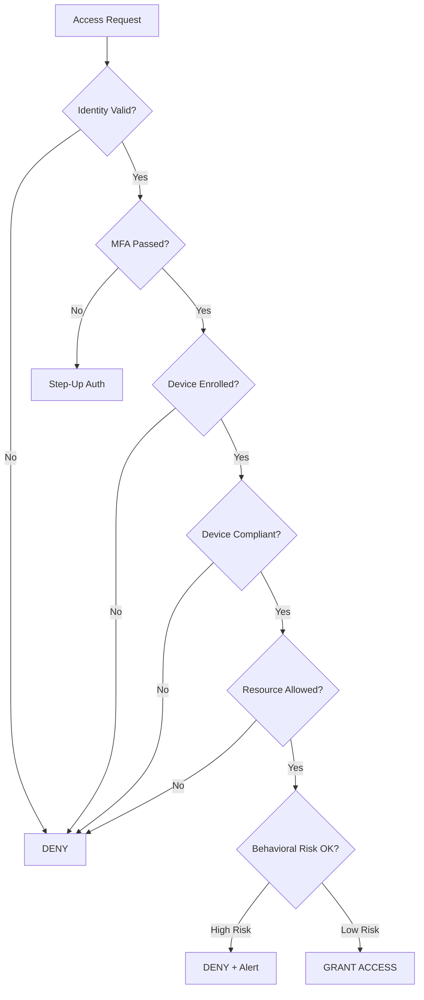
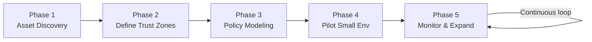

# 02 — NIST SP 800-207: The Zero Trust Architecture Standard

## Why NIST 800-207 Matters

NIST Special Publication 800-207 (published August 2020) is the **definitive reference** for Zero Trust Architecture. It was mandated by **US Executive Order 14028** (2021) for all federal agencies, making it the de facto industry standard.

Understanding NIST 800-207 gives you a vendor-neutral framework to evaluate any Zero Trust product or implementation.

---

## The Logical Architecture

NIST defines Zero Trust around two core planes:

```
┌──────────────────────────────────────────────────────────────┐
│                    CONTROL PLANE                             │
│                                                              │
│  ┌──────────────────────────────┐                           │
│  │     POLICY ENGINE (PE)       │ ◀── Threat Intelligence   │
│  │  - Evaluates access request  │ ◀── SIEM / SOAR           │
│  │  - Trust algorithm           │ ◀── CDM System            │
│  │  - Grant / Deny / Step-up    │ ◀── IdP (Okta/AD)         │
│  └──────────┬───────────────────┘ ◀── Device Registry       │
│             │                                                │
│             ▼                                                │
│  ┌──────────────────────────────┐                           │
│  │  POLICY ADMINISTRATOR (PA)   │                           │
│  │  - Communicates decisions    │                           │
│  │  - Issues session tokens     │                           │
│  │  - Updates PEP               │                           │
│  └──────────┬───────────────────┘                           │
└─────────────┼────────────────────────────────────────────────┘
              │
              │ Control channel (secure)
              │
┌─────────────┼────────────────────────────────────────────────┐
│             ▼        DATA PLANE                              │
│  ┌──────────────────────────────┐                           │
│  │  POLICY ENFORCEMENT POINT    │                           │
│  │         (PEP)                │                           │
│  │  - Sits between subject      │                           │
│  │    and resource              │                           │
│  │  - Allows or blocks traffic  │                           │
│  │  - Examples: Cloudflare,     │                           │
│  │    Tailscale, NGINX+Auth     │                           │
│  └────────┬────────────────────┘                           │
│           │                                                  │
│   ┌───────┘         ┌────────────┐                          │
│   │                 │            │                          │
│   ▼                 ▼            ▼                          │
│ [Subject]       [Resource]  [Resource]                       │
│ (User+Device)   (App/DB)    (API)                            │
└──────────────────────────────────────────────────────────────┘
```

---

## The Three Core Components

### 1. Policy Engine (PE)

The **brain** of Zero Trust. Makes the trust/access decision.

**Inputs to the Policy Engine:**
- **Subject identity**: Who is the user? What roles? What groups?
- **Subject credentials**: Is MFA completed? Is the session current?
- **Device posture**: Is the device enrolled? Encrypted? Updated? Has an EDR agent?
- **Request context**: What resource? What time? What location? What action?
- **Behavioral baseline**: Is this normal for this user? Unusual access pattern?
- **Threat intelligence**: Is the source IP flagged? Known bad actor?
- **Compliance state**: Does the user's device comply with company policy?

**Trust Algorithm Output:**
- **Grant**: Full access to resource
- **Grant with conditions**: Access but log everything / shorter session / read-only
- **Step-up authentication**: Require additional factor before granting
- **Deny**: Block access, alert security team
- **Deny + quarantine**: Block and isolate device



### 2. Policy Administrator (PA)

The **messenger** between the Policy Engine and the Policy Enforcement Point.

Responsibilities:
- Receives the PE's decision
- Issues session tokens, certificates, or session keys
- Configures the PEP to allow/block the specific traffic flow
- Monitors session health and can revoke access mid-session

### 3. Policy Enforcement Point (PEP)

The **gatekeeper** — what actually allows or blocks network traffic.

The PEP is physically between the user and the resource:
```
User ──request──▶ [PEP] ──allowed──▶ Resource
                    │
                    ├─ Cloudflare Access (for web apps)
                    ├─ Tailscale (for SSH/databases)
                    ├─ Zscaler Private Access
                    ├─ NGINX with auth_request
                    └─ Service mesh sidecar (Envoy/Istio)
```

---

## Supporting Components

### Identity Provider (IdP)

The source of truth for **who the user is**.

Examples: Okta, Microsoft Entra ID (Azure AD), Google Workspace, JumpCloud, Ping Identity

Functions:
- Store user identities and group memberships
- Authenticate users (password + MFA)
- Issue SAML assertions or OIDC tokens
- Provide SCIM for automated provisioning/deprovisioning

### Device Registry / MDM

The source of truth for **device trustworthiness**.

Examples: Microsoft Intune, Jamf, CrowdStrike Falcon, VMware Workspace ONE

Data provided to Policy Engine:
- Is the device enrolled in MDM?
- Is the OS updated to policy-required version?
- Is disk encryption enabled (FileVault / BitLocker)?
- Is the EDR agent installed and running?
- Is the device in compliance with security baseline?
- Certificate-based device identity

### CDM (Continuous Diagnostics and Mitigation)

Ongoing monitoring of all assets:
- Asset inventory (know what you have)
- Vulnerability scanning
- Software inventory
- Configuration compliance checking

### SIEM (Security Information and Event Management)

Collects logs from all components:
- Authentication events
- Access decisions (allow/deny)
- Network flows
- Anomalous behavior alerts

Examples: Splunk, Microsoft Sentinel, Google Chronicle, Elastic SIEM

---

## NIST's Three Deployment Models

### Model 1: Identity-Governed Access (Enhanced Identity Governance)

**Best for**: Organizations with strong IdP but limited network control

```
User + Strong Auth ──▶ IdP verifies ──▶ IAP/Gateway decides ──▶ Resource

Examples:
  - Google BeyondCorp
  - Cloudflare Access
  - Azure Application Proxy

How it works:
  Identity Provider (Okta/Google) becomes the primary gating mechanism.
  All apps are placed behind an Identity-Aware Proxy.
  Access decision is made purely on identity + device + context.
  No VPN, no network segmentation required.
```

### Model 2: Microsegmentation

**Best for**: Datacenter environments, protecting east-west traffic

```
Segment A ──▶ [PEP/Firewall] ──▶ Segment B
              Policy Engine
              decides per flow

Examples:
  - Illumio
  - VMware NSX
  - AWS Security Groups (fine-grained)
  - Guardicore Centra

How it works:
  Network is divided into tiny segments (per workload, per VM).
  Traffic between segments requires explicit policy approval.
  East-west traffic (server to server) is controlled, not just north-south.
```

### Model 3: Software-Defined Perimeter (SDP)

**Best for**: Remote access, multi-cloud, replacing VPN

```
User ──▶ SDP Client ──▶ SDP Controller ──▶ Gateway ──▶ Resource
          (device cert)   (auth + posture)

Examples:
  - Tailscale (WireGuard-based)
  - Zscaler Private Access
  - Cisco Duo Network Gateway
  - Palo Alto Prisma Access

How it works:
  Users install a client agent.
  Agent authenticates and verifies device posture.
  Creates a direct encrypted tunnel to specific resources only.
  Resources are completely hidden from the internet (dark network).
```

---

## The Trust Algorithm in Detail

The trust algorithm is what the Policy Engine runs to decide access. NIST defines two approaches:

### Approach 1: Criteria-Based (Checklist)

```
Access = IdP_valid AND MFA_passed AND Device_enrolled AND Device_compliant
         AND Resource_allowed AND Time_window_OK AND Risk_score < threshold
```

Simple but inflexible — binary allow/deny.

### Approach 2: Score-Based (Risk Scoring)

```
Trust_score = 
    identity_strength      × 0.30  (MFA type, credential age)
  + device_posture_score   × 0.25  (compliance %, patch level)
  + behavior_baseline      × 0.20  (deviation from normal patterns)
  + network_risk           × 0.15  (IP reputation, geo-location)
  + resource_sensitivity   × 0.10  (data classification)

If trust_score > 0.70: GRANT
If 0.40 < trust_score < 0.70: STEP-UP AUTH
If trust_score < 0.40: DENY
```

Modern systems use **ML-based risk scoring** that learns what "normal" looks like and triggers on deviations.

---

## NIST's 5-Phase Implementation Roadmap



### Phase 1: Asset Discovery
- Inventory all users, devices, apps, services, data
- Classify data sensitivity
- Map application dependencies
- Identify current access patterns

### Phase 2: Define Trust Zones
- Identify which resources need protecting
- Define subject categories (employee, contractor, partner, service account)
- Define device categories (managed, BYOD, IoT, CI/CD pipeline)

### Phase 3: Policy Modeling
- Write access policies: "Developer group can SSH to dev servers from compliant devices 9AM-6PM"
- Define step-up triggers: "Database access requires re-authentication"
- Define deny defaults: "Everything not explicitly allowed is denied"

### Phase 4: Pilot in Small Environment
- Deploy to one team or one application
- Measure impact on productivity
- Tune policies based on real feedback
- Build runbooks for common issues

### Phase 5: Monitor, Adjust, Expand
- Continuous logging and behavioral analytics
- Regular policy reviews
- Expand to additional applications and teams
- Work toward least-privilege automation

---

## Common Mistakes When Implementing NIST 800-207

```
Mistake 1: Treating Zero Trust as a product purchase
  Reality: It's an architecture requiring multiple tools + process changes

Mistake 2: Starting with network segmentation before identity
  Reality: Identity is the foundation — start there (Phase 1)

Mistake 3: Ignoring service-to-service communication
  Reality: Machines need Zero Trust too (mTLS, service accounts, workload identity)

Mistake 4: Keeping VPN as a fallback
  Reality: Users will use the easier VPN path; remove it gradually but completely

Mistake 5: Binary allow/deny with no step-up
  Reality: Risk-based step-up auth reduces friction for normal access,
           adds friction only for anomalous requests

Mistake 6: No continuous monitoring after deployment
  Reality: Zero Trust is not "set and forget" — it requires ongoing telemetry and tuning
```

---

## Literature Connection

> *Patterns of Enterprise Application Architecture* (Fowler) describes the **Service Layer** pattern — a layer that defines an application's boundary and the set of available operations. NIST 800-207's Policy Engine is a security Service Layer: it defines the boundary of every resource and the set of available operations (who can do what).

The Policy Engine externalizes authorization logic from individual applications — exactly as Fowler's patterns advocate for externalizing cross-cutting concerns from business logic.
