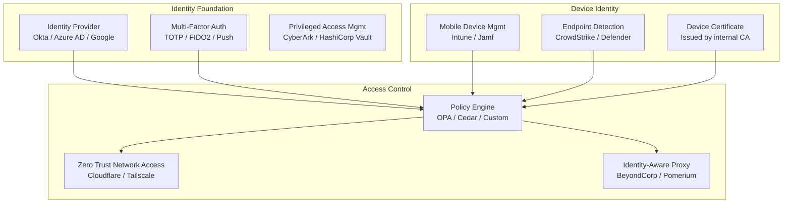
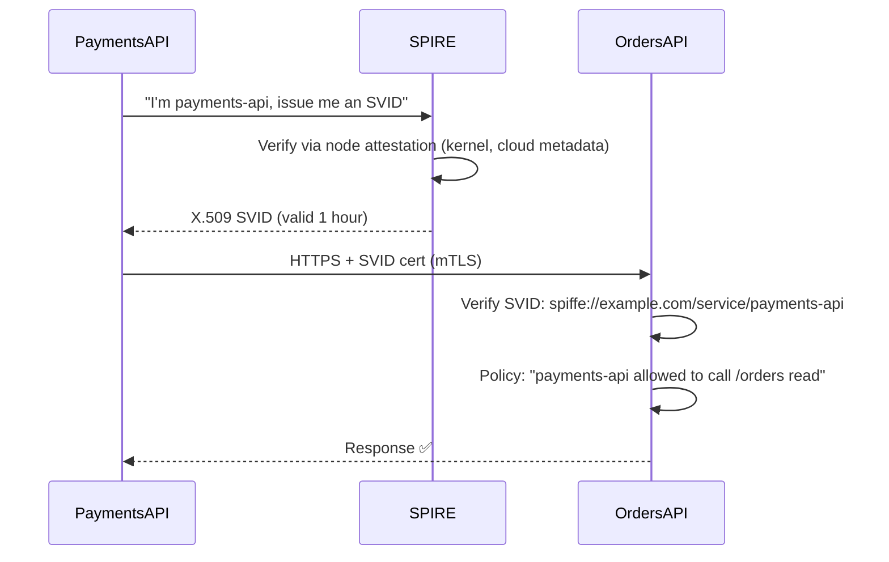

# 03 — Identity & Access Management in Zero Trust

## Identity Is the New Perimeter

In Zero Trust, **identity replaces the network perimeter** as the primary security control. The question shifts from "Is this request coming from inside our network?" to "Can this request prove who it is?"

```
OLD PERIMETER:            NEW PERIMETER (Zero Trust):
  Network boundary    →       Identity + Device + Context
  IP address          →       User principal + MFA token
  VPN connection      →       Verified device certificate
  Location-based      →       Continuous validation
```

---

## The Identity Stack



---

## Multi-Factor Authentication (MFA)

MFA is the **minimum entry requirement** for Zero Trust. Passwords alone are broken — they are phished, leaked, brute-forced, and credential-stuffed every day.

### MFA Methods (Ranked by Security)

```
┌────────────────────────────┬─────────┬────────────────────────────────────────┐
│ Method                     │Security │ Notes                                  │
├────────────────────────────┼─────────┼────────────────────────────────────────┤
│ FIDO2 / WebAuthn / Passkeys│ ★★★★★  │ Phishing-proof, hardware key or biometric│
│ TOTP (Google Auth, Authy)  │ ★★★★   │ Time-based OTP, phishable but common   │
│ Push notification (Duo)    │ ★★★    │ Easy UX, vulnerable to MFA fatigue     │
│ SMS OTP                    │ ★★     │ SIM swappable, SS7 attacks             │
│ Email OTP                  │ ★★     │ Email account can be compromised       │
│ Security questions         │ ★      │ Not MFA at all — avoid                 │
└────────────────────────────┴─────────┴────────────────────────────────────────┘
```

### FIDO2 / WebAuthn (The Gold Standard)

FIDO2 uses **public-key cryptography** tied to the specific website origin. If you're phished to `evil-example.com`, your FIDO2 token refuses to authenticate because the origin doesn't match.

```
TOTP Phishing Attack (succeeds):
  Attacker: "Login to evil-example.com" (looks like real site)
  User: enters username + password + TOTP code
  Attacker: replays these to real example.com immediately
  Result: Compromised ✅ for attacker

FIDO2 Phishing Attack (fails):
  Attacker: "Login to evil-example.com"
  User: username + password entered
  FIDO2 challenge: "sign this for evil-example.com"
  Token: "evil-example.com ≠ example.com → REFUSE"
  Result: DENIED ❌ for attacker
```

### MFA Fatigue Attacks

```
MFA Fatigue:
  Attacker has stolen username + password
  Attacker triggers push notification dozens of times
  User (annoyed, confused): "I'll just accept to make it stop"
  Attacker: gains access

Defense:
  - Use number matching in push (user must enter number shown on screen)
  - Use FIDO2/passkeys (not vulnerable to this attack)
  - Alert on >3 denied MFA pushes in 5 minutes
  - Microsoft Authenticator, Duo, and Okta all support number matching
```

---

## Workload Identity (Machine-to-Machine)

Zero Trust is not just for humans. **Services, CI/CD pipelines, and automated processes** also need identity.

### Problem: Long-Lived Secrets

```
Traditional approach:
  CI/CD pipeline has DATABASE_PASSWORD=abc123 in environment
  This password:
    - Never expires
    - Is stored in multiple places
    - If leaked, gives permanent access
    - Hard to rotate without downtime
```

### Solution: Short-Lived Credentials (SPIFFE/SPIRE)

**SPIFFE** (Secure Production Identity Framework For Everyone) provides workload identity:

```
SPIFFE Identity:
  spiffe://example.com/service/payments-api
  spiffe://example.com/ci/github-actions/deploy

SPIRE issues X.509 SVIDs (SPIFFE Verifiable Identity Documents):
  - Short-lived certificates (hours, not years)
  - Automatically rotated before expiry
  - Service proves identity to other services
  - No long-lived secrets needed
```



### HashiCorp Vault: Dynamic Secrets

```bash
# Instead of storing a password, get a temporary one at runtime
vault read database/creds/my-role

# Output:
# Key                Value
# lease_duration     1h
# password           A1a2B3b4-generated-per-request
# username           v-token-myapp-xKy8Dq

# This credential:
# - Was just created (never existed before)
# - Expires in 1 hour automatically
# - If leaked, becomes useless after 1 hour
# - Each service instance gets unique credentials
```

---

## Device Posture Assessment

Identity alone is not enough. Zero Trust also validates **what device** the user is on.

### Device Trust Levels

```
┌──────────────────────────────────────────────────────────────────┐
│ Trust Level     │ Criteria                  │ Access Granted      │
├──────────────────────────────────────────────────────────────────┤
│ HIGH TRUST      │ - Corporate-managed MDM   │ All resources       │
│                 │ - EDR agent installed     │                     │
│                 │ - OS patched (< 30 days)  │                     │
│                 │ - Disk encrypted          │                     │
│                 │ - Device cert valid       │                     │
├──────────────────────────────────────────────────────────────────┤
│ MEDIUM TRUST    │ - BYOD registered         │ Email, Slack, Docs  │
│                 │ - Screen lock enabled     │ No prod databases   │
│                 │ - OS not critically old   │ No source code      │
├──────────────────────────────────────────────────────────────────┤
│ LOW TRUST       │ - Unmanaged device        │ Public portal only  │
│                 │ - Browser-only access     │ No internal apps    │
│                 │ - No device cert          │                     │
├──────────────────────────────────────────────────────────────────┤
│ ZERO TRUST      │ - Jailbroken/rooted       │ DENIED              │
│                 │ - Known malware           │                     │
│                 │ - Failed EDR check        │                     │
└──────────────────────────────────────────────────────────────────┘
```

### Device Certificate Authentication

Corporate devices are issued **device certificates** by an internal CA:

```
Internal CA (Active Directory CS / HashiCorp Vault / Smallstep)
  └── Device Cert: "MacBook-John-Smith.corp.example.com"
        └── Attributes:
              serialNumber: MDM-DEVICE-12345
              CN: John Smith's MacBook Pro
              OU: Engineering
              validity: 1 year (auto-renewed by MDM)
```

At authentication:
1. User provides credentials + MFA (proves WHO)
2. Browser/client presents device cert (proves WHAT device)
3. Policy Engine checks device cert against MDM inventory
4. If device is compliant → access granted

---

## Privileged Access Management (PAM)

For high-privilege access (production databases, root access, admin panels), additional controls are needed.

### Just-In-Time (JIT) Access

```
Traditional:
  admin_group → always has prod DB access → huge blast radius

Just-In-Time:
  engineer → requests 1-hour prod DB access → manager approves →
  access granted for exactly 1 hour → automatically revoked →
  full audit log of what was done during that hour
```

Tools: CyberArk, BeyondTrust, HashiCorp Vault, Teleport

### Example: JIT SSH with Teleport

```yaml
# Teleport role: request-only access by default
kind: role
metadata:
  name: dev-prod-access
spec:
  allow:
    request:
      roles: ['prod-ssh-access']   # Must request, cannot use by default
      thresholds:
        - approve: 1               # 1 approval needed

---
# Teleport role: actual prod access (granted only after approval)
kind: role
metadata:
  name: prod-ssh-access
spec:
  allow:
    logins: ['ubuntu']
    node_labels:
      environment: production
  options:
    max_session_ttl: 1h            # Expires after 1 hour automatically
```

```bash
# Engineer requests access
tsh request create --roles=prod-ssh-access --reason="Investigating prod incident #1234"

# Manager approves
tsh request approve <request-id>

# Engineer SSHes in (access auto-expires in 1h)
tsh ssh ubuntu@prod-server-01
```

---

## Context-Aware Access Policies

Real-world policies combine multiple signals:

```python
# Policy expressed in Open Policy Agent (OPA) - Rego language

package access.policy

default allow = false

# Allow access only if all conditions are met
allow {
    # User is authenticated
    input.user.authenticated == true
    
    # User is in the correct group
    input.user.groups[_] == "engineering"
    
    # MFA was completed
    input.user.mfa_completed == true
    input.user.mfa_method != "sms"        # SMS not acceptable
    
    # Device is managed
    input.device.managed == true
    input.device.encrypted == true
    input.device.os_patch_age_days < 30
    
    # Request context
    input.request.time_of_day >= 6        # After 6 AM
    input.request.time_of_day <= 22       # Before 10 PM
    
    # Risk score
    input.risk.score < 0.7
}

# Require step-up auth for sensitive resources
step_up_required {
    input.resource.sensitivity == "high"
    input.user.last_step_up_minutes > 30  # Re-auth every 30 min for sensitive resources
}

# Block if device is known compromised
deny {
    input.device.threat_status == "compromised"
}

# Block anomalous geographic access
deny {
    input.request.country != input.user.baseline_country
    input.user.travel_mode == false
}
```

---

## Session Management

Zero Trust sessions are **shorter and more granular** than traditional sessions:

```
Traditional web session:
  Login once → session cookie valid for 30 days
  If cookie is stolen → 30 days of unauthorized access

Zero Trust session:
  Login with MFA → short-lived token (15 min - 4 hours)
  For sensitive actions: re-authenticate
  Continuous behavioral monitoring during session
  Session revocable at any time (e.g., device fails compliance)
  
Token types:
  Access token: short-lived (15 min), sent with every request
  Refresh token: longer-lived (hours), used to get new access tokens
  Device certificate: rotated by MDM (daily/weekly)
```

---

## Literature Connection

> *Clean Code* (Martin) advocates for the **Single Responsibility Principle** — each module does one thing. The identity stack in Zero Trust applies this to security:
>
> - IdP does identity (one thing)
> - MDM does device management (one thing)
> - Policy Engine does access decisions (one thing)
> - PEP does enforcement (one thing)
>
> Separating these concerns makes each component replaceable, auditable, and improvable independently.
