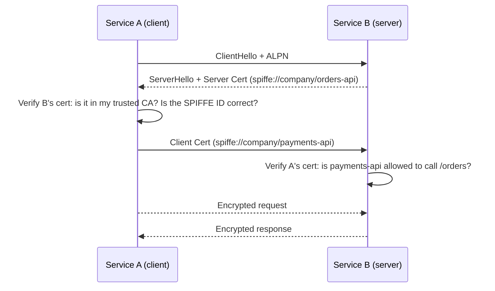

# 04 — Microsegmentation & Zero Trust Networks

## The Problem: East-West Traffic

Traditional perimeter security focuses on **north-south traffic** — traffic entering or leaving the network from the internet. But once an attacker gets inside (via phishing, a compromised device, or a vulnerable service), they can move freely between servers — this is **east-west traffic** (lateral movement).

```
NORTH-SOUTH (Traditional security focuses here):
   Internet ──▶ Firewall ──▶ Internal Network

EAST-WEST (Where attacks actually spread):
   Server A ──▶ Server B ──▶ Database ──▶ Sensitive Data
   (All inside the "trusted" network — no controls)

MICROSEGMENTATION (Zero Trust for east-west):
   Server A ──▶ [Policy Check] ──▶ Server B
                Only if: Server A is allowed to call Server B's specific API
```

---

## What Is Microsegmentation?

Microsegmentation divides the network into **very small zones**, with explicit access controls between each zone. Unlike VLANs (which create broad segments of hundreds of servers), microsegmentation can go down to:

- **Workload level**: Each VM or container gets a policy
- **Process level**: Each process on a host gets a policy
- **API level**: Service A can call `/read` on Service B but not `/write`

```
Traditional VLAN:
  ┌─────────────────────────────────────────────────────────┐
  │ "Database VLAN" — all servers can see all databases     │
  │ [Web1] [Web2] [API1] [API2] → [DB1] [DB2] [DB3]        │
  └─────────────────────────────────────────────────────────┘

Microsegmentation:
  [Web1] → (allowed to reach API1:8080/v1/users)
  [Web1] → (DENIED: API2, DB1, DB2, DB3)
  [API1] → (allowed to reach DB1:5432/users_db read-only)
  [API1] → (DENIED: DB2, DB3, other services)
  [API2] → (allowed to reach DB2:5432/orders_db)
  [API2] → (DENIED: DB1, DB3)
```

---

## Microsegmentation Approaches

### Approach 1: Host-Based (Agent)

Deploy a software agent on each host that enforces policy at the OS level.

```
Tools: Illumio Core, Guardicore Centra, Cisco Tetration

How it works:
  Agent on each VM intercepts all network connections
  Checks policy engine: "Is this flow allowed?"
  Enforces via iptables/nftables/Windows Firewall rules
  
Pros:
  - Works across any network (cloud, on-prem, hybrid)
  - Highly granular
  - Encrypts east-west traffic (agent-to-agent TLS)
  
Cons:
  - Agent must be installed on every host
  - Agent is another attack surface
  - Operational overhead of agent management
```

### Approach 2: Network-Based (SDN)

Use software-defined networking to enforce policies at the network layer.

```
Tools: VMware NSX, Cisco ACI, AWS Security Groups, Azure NSG

How it works:
  Virtual switch/router enforces flows
  No agent needed on workloads
  Policy defined centrally, pushed to network
  
Pros:
  - No agents on workloads
  - Works at line speed (hardware enforcement)
  
Cons:
  - Tied to specific infrastructure
  - Coarser granularity than host-based
  - Doesn't encrypt payload
```

### Approach 3: Service Mesh (Application Layer)

Each service gets a **sidecar proxy** that enforces policy at Layer 7.

```
Tools: Istio, Linkerd, Consul Connect

How it works:
  ┌───────────────────────────────────────────────────────────┐
  │ Payment Service Pod                                       │
  │  ┌─────────────────────┐  ┌──────────────────────────┐  │
  │  │   Payment App       │  │  Envoy Sidecar Proxy     │  │
  │  │   (business logic)  │◀─│  - mTLS between services │  │
  │  └─────────────────────┘  │  - Policy enforcement    │  │
  │                           │  - Retry / circuit break │  │
  │                           │  - Telemetry/tracing     │  │
  │                           └──────────────────────────┘  │
  └───────────────────────────────────────────────────────────┘
```

**Istio example**:
```yaml
# Allow only Order Service to call Payment API
apiVersion: security.istio.io/v1beta1
kind: AuthorizationPolicy
metadata:
  name: payment-api-policy
  namespace: default
spec:
  selector:
    matchLabels:
      app: payment-api
  action: ALLOW
  rules:
    - from:
        - source:
            principals: ["cluster.local/ns/default/sa/order-service"]
      to:
        - operation:
            methods: ["POST"]
            paths: ["/v1/payments"]
```

---

## SASE (Secure Access Service Edge)

SASE (pronounced "sassy") is an architecture that **converges network security and WAN into a cloud-delivered service**.

```
Traditional (Backhauling traffic):
  Branch Office ──WAN──▶ HQ Datacenter ──▶ Internet
                          (traffic goes to HQ even if destination is SaaS)
                          Adds latency, creates bottleneck

SASE:
  Branch Office ──▶ Cloud Edge (Cloudflare / Zscaler PoP)
       │               │
       │               ├── ZTNA (access internal apps)
       │               ├── FWaaS (Firewall as a Service)
       │               ├── CASB (Cloud Access Security Broker)
       │               ├── SWG (Secure Web Gateway)
       │               └── Direct to internet (with inspection)
```

### SASE Components

```
┌───────────────────────────────────────────────────────────────────────┐
│                         SASE Platform                                 │
│                                                                       │
│  ┌─────────────┐  ┌─────────────┐  ┌──────────┐  ┌──────────────┐  │
│  │    ZTNA     │  │   SWG       │  │   CASB   │  │   FWaaS      │  │
│  │             │  │             │  │          │  │              │  │
│  │ Replace VPN │  │ Web filter  │  │ SaaS     │  │ Stateful     │  │
│  │ App-level   │  │ Malware     │  │ security │  │ firewall     │  │
│  │ access      │  │ scanning    │  │ policy   │  │ cloud-native │  │
│  └─────────────┘  └─────────────┘  └──────────┘  └──────────────┘  │
│                                                                       │
│  ┌───────────────────────────────────────────────────────────────┐   │
│  │                    SD-WAN backbone                            │   │
│  │     Optimized routing between PoPs, branches, and cloud       │   │
│  └───────────────────────────────────────────────────────────────┘   │
└───────────────────────────────────────────────────────────────────────┘

Vendors: Cloudflare One, Zscaler, Palo Alto Prisma, Cisco Umbrella
```

---

## ZTNA: Zero Trust Network Access

ZTNA is the **VPN replacement** — the piece of Zero Trust that controls network-level access to applications.

### ZTNA vs VPN

```
VPN:
  User connects → entire network visible
  ┌──────────────────────────────────────────────────────────┐
  │ User can see: Database1, Database2, FileServer, API1...  │
  │ User accesses: only what they need (honor system)        │
  └──────────────────────────────────────────────────────────┘

ZTNA:
  User connects → only approved apps visible
  ┌─────────────────────────────────────────────────────┐
  │ User can see: Only AppA (by policy)                 │
  │ Database1, Database2, FileServer: invisible/blocked │
  └─────────────────────────────────────────────────────┘
```

### Cloudflare Access (ZTNA Example)

```
# What happens when user accesses app.example.com:

1. User → app.example.com
2. Cloudflare intercepts (DNS points to Cloudflare)
3. Cloudflare: "Not authenticated — redirect to login"
4. User authenticates with Okta/Google (IdP)
5. Cloudflare: checks policy
   - Is user in "Engineering" group? ✅
   - Did MFA complete? ✅ 
   - Is it business hours? ✅
   - Country: US? ✅
6. Cloudflare issues short-lived JWT
7. Cloudflare forwards request to origin (backend in private network)
8. User: sees the app ✅

Origin backend is NEVER exposed to internet.
Cloudflare Tunnel (cloudflared) creates outbound-only connection:
  Private Backend ──outbound──▶ Cloudflare Edge ◀── User
```

**cloudflared configuration**:
```yaml
# config.yml for cloudflared tunnel
tunnel: <TUNNEL_ID>
credentials-file: /etc/cloudflared/credentials.json

ingress:
  - hostname: app.example.com
    service: http://localhost:3000
  - hostname: db-admin.example.com
    service: http://localhost:8080
  - service: http_status:404
```

### Tailscale (WireGuard-based ZTNA)

Tailscale creates a **mesh VPN** where devices communicate directly, with identity enforced by Tailscale's coordination server.

```bash
# Install Tailscale
curl -fsSL https://tailscale.com/install.sh | sh
tailscale up --authkey=tskey-auth-xxxxxx

# Each device gets a Tailscale IP (100.x.x.x)
tailscale ip  # → 100.64.0.1

# SSH to another device in the mesh
ssh user@100.64.0.5   # No firewall rules needed — policy controls access

# Tailscale ACL (Access Control List)
{
  "acls": [
    {
      "action": "accept",
      "src": ["group:engineering"],
      "dst": ["tag:prod-server:22"]  # SSH only
    },
    {
      "action": "accept",
      "src": ["group:dba"],
      "dst": ["tag:database:5432"]   # Postgres only
    }
  ],
  
  "tagOwners": {
    "tag:prod-server": ["group:infrastructure"],
    "tag:database": ["group:infrastructure"]
  }
}
```

---

## mTLS: Mutual TLS for Service-to-Service

In Zero Trust networks, services prove their identity to each other using **mutual TLS** — both sides present certificates.



Implementing mTLS with Istio:
```yaml
# Enforce mTLS for all services in namespace
apiVersion: security.istio.io/v1beta1
kind: PeerAuthentication
metadata:
  name: default
  namespace: production
spec:
  mtls:
    mode: STRICT   # Reject non-mTLS connections
```

---

## Network Segmentation in AWS

AWS Security Groups + VPC design implements microsegmentation at the cloud level:

```
┌─────────────────────────────────────────────────────────────────────┐
│ VPC: 10.0.0.0/16                                                    │
│                                                                     │
│ ┌─────────────────┐  ┌─────────────────┐  ┌─────────────────────┐ │
│ │ Public Subnet   │  │ App Subnet      │  │ Data Subnet         │ │
│ │ 10.0.1.0/24     │  │ 10.0.2.0/24     │  │ 10.0.3.0/24         │ │
│ │                 │  │                 │  │                     │ │
│ │ [Load Balancer] │  │ [App Server]    │  │ [RDS PostgreSQL]    │ │
│ │                 │  │                 │  │                     │ │
│ │ SG: allow 443   │  │ SG: allow 8080  │  │ SG: allow 5432      │ │
│ │ from 0.0.0.0/0  │  │ from SG-LB only │  │ from SG-App only    │ │
│ └─────────────────┘  └─────────────────┘  └─────────────────────┘ │
│                                                                     │
│ Database is UNREACHABLE from internet even if app is compromised    │
│ App is UNREACHABLE from internet except via LB on port 443 only     │
└─────────────────────────────────────────────────────────────────────┘
```

Terraform:
```hcl
resource "aws_security_group" "database" {
  name   = "database-sg"
  vpc_id = aws_vpc.main.id

  ingress {
    from_port       = 5432
    to_port         = 5432
    protocol        = "tcp"
    security_groups = [aws_security_group.app.id]  # Only app SG can reach DB
  }

  egress {
    from_port   = 0
    to_port     = 0
    protocol    = "-1"
    cidr_blocks = ["0.0.0.0/0"]
  }
}
```

---

## Literature Connection

> *Designing Data-Intensive Applications* (Kleppmann) describes **partitioning** as dividing data to improve scalability and fault isolation. Microsegmentation is the security equivalent: partitioning the network into isolated zones to improve security and fault isolation.

> Just as database partitioning limits the blast radius of a performance problem to one partition, microsegmentation limits the blast radius of a security breach to one segment.
