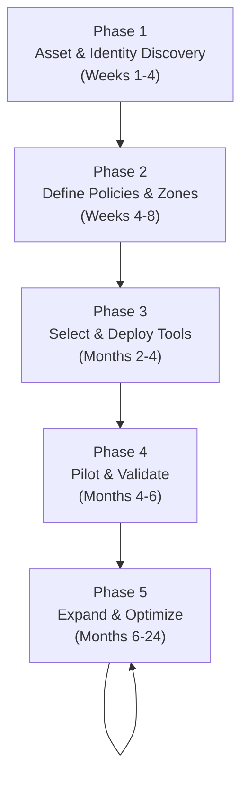

# 06 — Zero Trust Implementation Roadmap

## Why Implementation Order Matters

Zero Trust cannot be implemented all at once. Attempting to do everything simultaneously causes:
- User friction (employees can't work)
- Rollback pressure (security team overrules ops)
- Wasted budget (tools bought before use cases defined)
- Policy conflicts (multiple systems making contradictory decisions)

The correct approach is **phased, iterative implementation** — exactly what NIST 800-207 prescribes.

---

## The NIST 5-Phase Roadmap



---

## Phase 1: Asset & Identity Discovery (Weeks 1–4)

You cannot protect what you don't know exists. Start by building a complete inventory.

### Asset Inventory

```bash
# Network scanning to discover assets
nmap -sn 10.0.0.0/8 -oX assets.xml   # Ping sweep entire internal range
nmap -sV -sC 10.0.1.0/24            # Service detection on subnet

# Cloud asset inventory
aws ec2 describe-instances --output json > aws-assets.json
gcloud compute instances list --format=json > gcp-assets.json
az vm list --output json > azure-assets.json

# Kubernetes workloads
kubectl get all --all-namespaces -o json > k8s-workloads.json
```

**Deliverable**: A spreadsheet/CMDB with:
- Every server, VM, container, SaaS app
- Data classification (public, internal, confidential, restricted)
- Current access controls
- Owner / team

### Identity Inventory

```
For each identity type, document:

Human Users:
  - Total count
  - Roles and job functions
  - Current authentication method (password only? MFA? which MFA?)
  - Privileged accounts (admins, DBAs, root access)
  - Contractor/vendor accounts
  - Stale accounts (unused > 90 days)

Service Accounts:
  - Application credentials (API keys, database passwords)
  - CI/CD pipeline credentials
  - Inter-service communication credentials
  - Expiry/rotation status

Devices:
  - Corporate-managed devices (from MDM)
  - BYOD devices
  - Servers and VMs
  - IoT devices
  - Network equipment
```

### Application Dependency Mapping

```
For each application, map:
  - What does it connect to? (databases, APIs, services)
  - Who connects to it? (users, other services, external systems)
  - What data does it handle? (sensitivity classification)
  - What ports/protocols does it use?

Tools:
  - Wireshark / tcpdump (network capture)
  - AWS VPC Flow Logs / GCP Flow Logs
  - Service mesh traffic graphs (Kiali for Istio)
  - Dependency mapping tools: Dynatrace, New Relic, Datadog APM
```

---

## Phase 2: Define Policies & Zones (Weeks 4–8)

Turn your inventory into policy. Answer these questions for every resource:

### Resource Sensitivity Classification

```
LEVEL 1 — Public:
  Examples: Marketing website, public API
  Policy: Anyone on internet can access
  
LEVEL 2 — Internal:  
  Examples: Internal wiki, Slack, email
  Policy: Authenticated employees only
  
LEVEL 3 — Confidential:
  Examples: Customer data, financial reports, source code
  Policy: Authenticated + MFA + managed device + role-based
  
LEVEL 4 — Restricted:
  Examples: Production databases, encryption keys, payment systems
  Policy: Authenticated + FIDO2 + managed device + specific role + JIT access + session recording
```

### Policy Definition Template

For each resource, fill out:

```yaml
resource:
  name: "Production Database - payments"
  classification: restricted
  owner: "DBA Team"
  sensitivity: 4
  
access_policy:
  allowed_subjects:
    - type: human
      groups: ["dba", "devops-leads"]
      mfa_required: true
      mfa_methods: ["fido2", "totp"]
      device_requirements:
        managed: true
        encrypted: true
        os_patch_days: 14
        edr_installed: true
    - type: service
      workload_identity: "spiffe://company/payments-api"
      certificate_required: true
      
  temporal_constraints:
    human_access:
      mode: just_in_time
      max_duration: 4h
      approval_required: true
      approvers: ["dba-manager", "security-team"]
    service_access:
      mode: continuous
      
  session_controls:
    record_session: true
    idle_timeout: 15m
    
  network_path:
    allowed_from: ["tailnet", "office-vpn"]
    protocol: postgresql
    port: 5432
```

---

## Phase 3: Select & Deploy Tools (Months 2–4)

Based on your policies from Phase 2, select tools.

### Starter Stack (Small Team, Low Budget)

```
Identity:
  Google Workspace ($6/user/month) — includes Google IdP + MFA
  
ZTNA:
  Cloudflare Zero Trust Free (up to 50 users) OR
  Tailscale (free for 3 users, $6/user/month after)
  
Device:
  Google Endpoint Management (included with Workspace)
  
Secrets:
  HashiCorp Vault Community (free, self-hosted) OR
  Infisical (open source, free self-hosted)
  
Monitoring:
  Cloudflare Analytics (included)
  GCP Cloud Logging / AWS CloudWatch (pay-per-use)

Estimated monthly cost: $0-$300
```

### Mid-Size Stack (50-200 users)

```
Identity:
  Okta ($8-15/user/month) — enterprise IdP
  
ZTNA:
  Cloudflare Zero Trust Teams ($7/user/month)
  
Device:
  Microsoft Intune ($8/user/month) for Windows
  Jamf Now ($4/device/month) for Mac
  CrowdStrike Falcon Go (EDR)
  
Secrets:
  HashiCorp Vault Enterprise OR HashiCorp Cloud Platform
  
Monitoring:
  Datadog ($15+/host/month) with security monitoring

Estimated monthly cost: $30-60/user
```

---

## Phase 4: Pilot in Small Environment (Months 4–6)

Never roll out to everyone at once. Start with a single team or single application.

### Pilot Selection Criteria

Good pilot candidates:
```
✅ Team is willing to participate (not forced)
✅ Relatively low blast radius if it breaks
✅ Team lead is technically capable
✅ Clear success metrics
✅ Easy rollback path

Bad pilot candidates:
❌ C-level executives (too much pressure if it breaks)
❌ Customer-facing team (user impact)
❌ Team with critical deadlines in next 3 months
❌ Team with highly regulated workflows
```

### Pilot Execution Plan

```
Week 1: Deploy ZTNA in "shadow mode"
  - Tool deployed but not enforcing
  - Monitor what traffic it would have blocked
  - Fix false positives in policy

Week 2: Enable enforcement for pilot team
  - MFA enforcement: Yes
  - Device compliance: Warning (not block yet)
  - ZTNA: Active for test applications

Week 3: Enforce device compliance
  - Block non-compliant devices
  - Handle exceptions (old hardware, special cases)
  - Collect friction reports

Week 4: Validate and document
  - Security incident reduction metrics
  - User friction survey (0-10 rating)
  - List of policy adjustments made
  - Runbooks for common issues
  - Go/no-go for expansion
```

### Success Metrics

```
Security metrics:
  - Credential theft attempts blocked
  - Unauthorized access attempts detected
  - Policy violations caught
  
User experience metrics:
  - Average login time (should be < 5 seconds)
  - Help desk tickets related to ZT tools
  - User satisfaction score (> 7/10 target)
  
Coverage metrics:
  - % of apps behind Zero Trust proxy
  - % of users with MFA enabled
  - % of devices enrolled in MDM
  - % of service accounts using short-lived credentials
```

---

## Phase 5: Expand & Optimize (Months 6–24)

### Expansion Prioritization

```
Priority 1 (Months 6-9): Remaining high-risk apps
  - Production databases
  - Code repositories
  - Infrastructure management (AWS console, Kubernetes)
  - Financial systems

Priority 2 (Months 9-12): Service-to-service auth
  - Deploy mTLS between services
  - Replace long-lived API keys with SPIFFE/Vault
  - Implement service mesh (Istio/Linkerd) for Kubernetes

Priority 3 (Months 12-18): Comprehensive coverage
  - All internal apps behind ZTNA
  - Microsegmentation deployed
  - SIEM with Zero Trust telemetry

Priority 4 (Months 18-24): Advanced controls
  - AI/ML behavioral analytics
  - Just-in-time access for all privileged access
  - Zero standing privileges target
  - Continuous compliance validation
```

### Migrating Away from VPN

The VPN removal is often the most psychologically difficult step:

```
Step 1: Inventory VPN use cases
  - What specific servers/apps do users VPN to access?
  - Map each use case to a ZTNA replacement

Step 2: Migrate use cases one by one
  Use Case: "Access internal Jira"
    VPN → Cloudflare Access in front of Jira

  Use Case: "SSH to production servers"
    VPN → Tailscale with ACL policy for SSH only

  Use Case: "Access customer database"
    VPN → Teleport with JIT access + session recording

Step 3: Run VPN and ZTNA in parallel (2-4 weeks)
  - Users can choose either method
  - Monitor adoption of ZTNA

Step 4: Disable VPN for migrated use cases
  - Block VPN for already-migrated apps
  - Keep VPN for not-yet-migrated resources

Step 5: Decommission VPN
  - All use cases migrated
  - VPN server turned off
  - Certificates revoked
```

---

## Common Rollout Mistakes

### Mistake 1: Big-Bang Rollout

```
Wrong approach:
  "We're enabling MFA for all 500 employees next Monday"
  
Result:
  - Mass help desk tickets
  - Executives complaining
  - Project cancelled after week 1

Right approach:
  "We're enabling MFA for the security team (10 people) this week,
   IT team next week, then 50 users per week after that"
```

### Mistake 2: No Exceptions Process

```
Some users have legitimate needs that conflict with strict policies:
  - Field technician with no internet for device compliance checks
  - Executive with personal device (they won't use MDM)
  - Partner/vendor with different MFA tools
  
Build an exceptions process BEFORE rollout:
  - Formal exception request form
  - Approval workflow
  - Time-limited exceptions (90 days max)
  - Compensating controls for exceptions
  - Regular exception review
```

### Mistake 3: Ignoring Developer Workflows

```
Developers have unique access needs:
  - SSH to multiple servers frequently
  - Database access for debugging
  - Multiple cloud accounts
  - CI/CD pipeline credentials
  
Poor Zero Trust implementation kills developer productivity.
Solutions:
  - Tailscale (SSH) + 1Password for SSH keys
  - Teleport (SSH + DB access in one tool)
  - Short-lived AWS credentials via Vault
  - GitHub Actions OIDC for cloud access (no stored secrets)
```

---

## GitHub Actions: Zero Trust for CI/CD

Modern CI/CD doesn't need stored secrets. Use OIDC:

```yaml
# .github/workflows/deploy.yml
name: Deploy

permissions:
  id-token: write   # Required for OIDC
  contents: read

jobs:
  deploy:
    runs-on: ubuntu-latest
    steps:
      - uses: actions/checkout@v4
      
      # Get short-lived AWS credentials via OIDC — no stored secrets!
      - name: Configure AWS Credentials
        uses: aws-actions/configure-aws-credentials@v4
        with:
          role-to-assume: arn:aws:iam::ACCOUNT:role/github-actions-deploy
          aws-region: us-east-1
          # GitHub sends OIDC token → AWS trusts GitHub → Issues temp credentials
          
      - name: Deploy
        run: aws ecs update-service ...
```

```json
// AWS IAM Trust Policy for the role
{
  "Version": "2012-10-17",
  "Statement": [
    {
      "Effect": "Allow",
      "Principal": {
        "Federated": "arn:aws:iam::ACCOUNT:oidc-provider/token.actions.githubusercontent.com"
      },
      "Action": "sts:AssumeRoleWithWebIdentity",
      "Condition": {
        "StringEquals": {
          "token.actions.githubusercontent.com:sub": "repo:myorg/myrepo:ref:refs/heads/main"
        }
      }
    }
  ]
}
```

This is Zero Trust for CI/CD: **the workflow proves its identity (OIDC) → gets temporary credentials → no stored secrets exist to steal**.

---

## Measuring Zero Trust Maturity

Track these KPIs quarterly:

```
Identity Pillar:
  □ % users with MFA: target > 99%
  □ % users with phishing-resistant MFA (FIDO2): target > 50%
  □ % privileged access via JIT: target > 80%
  □ Mean time to deprovision departed employees: target < 4 hours

Device Pillar:
  □ % corporate devices enrolled in MDM: target 100%
  □ % devices meeting OS patch compliance: target > 95%
  □ % devices with EDR agent: target 100%
  □ % endpoints with disk encryption: target 100%

Network Pillar:
  □ % of internal apps behind ZTNA: target 100%
  □ % of service traffic using mTLS: target > 80%
  □ VPN usage: target → 0%
  □ % of secrets via dynamic/short-lived credentials: target > 90%

Monitoring Pillar:
  □ Time to detect credential abuse: target < 15 minutes
  □ % of user sessions with behavioral monitoring: target 100%
  □ % of production changes with audit trail: target 100%
```
